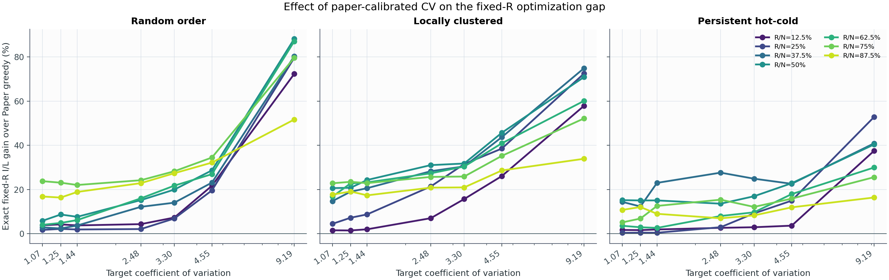
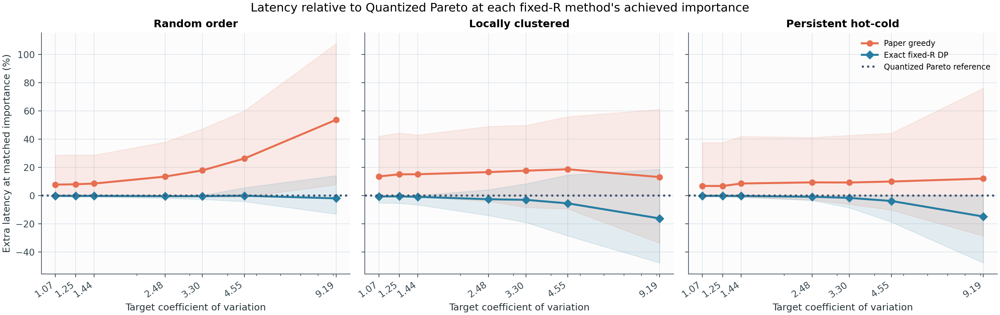
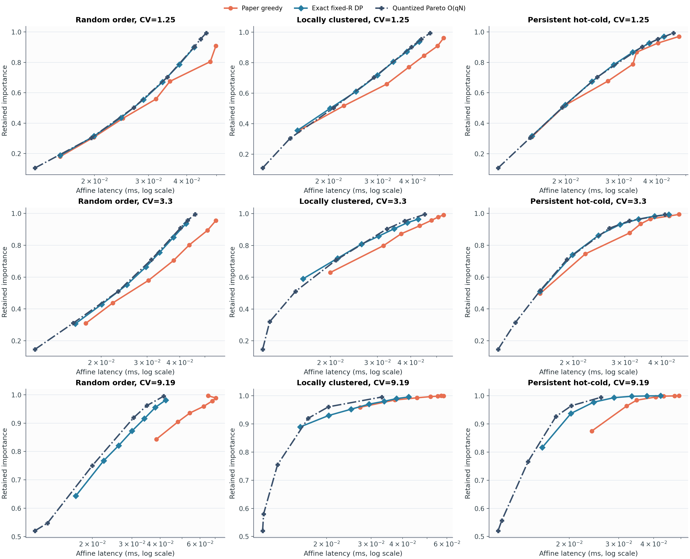

# Experiment 02: paper-calibrated CV sweep

## 질문

논문 Appendix C의 neuron-importance CV를 재현했을 때 다음 세 방법은 어떻게
달라지는가?

1. Paper greedy
2. Exact fixed-`R` DP
3. Quantized Pareto `O(qN)` (`q=256`)

## 설정

- `N=256`, CV당 독립 multiset 100개
- 목표 CV: `1.07, 1.25, 1.44, 2.48, 3.30, 4.55, 9.19`
- 앞의 여섯 값은 논문 VLM 범위이고 `9.19`는 ReLU OPT 참고값이다.
- 각 multiset은 sample CV가 목표값과 일치하도록 lognormal-shaped sample을
  보정했다. 관측된 최대 CV 오차는 `1.07e-14`였다.
- 동일한 값 multiset을 `random`, `locally clustered`, `persistent hot-cold`
  세 순서로 재배치했다. 따라서 ordering 비교에서 marginal distribution과
  CV는 변하지 않는다.
- fixed-`R` 비교는 `R/N = 12.5%, 25%, ..., 87.5%`의 7개 budget을 사용한다.
- Paper greedy가 실제 선택한 행 수를 exact fixed-`R` DP에도 동일하게 주고,
  `I/L`을 비교한다.
- Quantized Pareto는 각 fixed-`R` 방법이 달성한 importance를 그대로 하한으로
  받아 latency를 최소화한다. 따라서 importance가 다른 점을 직접 비교하지
  않는다.
- affine latency는 Orin AGX 측정표의 적합식
  `L = 0.0110009 K + 0.000139813 R ms` (`R^2=0.9867`)을 사용한다.

총 2,100개 ordered input, 14,700개 fixed-`R` 비교, 14,700개 Pareto
frontier 점을 계산했다.

공간 구조가 실제로 달라졌는지도 확인했다. 평균 lag-1 correlation은 random
`-0.008`, local `0.608`, hot-cold `0.205`였다. 앞 절반에 놓인 importance
비율은 각각 `0.497`, `0.499`, `0.876`으로, hot-cold만 persistent spatial
bias를 갖는다.

## 결과 1: Exact fixed-R이 Paper greedy보다 얼마나 좋은가

아래 값은 7개 `R`에서의 **exact fixed-`R` I/L 개선율 평균**이다.

| CV | Random | Local | Hot-cold |
|---:|---:|---:|---:|
| 1.07 | 8.40% | 14.08% | 7.29% |
| 1.25 | 8.81% | 16.26% | 7.32% |
| 1.44 | 9.15% | 17.01% | 9.22% |
| 2.48 | 13.83% | 23.08% | 11.02% |
| 3.30 | 17.93% | 26.67% | 12.00% |
| 4.55 | 26.67% | 36.97% | 15.67% |
| 9.19 (OPT) | 77.00% | 60.37% | 34.77% |

VLM 범위만 평균하면 개선율은 **15.63%**다. Ordering별로는 random
`14.13%`, local `22.34%`, hot-cold `10.42%`다. 즉 CV가 커질수록 exact
optimization의 이점이 대체로 커지며, local cluster에서 greedy의 손실이
가장 컸다. Hot-cold ordering은 이미 큰 값들을 가깝게 두므로 greedy와
optimal의 차이를 줄였다.

LLaVA-OneVision-7B의 세 CV만 ordering 전체에서 평균하면 middle `CV=1.25`
에서 `10.79%`, first `CV=1.44`에서 `11.79%`, last `CV=3.30`에서
`18.87%` 개선됐다.

## 결과 2: 같은 importance에서의 latency

Paper greedy가 달성한 importance를 Quantized Pareto의 constraint로 주었을
때, greedy의 추가 latency는 다음과 같다. 양수는 Pareto가 더 빠르다는
뜻이다.

| CV | Random | Local | Hot-cold |
|---:|---:|---:|---:|
| 1.07 | 7.64% | 13.46% | 6.74% |
| 1.25 | 7.92% | 14.94% | 6.68% |
| 1.44 | 8.42% | 15.02% | 8.45% |
| 2.48 | 13.34% | 16.54% | 9.26% |
| 3.30 | 17.74% | 17.54% | 9.16% |
| 4.55 | 26.15% | 18.54% | 9.85% |
| 9.19 (OPT) | 53.61% | 13.01% | 11.94% |

VLM 범위 평균은 **12.63%**다. 이 결과는 Pareto 문제의 장점을 보여준다.
fixed row budget을 모두 채우는 대신 필요한 importance만 보존하면 latency를
직접 줄일 수 있다.

## 결과 3: `q=256` Pareto의 한계

Exact fixed-`R` solution이 달성한 importance를 Pareto에 다시 요구하면,
그 fixed-`R` mask 자체가 하나의 feasible solution이다. 따라서 exact
coverage solver라면 그보다 느릴 수 없다. 그러나 Quantized Pareto의 signed
latency 차이 `(L_fixed/L_pareto - 1)`는 VLM 범위에서 평균 `-1.30%`였다.
음수는 Pareto가 quantization/pruning 때문에 이미 알려진 feasible fixed-`R`
solution을 놓쳤다는 뜻이다.

- `CV=1.25`: random `-0.33%`, local `-0.67%`, hot-cold `-0.27%`
- `CV=1.44`: random `-0.31%`, local `-1.00%`, hot-cold `-0.34%`
- `CV=3.30`: random `-0.51%`, local `-3.12%`, hot-cold `-1.75%`
- `CV=9.19`: random `-2.06%`, local `-16.31%`, hot-cold `-14.95%`

따라서 Experiment 01의 low-CV half-normal에서 관찰한 `q=256`의 거의 exact한
결과는 고CV 전체로 일반화되지 않는다. Pareto DP의 `O(qN)` 구조가 실패한
것은 아니지만, fixed `q=256`의 절대 coverage bucket 폭이 heavy-tail에서
충분하지 않다. 다음 단계는 `q` sensitivity를 측정하거나 nonuniform/adaptive
bucket을 사용하는 것이다.

세 방법의 평균 frontier는 다음 그림에 함께 표시했다. Pareto의 고정
coverage target과 fixed-`R`의 budget point는 서로 다른 격자를 사용하므로,
선 자체보다 latency-importance envelope를 비교해야 한다.

## 결론

1. 논문 CV 범위에서도 Paper greedy의 suboptimality는 사라지지 않았고,
   exact fixed-`R` DP는 평균 `15.63%`의 I/L 이득을 보였다.
2. 동일 importance에서 직접 latency를 최소화하는 Pareto formulation은
   Paper greedy 대비 평균 `12.63%`의 latency 여지를 보였다.
3. 공간 구조가 중요하다. 같은 CV와 같은 multiset이어도 local ordering은
   greedy의 gap을 키우고, hot-cold ordering은 이를 줄였다.
4. `q=256`은 early/middle CV에서 exact fixed-`R`과 매우 가깝지만,
   last-layer와 OPT 수준의 heavy-tail에서는 해상도가 부족하다.

이는 실제 activation vector를 사용한 결과가 아니라 논문 CV를 맞춘 synthetic
experiment다. CV와 ordering을 분리한 stress test로 해석해야 하며, 최종
주장은 TempCompass activation 원자료로 재검증해야 한다.
