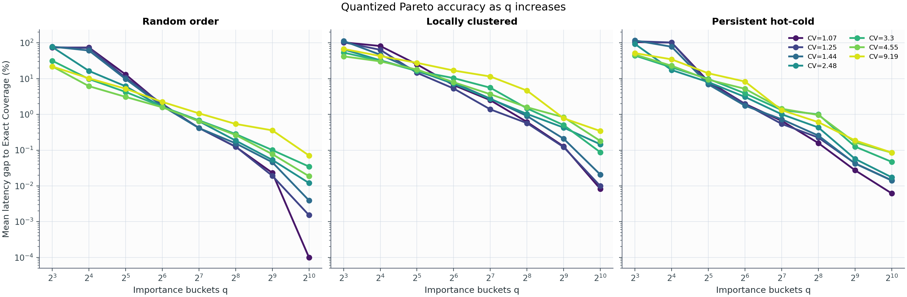
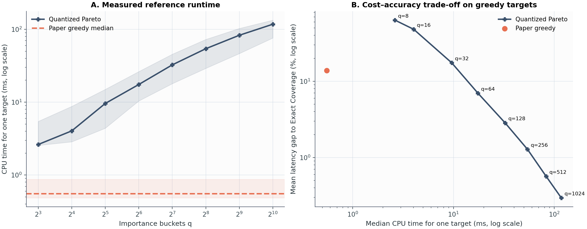
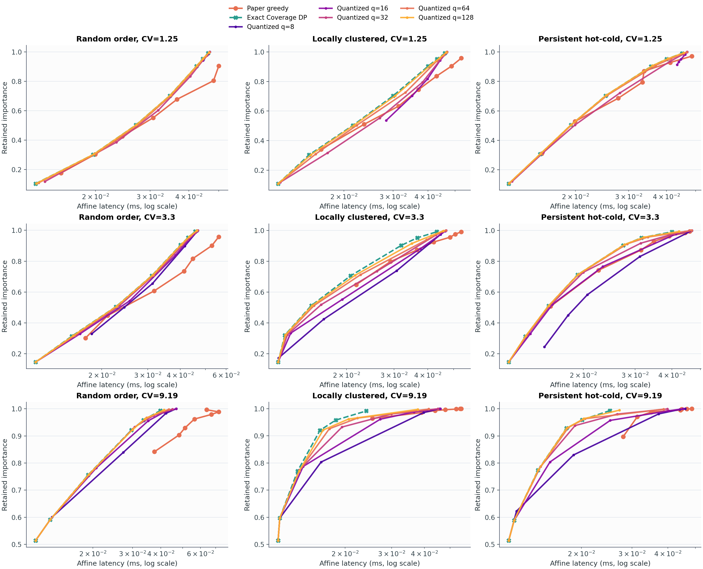

# Experiment 03: Quantized Pareto cost–accuracy trade-off

## 질문

Quantized Pareto의 importance bucket 수 `q`를 줄이면 계산량과 정확도가 어떻게
바뀌는가? 같은 입력에서 Paper greedy와 연산 비용 및 solution quality를
비교할 수 있는가?

## 실험 설정

- `N=256`, CV당 30개 독립 multiset
- CV: `1.07, 1.25, 1.44, 2.48, 3.30, 4.55, 9.19`
- ordering: random, locally clustered, persistent hot-cold
- `q = 8, 16, 32, 64, 128, 256, 512, 1024`
- coverage target: `0.10, 0.30, 0.50, 0.70, 0.90, 0.95, 0.99`
- Paper greedy budget: `R/N = 12.5%, 25%, ..., 87.5%`
- Exact Coverage DP가 latency optimum을 제공한다.

총 630개 ordered input에서 35,280개 quantized coverage point와 35,280개
Paper-greedy-matched point를 계산했다.

정확도는 두 종류로 분리했다.

1. Requested-target gap:
   `100 * (L_quant(alpha) / L_exact(alpha) - 1)`
2. Achieved-target gap:
   `100 * (L_quant(alpha) / L_exact(I_quant) - 1)`

첫 지표에는 quantization 때문에 target을 초과 달성한 비용도 포함된다. 두
번째 지표는 실제 달성 importance에서 선택한 mask가 frontier로부터 얼마나
떨어졌는지 측정한다.

Paper와의 paired 비교에서는 각 Paper mask가 실제 달성한 importance를
Quantized Pareto와 Exact Coverage에 그대로 입력했다. 따라서 해당 비교는
동일 importance target을 사용한다.

## 정확도와 비용

아래는 OPT `CV=9.19`를 제외한 VLM CV 범위의 결과다. CPU 시간은 한 target을
풀기 위해 frontier build와 한 번의 mask 복원을 모두 포함한다.

| q | DP state-slot proxy | 공통 target 평균 gap | 공통 target p95 | Paper target 평균 gap | CPU median | Paper 대비 |
|---:|---:|---:|---:|---:|---:|---:|
| 8 | 4,608 | 75.37% | 290.61% | 63.42% | 2.63 ms | 4.7x |
| 16 | 8,704 | 48.32% | 253.48% | 48.02% | 4.04 ms | 7.3x |
| 32 | 16,896 | 11.32% | 46.37% | 17.48% | 9.60 ms | 17.4x |
| 64 | 33,280 | 4.06% | 18.54% | 6.98% | 17.49 ms | 31.6x |
| 128 | 66,048 | 1.53% | 6.58% | 2.85% | 32.54 ms | 58.8x |
| 256 | 131,584 | 0.57% | 2.85% | 1.28% | 54.25 ms | 98.0x |
| 512 | 262,656 | 0.17% | 0.60% | 0.57% | 82.95 ms | 149.9x |
| 1024 | 524,800 | 0.04% | 0.00% | 0.29% | 117.59 ms | 212.5x |

`q=1024`의 공통-target p95가 0%인 것은 적어도 95%의 점에서 exact cost를
복원했다는 뜻이다. 하지만 희소한 worst case는 여전히 `21.40%`였으므로
uniform guarantee로 읽으면 안 된다.

평균 정확도의 knee는 `q=128--256`이다. `q=128`에서 평균 gap이 1.53%,
`q=256`에서 0.57%로 내려가지만, 이후 bucket을 두 배로 늘릴 때 얻는 절대
개선은 각각 약 0.4 percentage point 이하로 줄어든다. p95를 1% 아래로
내리려면 공통 target에서는 `q=512`가 필요했다. Paper가 달성한 불규칙한
target에서 p95를 1% 아래로 내리려면 `q=1024`가 필요했다.

## Paper greedy와의 paired 비교

Paper greedy의 VLM 평균 Exact Coverage gap은 `13.87%`, CPU median은
`0.553 ms`였다. 동일한 Paper importance target에서:

- `q=32`: Quantized gap `17.48%`; Paper와 latency가 평균적으로 거의 동률
- `q=64`: Quantized gap `6.98%`; Paper가 Quantized보다 평균 `7.47%` 느림
- `q=128`: Quantized gap `2.85%`; Paper가 Quantized보다 평균 `11.10%` 느림
- `q=256`: Quantized gap `1.28%`; Paper가 Quantized보다 평균 `12.57%` 느림

즉 solution quality의 crossover는 대략 `q=32--64` 사이에 있다. 하지만
현재 구현의 wall-clock crossover는 없다. 가장 작은 `q=8`도 Paper보다
4.7배 느렸다.

이 wall-clock 결과는 알고리즘 자체만의 비교가 아니다. Quantized Pareto는
Python loop 중심이고 Paper greedy는 vectorized PyTorch를 사용한다. 따라서
compiled implementation에서는 절대 시간과 crossover가 달라질 수 있다.

연산량 proxy도 직접 같은 단위는 아니다. Quantized DP는 ending bit까지 포함해
`2N(q+1)` bucket slot을 방문한다. Paper greedy는 기본 설정에서 31개 window
size와 527개 candidate를 만들며, comparison-sort proxy는 약 4,765회,
모든 overlap slice를 끝까지 검사하는 상한은 47,616 cell이다. `q=8`의
4,608 slots는 sort proxy와 비슷하지만, transition·pruning 및 Python overhead
때문에 실제 시간은 더 길었다.

여러 threshold에 같은 frontier를 재사용하면 build cost를 amortize할 수 있다.
7개 target당 median 비용은 `q=8: 0.392 ms`, `q=16: 0.613 ms`,
`q=32: 1.422 ms`, `q=64: 2.558 ms`였다. 그러나 실제 inference에서 입력당
target 하나만 필요하다면 이 amortization을 적용하면 안 된다.

## CV와 ordering의 영향

공통 target의 평균 gap은 high-CV에서 대체로 컸다.

| CV | q=64 | q=256 | q=1024 |
|---:|---:|---:|---:|
| 1.07 | 3.45% | 0.30% | 0.01% |
| 1.25 | 3.07% | 0.31% | 0.01% |
| 1.44 | 3.70% | 0.44% | 0.01% |
| 2.48 | 3.95% | 0.55% | 0.06% |
| 3.30 | 5.29% | 0.92% | 0.06% |
| 4.55 | 4.90% | 0.94% | 0.10% |
| 9.19 | 9.12% | 1.93% | 0.17% |

Local clustering이 가장 어려웠다. VLM 범위에서 `q=256`의 평균/p95 gap은
random `0.19/1.10%`, local `1.03/5.79%`, hot-cold `0.51/2.62%`였다.
따라서 같은 CV라도 필요한 q는 ordering에 따라 달라진다.

## 결론

1. `q`를 늘리면 평균 accuracy는 확실히 좋아지지만 계산 상태와 CPU 시간도
   함께 증가한다.
2. 평균 gap 기준 실용적인 knee는 `q=128--256`이다.
3. tail accuracy까지 요구하면 `q=512--1024`가 필요하며, 일부 high-CV/local
   입력의 outlier는 여전히 남는다.
4. `q>=64`는 같은 importance에서 Paper greedy보다 좋은 solution을 만들지만,
   현재 Python 구현은 Paper greedy보다 훨씬 느리다.
5. 온라인 대체를 주장하려면 Quantized DP의 compiled/vectorized 구현과 실제
   GPU timing이 필요하다. 현재 결과는 algorithmic trade-off와 reference CPU
   implementation의 비용을 분리해서 읽어야 한다.
