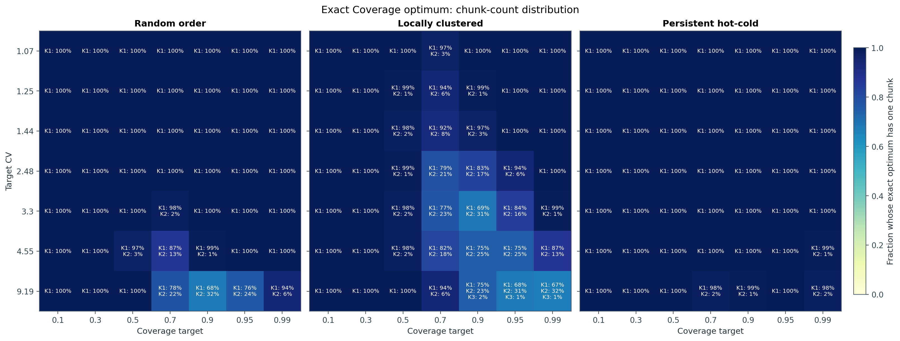
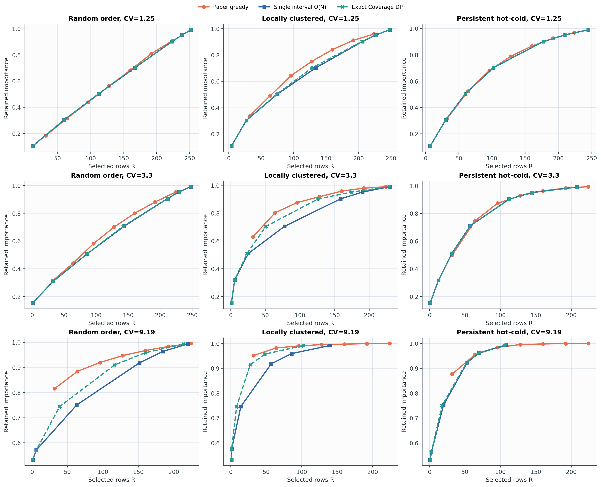
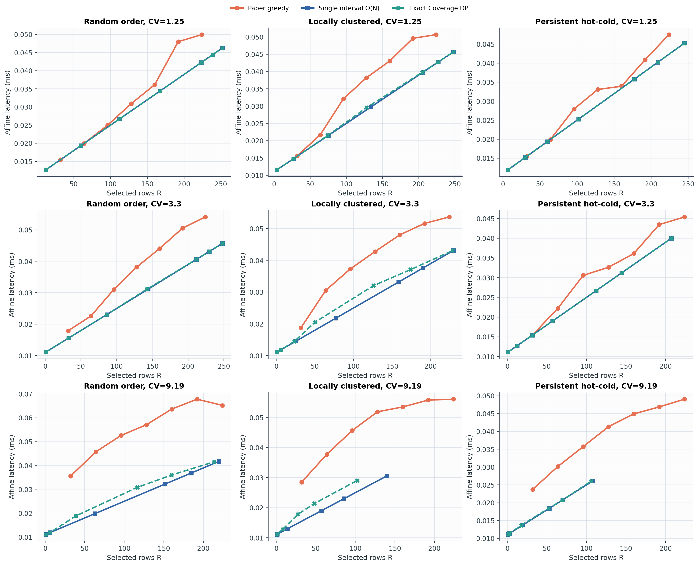
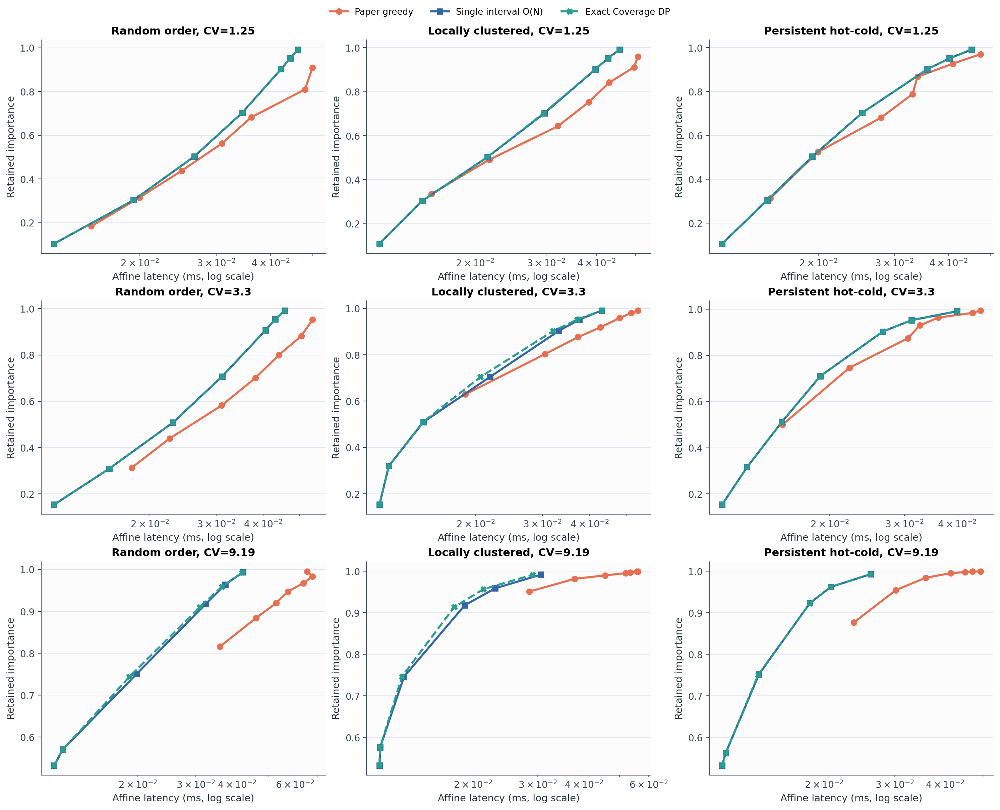

# Experiment 04: O(N) single-interval solver

## 질문

새 coverage 문제

\[
\min_M L(M)=aK(M)+cR(M)
\quad\text{s.t.}\quad I(M)\ge \alpha
\]

에서 최적해는 실제로 거의 항상 한 chunk인가? 그렇다면 nonnegative
importance에 대해 minimum-length interval을 찾는 `O(N)` two-pointer가 Paper
greedy보다 싸면서 Exact Coverage에 가까운가?

## 실험 설정

- `N=256`, CV당 100개 독립 multiset
- CV: `1.07, 1.25, 1.44, 2.48, 3.30, 4.55, 9.19`
- ordering: random, locally clustered, persistent hot-cold
- coverage target: `0.10, 0.30, 0.50, 0.70, 0.90, 0.95, 0.99`
- Paper greedy budget: `R/N = 12.5%, 25%, ..., 87.5%`
- Orin AGX latency의 affine fit:
  `L = 0.0110009 K + 0.000139813 R` ms
- 비교 방법: Paper greedy, single interval `O(N)`, Exact Coverage DP

총 2,100개 ordered input과 14,700개 공통 coverage point를 계산했다. 별도로
Paper greedy가 실제 달성한 14,700개 importance target에서도 paired 비교했다.

Single interval은 모든 importance가 nonnegative이므로 sliding window의 왼쪽
포인터가 뒤로 움직일 필요가 없다. 따라서 target을 만족하는 가장 짧은 구간을
`O(N)` 시간과 `O(1)` 보조 공간으로 정확히 찾는다. 이는 **한 chunk로 제한한
문제의 exact solver**이며, 여러 chunk까지 허용한 전체 문제의 exact solver는
아니다.

## Exact optimum의 chunk 수

VLM CV 범위(`1.07--4.55`)에서 Exact Coverage 해의 chunk 분포는 다음과 같다.

| Ordering | K=1 | K=2 | K>=3 |
|---|---:|---:|---:|
| Random | 99.55% | 0.45% | 0% |
| Locally clustered | 94.64% | 5.36% | 0% |
| Persistent hot-cold | 99.98% | 0.02% | 0% |
| **전체** | **98.06%** | **1.94%** | **0%** |

coverage target별 한-chunk 비율은 다음과 같다.

| Target | 0.10 | 0.30 | 0.50 | 0.70 | 0.90 | 0.95 | 0.99 |
|---:|---:|---:|---:|---:|---:|---:|---:|
| K=1 | 100% | 100% | 99.39% | 94.78% | 95.67% | 97.39% | 99.17% |

즉 다중 chunk가 가장 자주 유리한 구간은 중간 이상 coverage인
`alpha=0.7--0.9`다. 아주 낮은 coverage에서는 하나의 hot interval이면 충분하고,
`alpha`가 1에 가까워지면 대부분의 행을 포함해야 하므로 다시 하나의 긴
interval이 유리해진다.

OPT reference `CV=9.19`까지 포함하면 K=1은 97.07%, K=2는 2.90%, K=3은
0.03%다. K=3 사례 네 개는 모두 high-CV locally-clustered 조건에서 나왔다.

## Single interval의 정확도

공통 coverage target의 VLM 결과:

| 지표 | Single interval O(N) |
|---|---:|
| Exact latency 일치율 | **98.06%** |
| 평균 latency gap | **0.263%** |
| p95 latency gap | **0%** |
| 최대 latency gap | **80.36%** |
| CPU median | **0.0509 ms** |

p95가 0%인 것은 최소 95%의 점에서 exact라는 뜻이다. 그러나 single interval이
실패한 245개 점만 보면 gap은 평균 13.53%, 중앙값 7.58%, 최대 80.36%다.
따라서 평균적으로는 매우 정확하지만 uniform approximation guarantee로
해석할 수는 없다.

ordering별 평균 gap과 exact 일치율은 다음과 같다.

| Ordering | 평균 gap | Exact 일치율 | 최대 gap |
|---|---:|---:|---:|
| Random | 0.036% | 99.55% | 24.63% |
| Locally clustered | 0.753% | 94.64% | 80.36% |
| Persistent hot-cold | 0.0004% | 99.98% | 1.89% |

예외는 거의 모두 서로 떨어진 hot cluster를 동시에 읽는 편이 chunk opening
cost를 상쇄하는 locally-clustered 입력에서 생긴다.

## Paper greedy와의 paired 비교

각 Paper mask가 달성한 importance를 동일한 target으로 사용하면:

| 방법 | Exact 대비 평균 latency gap | Exact 일치율 | CPU median |
|---|---:|---:|---:|
| Paper greedy | 13.74% | - | 0.5686 ms |
| Single interval O(N) | **0.298%** | **97.28%** | **0.0514 ms** |

이 reference Python 실행에서 single interval은 median 기준 Paper greedy보다
약 **11.1배 빨랐다**. Paper latency는 single interval보다 평균 13.47% 컸고,
전체 paired point의 98.57%에서 single interval이 Paper와 같거나 더 쌌다.
나머지 1.43%에서는 Paper의 다중 chunk가 single interval보다 유리했다.

Exact Coverage는 한 target을 위해 table을 새로 구성하는 기준 CPU median이
약 29.8 ms로 single interval보다 약 586배 느렸다. 이는 현재 NumPy/Python
구현의 reference timing이며 하드웨어 독립적인 상수 비교는 아니다.

## R 기준 그래프

아래 R--importance 그래프는 각 방법이 실제 선택한 행 수와 얻은 importance를
보여준다. Exact와 single interval은 같은 coverage target들을 풀고, Paper는
고정 row-budget sweep의 결과다.

R--latency에서는 같은 R에서도 chunk 수가 많으면 opening cost 때문에 latency가
증가하는 모습을 볼 수 있다. Exact와 single interval의 차이는 주로
locally-clustered/high-CV 조건에서 나타난다.

전체 importance--latency frontier는 다음과 같다.

## 결론

1. 이 benchmark에서 **한 chunk 가설은 98% 정도 맞지만 정리는 아니다.**
2. Single interval은 `O(N)`이고 Paper greedy보다 약 11배 빠르면서, 평균
   optimality gap을 13.74%에서 0.30% 수준으로 낮춘다.
3. 따라서 새 coverage 문제의 기본 알고리즘으로 single interval을 쓰는 것이
   타당하다.
4. 단, locally-clustered 입력의 희소한 실패는 매우 클 수 있으므로 “항상
   optimal”이라고 주장하면 안 된다. 논문에는 평균/p95와 함께 worst case 및
   ordering별 결과를 반드시 제시해야 한다.
