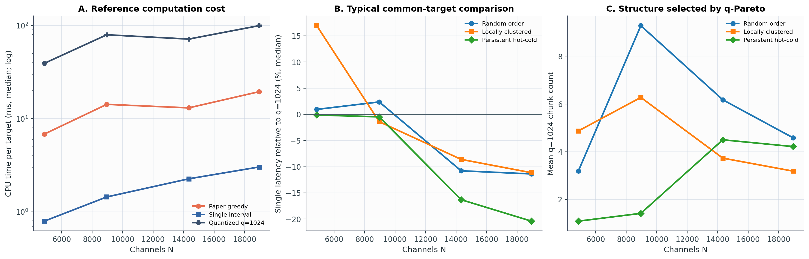
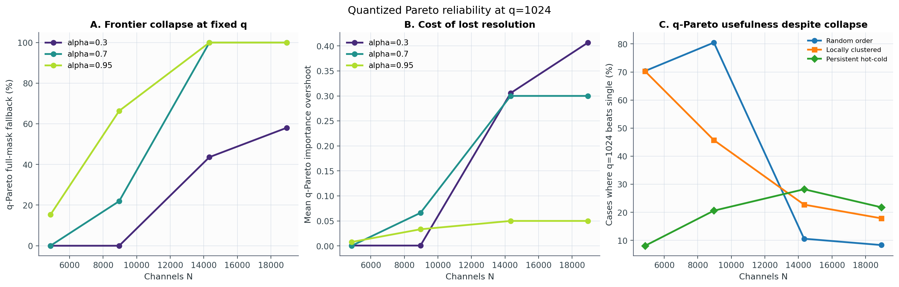

# Experiment 05: 현실적인 channel 수에서의 비교

## 질문

실험 4의 `N=256` 대신 논문의 실제 down-projection 크기에 가까운 channel 수를
사용했을 때 다음 세 방법이 어떻게 달라지는지 측정했다.

1. Paper greedy
2. Single interval `O(N)`
3. Quantized Pareto `q=1024`

이 크기에서 기존 Exact Coverage DP는 계산량이 지나치게 크므로 제외했다.
중요한 점은 **Quantized Pareto도 exact oracle이 아니라 근사 알고리즘**이라는
것이다. 따라서 이 실험은 세 방법의 feasible solution을 비교하지만 optimality
gap을 측정하지는 않는다.

## 설정

| Model family | Matrix shape | N | FP16 row | AGX `(start, jump)` |
|---|---:|---:|---:|---:|
| LLaVA-OneVision-0.5B | 4,864 × 896 | 4,864 | 1.75 KiB | (12, 16) KiB |
| NVILA-Lite-2B | 8,960 × 1,536 | 8,960 | 3 KiB | (16, 16) KiB |
| VILA1.5-8B | 14,336 × 4,096 | 14,336 | 8 KiB | (32, 32) KiB |
| LLaVA-OneVision-7B / LongVA-7B | 18,944 × 3,584 | 18,944 | 7 KiB | (32, 32) KiB |

- CV: `1.07, 1.25, 1.44, 2.48, 3.30, 4.55, 9.19`
- 배열 순서: random, local clustering, hot–cold
- CV별 독립 importance multiset: 20개
- common coverage target: `0.10, 0.30, 0.50, 0.70, 0.90, 0.95, 0.99`
- Paper budget fraction: `0.125`부터 `0.875`까지 7개
- 각 N에서 ordered input 420개, common-coverage 비교 2,940개

importance는 목표 CV에 맞춘 synthetic lognormal 값이다. 즉 **행렬 크기와
I/O 파라미터는 현실화했지만 activation 자체는 실제 모델 trace가 아니다.**

Latency는 논문의 Orin AGX 측정치에 affine model

\[
L(S)=aK(S)+c|S|
\]

을 맞춘 값이다. 여기서 `K`는 선택한 chunk 수, `|S|`는 읽은 row 수다. CPU
solver runtime과 이 predicted I/O latency는 서로 다른 측정값이다.

## 전체 결과

| N | `a/c` (rows) | Single runtime median | Paper runtime median | q=1024 one-query median | q=1024 amortized median* |
|---:|---:|---:|---:|---:|---:|
| 4,864 | 44.96 | 0.854 ms | 6.834 ms | 39.24 ms | 4.20 ms |
| 8,960 | 26.23 | 1.573 ms | 14.256 ms | 79.21 ms | 7.77 ms |
| 14,336 | 9.84 | 2.496 ms | 13.071 ms | 73.01 ms | 5.59 ms |
| 18,944 | 11.24 | 3.294 ms | 19.488 ms | 100.69 ms | 7.46 ms |

`*` q frontier build 비용을 동일 input의 14개 query에 나눈 값이다. 실제로 한
target만 푼다면 one-query 시간이 맞다. Runtime은 현재 CPU 단일 프로세스
구현의 참고치이며 알고리즘의 하드웨어 독립적인 성능은 아니다.

Single interval은 모든 N에서 가장 빠르다. q-Pareto는 frontier를 매번 새로
만들면 Paper보다 약 5–7배 느리다. 다수 target에서 frontier를 재사용할 때만
amortized runtime이 Paper와 비슷하거나 더 작아진다.

## q=1024의 신뢰성 문제

| N | q가 full mask를 반환 | q가 single보다 낮은 latency | median `(L_single/L_q - 1)` | q chunk 평균 |
|---:|---:|---:|---:|---:|
| 4,864 | 8.49% | 49.56% | 0.00% | 3.05 |
| 8,960 | 30.40% | 48.93% | 0.00% | 5.66 |
| 14,336 | 76.87% | 20.52% | -11.12% | 4.80 |
| 18,944 | 81.35% | 15.99% | -13.58% | 4.00 |

`q=1024`를 고정한 채 N만 키우면 importance 한 row가 차지하는 bucket 폭이
너무 작아진다. DP가 target 근처의 부분해를 충분히 보존하지 못하고 feasible
state를 찾지 못하면 full mask로 fallback한다. Coverage별 full-mask 비율은
다음처럼 악화된다.

| N | α=.10 | α=.30 | α=.50 | α=.70 | α=.90 | α=.95 | α=.99 |
|---:|---:|---:|---:|---:|---:|---:|---:|
| 4,864 | 0.0% | 0.0% | 0.0% | 0.0% | 0.8% | 15.3% | 43.3% |
| 8,960 | 0.0% | 0.0% | 0.3% | 21.9% | 36.9% | 66.4% | 87.2% |
| 14,336 | 17.8% | 43.6% | 76.7% | 100% | 100% | 100% | 100% |
| 18,944 | 26.1% | 58.1% | 85.3% | 100% | 100% | 100% | 100% |

따라서 큰 N에서 q의 평균 chunk 수가 다시 작아지는 것은 문제가 단순해졌다는
뜻이 아니다. full mask도 하나의 chunk로 세기 때문에 생긴 착시다. 특히
`N=14,336`과 `18,944`에서 Quantized 1024를 optimal solution의 대체물로
사용해서는 안 된다.

컴파일된 q-Pareto 구현은 작은 randomized case 및 `N=64, 256, q=1024`에서
기존 Python recurrence와 mask가 일치하도록 검증했다. 위 현상은 구현을
Numba로 옮기며 생긴 차이가 아니라 고정된 quantization 해상도의 한계다.

## 해의 품질

common coverage target에서 q가 single interval보다 낮은 latency를 찾은 비율은
`N=4,864`와 `8,960`에서 약 49%다. 이는 실제 크기에서도 “항상 하나의 chunk가
최선”은 아니라는 feasible counterexample이다. 특히 locally clustered
importance에서는 여러 짧은 hot region을 고르는 이점이 크다.

반면 `N=14,336`과 `18,944`에서는 q의 full-mask fallback이 비교 자체를 크게
오염시킨다. 이 구간에서 single이 q보다 좋아 보인다는 결과를 single의
optimality 증거로 해석할 수 없다.

Paper가 실제로 달성한 importance를 target으로 다시 single과 q를 푼 paired
비교는 다음과 같다. 양수는 Paper latency가 q보다 크다는 뜻이다.

| N | mean `(L_paper/L_q - 1)` | q가 Paper보다 낮은 비율 |
|---:|---:|---:|
| 4,864 | +25.15% | 98.13% |
| 8,960 | +4.93% | 64.88% |
| 14,336 | -31.06% | 14.05% |
| 18,944 | -33.50% | 11.59% |

마지막 두 행은 Paper가 본질적으로 더 좋은 알고리즘이라는 결론이 아니다.
q가 full mask를 과도하게 반환하기 때문에 나타나는 결과다. 반대로 처음 두
행에서는 Quantized 1024가 Paper의 attained importance 이상을 보존하면서 더
낮은 I/O latency를 자주 찾는다.

## 결론

1. 현실적인 N에서는 single interval이 매우 빠르고 안정적인 baseline이지만,
   다중 chunk가 더 좋은 입력이 적지 않으므로 일반 문제의 exact solver는 아니다.
2. `q=1024`는 `N=4,864` 정도에서는 유용한 비교 대상이지만, N이 커질수록
   quantization 해상도가 부족해진다.
3. 특히 `N≥14,336`에서는 full-mask 비율 때문에 Quantized 1024를 exact
   optimum의 대리 지표로 쓰면 안 된다.
4. 다음 단계는 q를 N 또는 effective support에 비례시켜 키우거나, target
   주변 bucket을 더 촘촘히 유지하는 adaptive quantization을 시험하는 것이다.
5. 정확한 최적성 비교가 필요하면 작은 N에서 exact DP로 calibration한 뒤,
   현실적인 N에서는 lower/upper bound를 함께 보고해야 한다.

## N별 결과

| N | Frontier | R–importance | R–latency | q chunk distribution | Raw summary |
|---:|---|---|---|---|---|
| 4,864 | [PDF](results/n_4864/importance_latency_frontiers.pdf) | [PDF](results/n_4864/r_importance.pdf) | [PDF](results/n_4864/r_latency.pdf) | [PDF](results/n_4864/quant_chunk_distribution.pdf) | [JSON](results/n_4864/summary.json) |
| 8,960 | [PDF](results/n_8960/importance_latency_frontiers.pdf) | [PDF](results/n_8960/r_importance.pdf) | [PDF](results/n_8960/r_latency.pdf) | [PDF](results/n_8960/quant_chunk_distribution.pdf) | [JSON](results/n_8960/summary.json) |
| 14,336 | [PDF](results/n_14336/importance_latency_frontiers.pdf) | [PDF](results/n_14336/r_importance.pdf) | [PDF](results/n_14336/r_latency.pdf) | [PDF](results/n_14336/quant_chunk_distribution.pdf) | [JSON](results/n_14336/summary.json) |
| 18,944 | [PDF](results/n_18944/importance_latency_frontiers.pdf) | [PDF](results/n_18944/r_importance.pdf) | [PDF](results/n_18944/r_latency.pdf) | [PDF](results/n_18944/quant_chunk_distribution.pdf) | [JSON](results/n_18944/summary.json) |

전체 aggregate 수치는 [`results/summary.json`](results/summary.json)에 있다.
