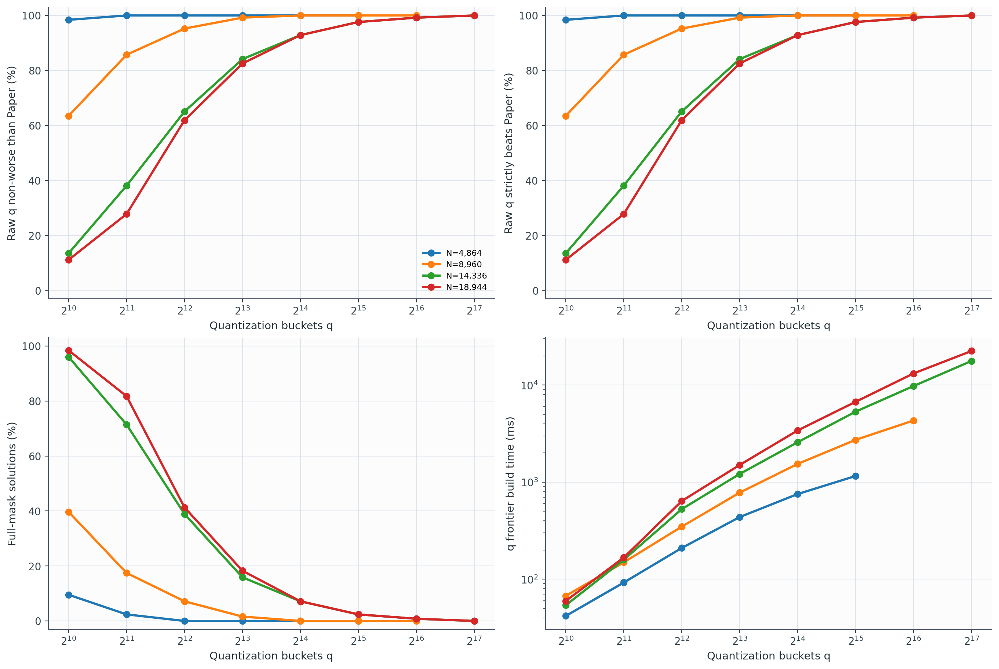

# Experiment 06: 현실적인 N에서 Top-R과 필요한 q 규모

## 목적

실험 5를 다음 세 가지 방향으로 다시 수행했다.

1. chunk 결과를 `K=1` 비율이 아니라 `x=chunk count K`, `y=solution fraction`인
   실제 히스토그램으로 표시한다.
2. Paper greedy, single interval, Quantized Pareto에 Top-R을 추가한다.
3. q를 최대 131,072까지 키워 Paper가 달성한 importance 이상을 보존하면서
   I/O latency가 Paper보다 안정적으로 낮아지는 데 필요한 규모를 찾는다.

Exact Coverage DP는 현실적인 N에서 계산할 수 없어 사용하지 않았다. 따라서
Quantized Pareto가 exact optimum이라는 주장은 하지 않는다.

## 실험 설정

| Model family | N | FP16 row | q sweep |
|---|---:|---:|---|
| LLaVA-OneVision-0.5B | 4,864 | 1.75 KiB | 1,024–32,768 |
| NVILA-Lite-2B | 8,960 | 3 KiB | 1,024–65,536 |
| VILA1.5-8B | 14,336 | 8 KiB | 1,024–131,072 |
| LLaVA-OneVision-7B / LongVA-7B | 18,944 | 7 KiB | 1,024–131,072 |

- VLM CV: `1.07, 1.25, 1.44, 2.48, 3.30, 4.55`
- 별도 stress test: ReLU OPT CV `9.19`
- ordering: random, locally clustered, persistent hot–cold
- Paper budget: `0.125N`부터 `0.875N`까지 7개
- latency: Orin AGX 자료에 맞춘 `aK+cR` affine model
- full q sweep: CV별 multiset 1개
- threshold validation: 별도 seed로 CV별 multiset 2개 추가

선택된 q의 최종 VLM 검증은 N마다

\[
3\text{ multisets}\times6\text{ CV}\times3\text{ orderings}
\times7\text{ budgets}=378
\]

개의 Paper-matched 사례로 구성된다.

“안정적으로 우수”는 full sweep에서 다음 조건을 처음 모두 만족하는 q로
정의했다.

- Paper와 같은 importance target을 만족
- 모든 VLM 사례에서 latency가 Paper 이하
- 최소 95%에서 strict-better
- latency gain의 5-percentile이 음수가 아님

선택된 q는 추가 252개 독립 사례에서도 다시 검증했다.

## 구현 및 복잡도

q sweep은 실험 5와 동일한 Quantized Pareto recurrence를 사용한다. 다만 큰 q를
실행할 수 있도록 mask parent를 저장하지 않고 최종 importance, rows, chunks,
latency만 보존했다.

- 시간: `O(Nq)`
- 메모리: `O(q)`
- 제한: 최종 mask 자체는 복원하지 않음

작은 randomized input에서 기존 mask-reconstructing 구현과 importance, rows,
chunks, latency가 일치함을 확인했다.

Top-R은 fixed-R에서는 상위 R개 row를 선택하고, coverage 비교에서는 target을
넘기는 최소 개수의 상위 row를 선택한다. 정렬 전처리는 `O(N log N)`이고,
정렬된 배열에서 R을 찾는 것은 매우 저렴하다.

## q–정확성–비용 결과

### 필요한 q

| N | 선택 q | q/N | 결합 검증 | 실패 | Paper가 q보다 높은 latency* | q build median |
|---:|---:|---:|---:|---:|---:|---:|
| 4,864 | **2,048** | 0.42 | 378/378 strict-win | 0 | mean 28.19%, p05 11.92% | 91.7 ms |
| 8,960 | **16,384** | 1.83 | 378/378 strict-win | 0 | mean 19.06%, p05 9.37% | 1.53 s |
| 14,336 | **131,072** | 9.14 | 378/378 strict-win | 0 | mean 16.59%, p05 6.34% | 18.19 s |
| 18,944 | **131,072** | 6.92 | 378/378 strict-win | 0 | mean 16.29%, p05 6.76% | 23.76 s |

`*` `100 × (L_paper/L_quant - 1)`. 예를 들어 16.29%는 Quant가 Paper보다
16.29% 작다는 뜻이 아니라, Paper latency가 Quant latency보다 16.29% 크다는
뜻이다.

결합 검증의 최소 gain도 각각 `3.16%, 0.09%, 3.24%, 3.69%`로 모두
양수였다. 즉 관측된 VLM 사례에서는 단순히 평균만 이긴 것이 아니라 모든
사례에서 strict-better였다.

그러나 필요한 q는 N에 선형 비례하는 정도를 넘어 입력에 따라 `7–9N`까지
증가했다. 이는 `q=1024`를 현실적인 N에 고정하는 접근이 충분하지 않음을
재확인한다.

| N | q=1,024 non-worse | q=1,024 full mask | 선택 q |
|---:|---:|---:|---:|
| 4,864 | 98.4% | 9.5% | 2,048 |
| 8,960 | 63.5% | 39.7% | 16,384 |
| 14,336 | 13.5% | 96.0% | 131,072 |
| 18,944 | 11.1% | 98.4% | 131,072 |

### 계산비 해석

선택 q의 build median과 Paper solver runtime median을 비교하면 다음과 같다.

| N | Paper runtime median | Quant build median | 대략적인 배수 |
|---:|---:|---:|---:|
| 4,864 | 9.10 ms | 91.7 ms | 10× |
| 8,960 | 16.25 ms | 1.53 s | 94× |
| 14,336 | 14.47 ms | 18.19 s | 1,258× |
| 18,944 | 21.21 ms | 23.76 s | 1,120× |

이 runtime은 각 solver가 단일 프로세스로 동작하되 여러 N의 실험을 같은
호스트에서 동시에 실행한 reference wall time이다. 절대적인 하드웨어
benchmark로 해석하기보다 계산량 차이를 보여주는 지표로 해석해야 한다.

따라서 충분히 큰 q는 해의 I/O latency를 확실히 개선하지만, 현재 `O(Nq)`
구현은 큰 모델에서 online selection용으로 실용적이지 않다. 여러 target이
같은 importance vector를 공유하면 frontier build를 amortize할 수 있지만,
초 단위 build 비용 자체는 남는다. 현재 결과에서 high-q Pareto는 빠른
replacement라기보다 **Paper보다 좋은 feasible solution을 제공하는 offline
oracle**에 가깝다.

## Top-R 결과

같은 R에서 Top-R은 정의상 importance를 가장 크게 만든다.

| N | fixed-R importance gain over Paper (mean) |
|---:|---:|
| 4,864 | +25.16% |
| 8,960 | +20.43% |
| 14,336 | +13.55% |
| 18,944 | +14.64% |

하지만 같은 importance target으로 맞추면 선택 row가 전체 주소 공간에
흩어져 chunk 수가 폭증한다.

| N | Paper median K | Top-R median K | Selected-q median K | Top-R latency over Paper (mean) |
|---:|---:|---:|---:|---:|
| 4,864 | 24.0 | 382.5 | 3.0 | +577% |
| 8,960 | 48.5 | 771.0 | 10.0 | +368% |
| 14,336 | 166.0 | 1,475.5 | 51.0 | +128% |
| 18,944 | 191.0 | 1,920.5 | 58.5 | +152% |

Top-R의 CPU 계산은 매우 빠르다. 정렬 build median은 N에 따라 약
`0.31–1.26 ms`, target query는 약 `0.05–0.09 ms`였다. 그러나 이 문제에서
중요한 I/O latency는 Paper보다 훨씬 나쁘다. 즉 Top-R은 “싸고 importance는
높지만 locality를 완전히 무시하는” 유용한 negative baseline이다.

## Chunk-count histogram

각 N의 `chunk_count_histograms.pdf`는 위쪽 행에 선택된 최소 안정 q의 실제
K histogram을, 아래쪽 행에 Paper/Top-R/Quant의 log-scale histogram을
표시한다. 모든 막대의 세로축은 해당 방법의 solution fraction이다.

- [N=4,864](results/n_4864/chunk_count_histograms.pdf)
- [N=8,960](results/n_8960/chunk_count_histograms.pdf)
- [N=14,336](results/n_14336/chunk_count_histograms.pdf)
- [N=18,944](results/n_18944/chunk_count_histograms.pdf)

이 결과는 `K=1`만 보는 것보다 구조를 훨씬 분명히 보여준다. Quant는
hot–cold ordering에서는 소수 chunk에 집중하고, random/local ordering에서는
여러 chunk를 사용한다. Top-R은 모든 ordering에서 수백–수천 chunk로
fragmentation된다.

## 결론

1. **해의 품질만 보면** 충분히 큰 Quantized Pareto는 관측된 모든 VLM
   사례에서 Paper보다 안정적으로 좋았다.
2. 하지만 필요한 q가 큰 N에서 `131,072`까지 증가했고 CPU build가
   `18–24초` 걸렸다. 현재 방식은 Paper를 대체할 online 알고리즘이 아니다.
3. **Top-R은 더 빠르지만 답이 아니다.** 같은 R에서 importance는 높지만
   chunk fragmentation 때문에 I/O latency가 Paper보다 2–7배가량 크다.
4. 다음 알고리즘 목표는 high-q 결과의 품질을 유지하면서 state를 target
   주변에만 배치하는 adaptive/nonuniform quantization 또는 Paper 해를
   incumbent로 사용하는 bounded refinement다.
5. `q=131072`의 안정성은 여기서 사용한 synthetic VLM-CV 표본에 대한
   경험적 결과이지 모든 입력에 대한 수학적 보장은 아니다. CV 9.19의 ReLU
   OPT stress test까지 포함하면 큰 두 N에서 각각 1건과 2건의 실패가 남았다.

## 결과 파일

- [Aggregate summary](results/summary.json)
- [Threshold validation summary](results/threshold_validation_summary.json)
- [q trade-off PDF](results/q_scale_tradeoff.pdf)

각 `results/n_<N>/` 디렉터리에는 다음 파일이 있다.

- `coverage_trials.csv`
- `paper_matched_trials.csv`
- `fixed_r_trials.csv`
- `input_q_trials.csv`
- `importance_latency_frontiers.{png,pdf}`
- `r_importance.{png,pdf}`
- `r_latency.{png,pdf}`
- `chunk_count_histograms.{png,pdf}`
- `summary.json`
