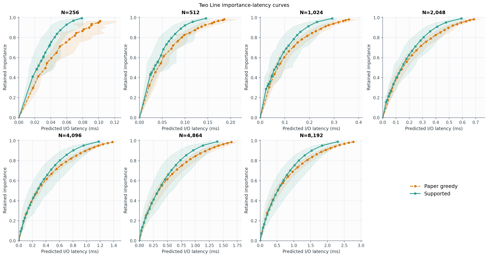
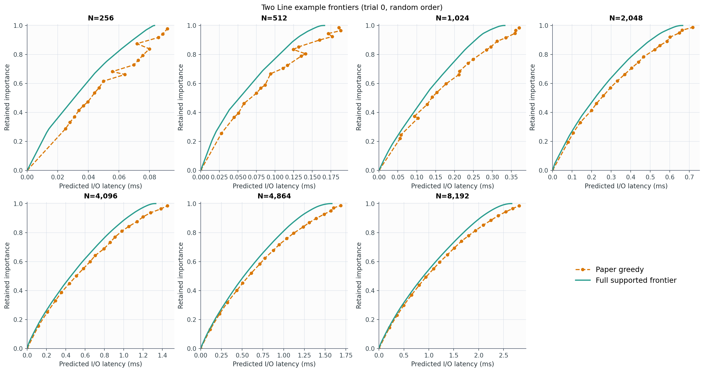
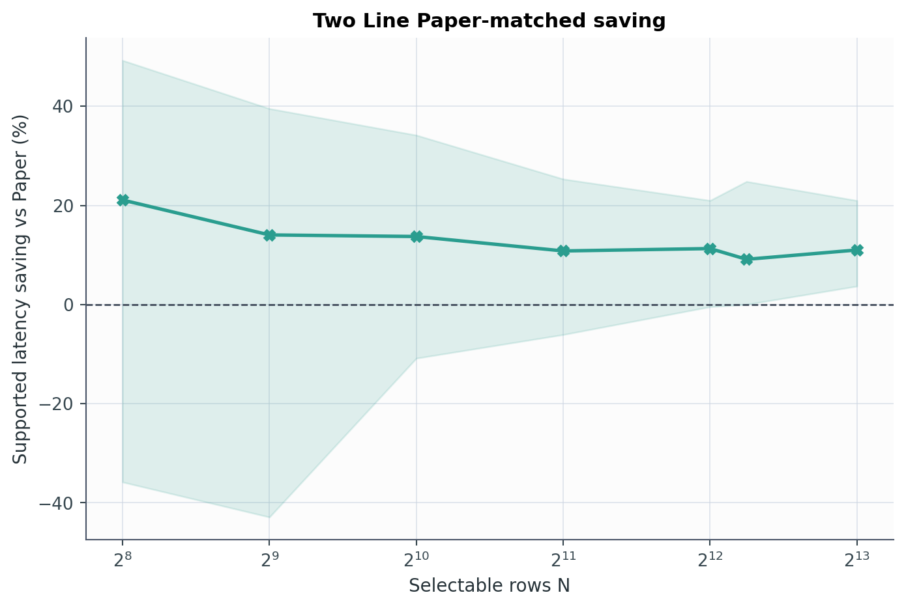
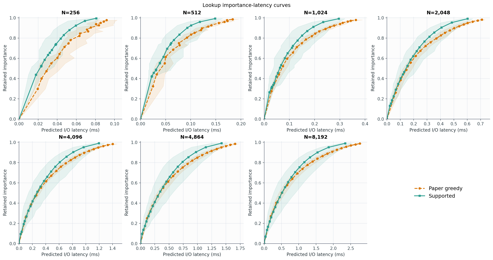
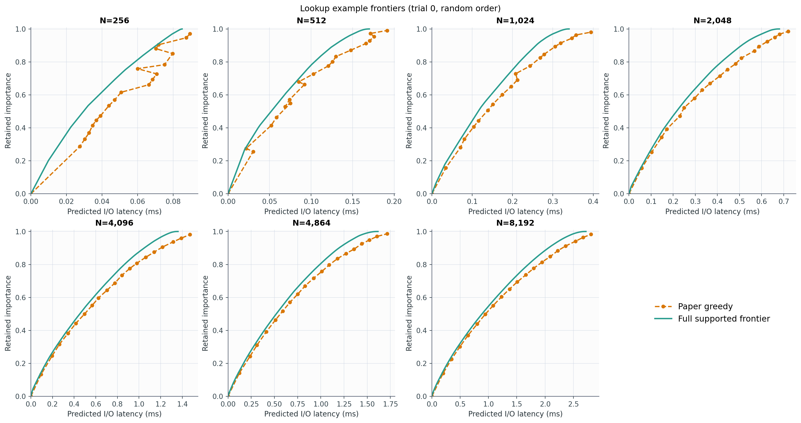
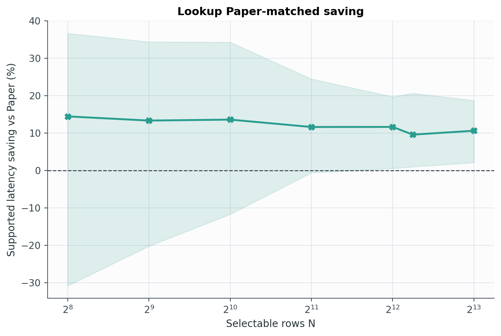

# Experiment 17 보고서: N별 importance-latency 곡선

Paper greedy와 complete supported frontier를 두 latency model에서 각각 비교했다.
모든 latency는 실제 I/O 측정값이 아니라 해당 모델의 predicted I/O latency다.

## Two Line latency model

| N | Supported points H | Solves P | 평균 절감 | 중앙값 절감 | 승률 |
|---:|---:|---:|---:|---:|---:|
| 256 | 17.4 | 33.9 | 15.68% | 21.09% | 80.7% |
| 512 | 43.8 | 86.6 | 9.61% | 14.05% | 77.8% |
| 1,024 | 86.1 | 171.2 | 12.38% | 13.73% | 87.1% |
| 2,048 | 176.1 | 351.2 | 10.03% | 10.81% | 85.4% |
| 4,096 | 341.6 | 682.1 | 10.98% | 11.30% | 94.2% |
| 4,864 | 397.0 | 793.0 | 10.84% | 9.12% | 94.7% |
| 8,192 | 688.4 | 1375.9 | 11.19% | 11.01% | 96.5% |

## Lookup latency model

| N | Supported points H | Solves P | 평균 절감 | 중앙값 절감 | 승률 |
|---:|---:|---:|---:|---:|---:|
| 256 | 16.8 | 32.6 | 9.05% | 14.45% | 74.9% |
| 512 | 35.1 | 69.2 | 10.38% | 13.33% | 80.1% |
| 1,024 | 71.6 | 142.1 | 11.81% | 13.59% | 86.0% |
| 2,048 | 138.0 | 275.0 | 11.54% | 11.62% | 94.7% |
| 4,096 | 277.6 | 554.1 | 11.23% | 11.63% | 95.9% |
| 4,864 | 330.2 | 659.4 | 10.24% | 9.57% | 97.1% |
| 8,192 | 557.0 | 1113.0 | 10.74% | 10.62% | 97.1% |

## 해석

Supported 곡선은 동일 importance에서 Paper보다 왼쪽에 있을수록 좋다. Paper-matched 표와 saving 그림은 각 Paper point가 달성한 importance를 target으로 supported point를 다시 선택해 계산했으므로, 서로 다른 importance를 직접 비교하는 오류를 피한다.

