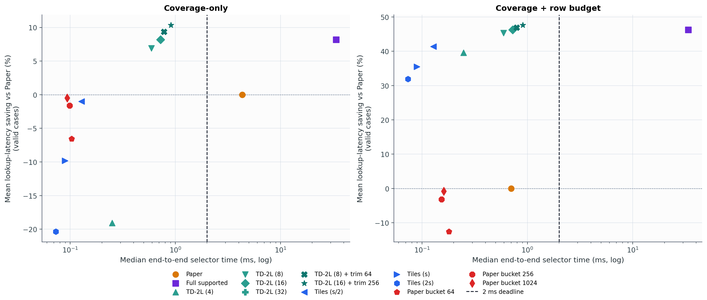
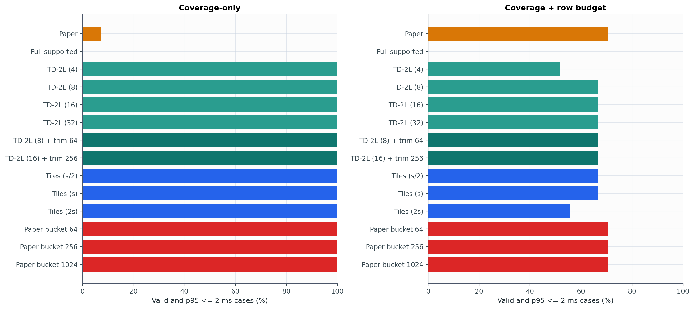

# Experiment 18 보고서: 2 ms selector 후보 1차 스크리닝

이 실험은 2 ms 달성을 확인하는 Jetson 측정이 아니라, 현재 host에서 후보를 구현하고 탈락 조건을 찾는 1차 스크리닝이다. 실제 I/O와 compute는 selector 시간에 포함하지 않았으며 별도의 predicted I/O latency로 평가했다.

## 실행 설정

- 후보 및 reference: 정확히 14개
- deadline: per-case 반복 측정 p95 <= 2 ms
- runtime 포함: candidate 구성, DP 호출, mask 복원, trim, fallback, CPU mask handoff
- runtime 제외: 최초 JIT/native compile, importance 생성, 실제 storage I/O와 compute
- coverage-only와 coverage+row-budget 결과를 별도로 집계

## Coverage-only

| 방법 | 중앙 runtime | case-p95 | 유효률(전체) | 유효+2ms(전체) | feasible 중 유효+2ms | Paper 대비 lookup 절감 | supported 개선 회수 |
|---|---:|---:|---:|---:|---:|---:|---:|
| Paper | 4.319 ms | 9.831 ms | 100.0% | 7.4% | 7.4% | 0.00% | 0.0% |
| Full supported | 33.719 ms | 75.995 ms | 100.0% | 0.0% | 0.0% | 8.17% | 100.0% |
| TD-2L (4) | 0.250 ms | 0.419 ms | 100.0% | 100.0% | 100.0% | -19.08% | -124.4% |
| TD-2L (8) | 0.591 ms | 0.698 ms | 100.0% | 100.0% | 100.0% | 6.92% | 89.7% |
| TD-2L (16) | 0.723 ms | 0.907 ms | 100.0% | 100.0% | 100.0% | 8.17% | 100.0% |
| TD-2L (32) | 0.727 ms | 0.934 ms | 100.0% | 100.0% | 100.0% | 8.17% | 100.0% |
| TD-2L (8) + trim 64 | 0.778 ms | 0.980 ms | 100.0% | 100.0% | 100.0% | 9.35% | 108.8% |
| TD-2L (16) + trim 256 | 0.908 ms | 1.156 ms | 100.0% | 100.0% | 100.0% | 10.36% | 116.0% |
| Tiles (s/2) | 0.128 ms | 0.165 ms | 100.0% | 100.0% | 100.0% | -1.01% | 14.8% |
| Tiles (s) | 0.089 ms | 0.119 ms | 100.0% | 100.0% | 100.0% | -9.80% | -50.1% |
| Tiles (2s) | 0.073 ms | 0.093 ms | 100.0% | 100.0% | 100.0% | -20.34% | -126.9% |
| Paper bucket 64 | 0.103 ms | 0.209 ms | 100.0% | 100.0% | 100.0% | -6.55% | -80.5% |
| Paper bucket 256 | 0.099 ms | 0.201 ms | 100.0% | 100.0% | 100.0% | -1.61% | -17.2% |
| Paper bucket 1024 | 0.094 ms | 0.197 ms | 100.0% | 100.0% | 100.0% | -0.48% | -4.9% |

## Coverage + row budget

| 방법 | 중앙 runtime | case-p95 | 유효률(전체) | 유효+2ms(전체) | feasible 중 유효+2ms | Paper 대비 lookup 절감 | supported 개선 회수 |
|---|---:|---:|---:|---:|---:|---:|---:|
| Paper | 0.701 ms | 1.085 ms | 70.4% | 70.4% | 70.4% | 0.00% | 0.0% |
| Full supported | 33.552 ms | 74.022 ms | 66.7% | 0.0% | 0.0% | 46.25% | 100.0% |
| TD-2L (4) | 0.247 ms | 0.412 ms | 51.9% | 51.9% | 51.9% | 39.60% | 82.0% |
| TD-2L (8) | 0.593 ms | 0.715 ms | 66.7% | 66.7% | 66.7% | 45.37% | 98.2% |
| TD-2L (16) | 0.724 ms | 0.923 ms | 66.7% | 66.7% | 66.7% | 46.25% | 100.0% |
| TD-2L (32) | 0.723 ms | 0.969 ms | 66.7% | 66.7% | 66.7% | 46.25% | 100.0% |
| TD-2L (8) + trim 64 | 0.789 ms | 0.970 ms | 66.7% | 66.7% | 66.7% | 46.91% | 101.2% |
| TD-2L (16) + trim 256 | 0.904 ms | 1.125 ms | 66.7% | 66.7% | 66.7% | 47.65% | 102.5% |
| Tiles (s/2) | 0.129 ms | 0.206 ms | 66.7% | 66.7% | 66.7% | 41.40% | 88.6% |
| Tiles (s) | 0.089 ms | 0.116 ms | 66.7% | 66.7% | 66.7% | 35.52% | 75.6% |
| Tiles (2s) | 0.074 ms | 0.106 ms | 55.6% | 55.6% | 55.6% | 31.89% | 66.3% |
| Paper bucket 64 | 0.181 ms | 0.439 ms | 70.4% | 70.4% | 70.4% | -12.56% | -31.8% |
| Paper bucket 256 | 0.153 ms | 0.399 ms | 70.4% | 70.4% | 70.4% | -3.20% | -9.5% |
| Paper bucket 1024 | 0.161 ms | 0.392 ms | 70.4% | 70.4% | 70.4% | -0.77% | -2.3% |

## 주요 결과

- `TD-2L (8)`은 case-p95 `0.698 ms`에서 full supported가 제공한 lookup 개선의 `89.7%`를 회수했다.
- `TD-2L (16)`은 최대 `12`회 호출 안에 모든 사례에서 full supported와 같은 품질에 도달했고 case-p95는 `0.907 ms`였다. 32회 설정은 추가 품질 개선이 없었다.
- endpoint trim 256은 coverage를 모두 유지하면서 Paper 대비 lookup latency를 평균 `10.36%` 줄였다. full supported의 `8.17%`보다 큰 이유는 trim 결과가 supported point에 한정되지 않기 때문이다.
- 가장 빠른 tiles/bucket 계열은 약 `0.08--0.14 ms`였지만, coverage-only lookup 품질은 Paper보다 같거나 나빴다. Bucket 수를 1,024까지 늘려도 평균 개선은 양수가 되지 않았다.
- row-budget의 세 `(Q,R)` 조합은 top-R 기준으로 모두 이론적으로 가능했지만, 가장 높은 전체 유효률은 Paper와 bucket 계열의 `70.4%`였다. 따라서 coverage-directed mask를 그대로 쓰는 것만으로는 row cap을 해결하지 못한다.

## 판정 규칙

평균이 2 ms 미만이어도 통과로 세지 않았다. 각 input/scenario에서 반복 측정 p95가 2 ms 이하여야 하며, coverage-only에서는 Q를 만족해야 한다. row-budget track에서는 Q와 R을 동시에 만족해야 한다. 실패와 fallback 사례도 분모에 남겼다.

