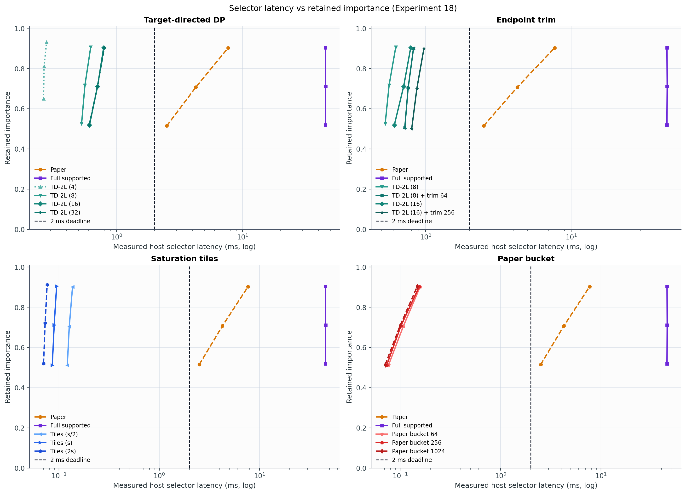
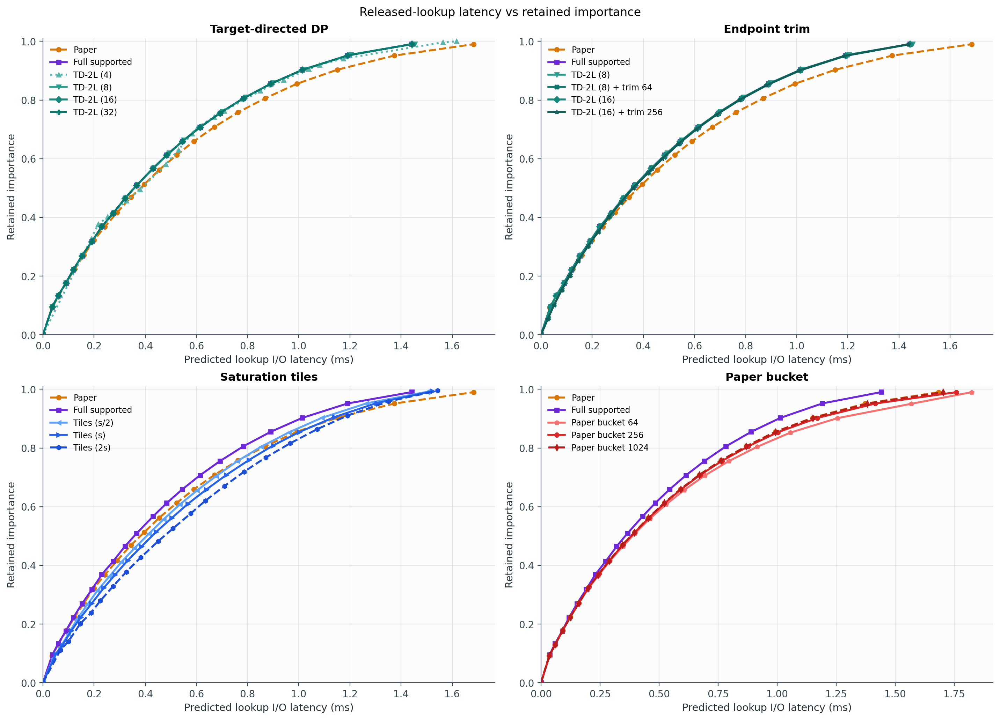
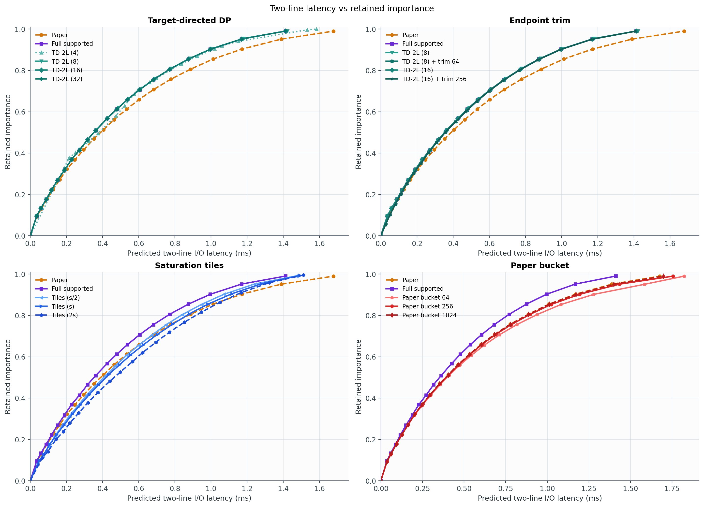
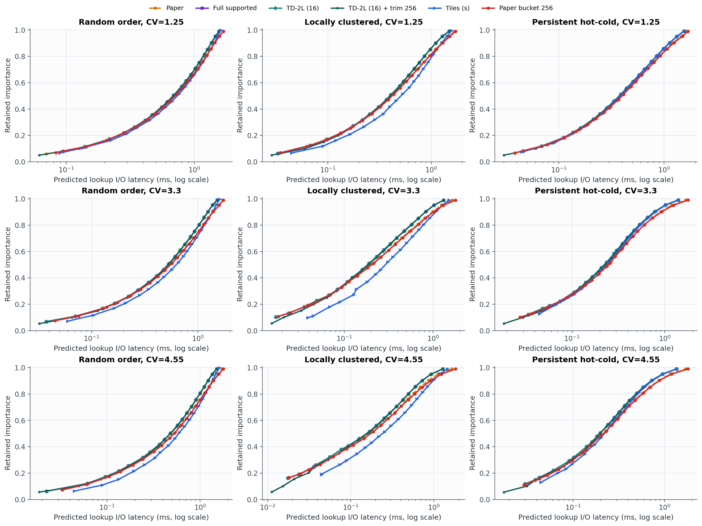
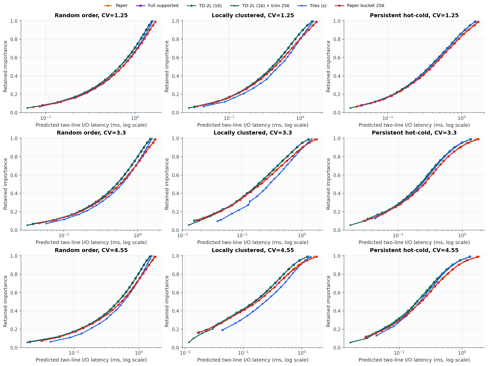

# Experiment 19 보고서: latency–importance curves

모든 그림은 가로축이 latency, 세로축이 retained importance다. Selector latency와 predicted I/O latency는 서로 다른 그림으로 분리했다.

## Lookup-model I/O curve summary

| 방법 | Paper 대비 평균 절감 | Paper 승률 | supported 대비 평균 절감 |
|---|---:|---:|---:|
| Paper | 0.00% | 0.0% | -9.39% |
| Full supported | 7.33% | 87.4% | 0.00% |
| TD-2L (4) | -84.67% | 17.0% | -99.18% |
| TD-2L (8) | 6.38% | 84.6% | -1.06% |
| TD-2L (16) | 7.33% | 87.4% | 0.00% |
| TD-2L (32) | 7.33% | 87.4% | 0.00% |
| TD-2L (8) + trim 64 | 11.15% | 95.7% | 3.63% |
| TD-2L (16) + trim 256 | 12.17% | 97.4% | 4.60% |
| Tiles (s/2) | -4.15% | 43.9% | -13.10% |
| Tiles (s) | -17.71% | 34.3% | -27.93% |
| Tiles (2s) | -43.06% | 24.4% | -55.57% |
| Paper bucket 64 | -3.36% | 26.1% | -13.05% |
| Paper bucket 256 | -1.01% | 33.9% | -10.40% |
| Paper bucket 1024 | -0.07% | 23.3% | -9.47% |

## 해석

Dense target sweep에서도 TD-2L (16)은 full supported 대비 평균 `0.000%` 차이다. TD-2L (16)+trim256은 supported보다 lookup latency를 평균 `4.60%` 더 줄인다. 이는 trim mask가 strongly-supported point에 제한되지 않기 때문이다.

Selector latency plot의 2 ms 선은 host pre-screen 기준이며 Jetson 측정 결과가 아니다. Lookup/two-line 그림의 x축은 predicted I/O latency이므로 2 ms selector deadline과 직접 비교하면 안 된다.

## CV × spatial-mode frontiers

각 행은 CV 1.25/3.30/4.55, 각 열은 Random order/Locally clustered/Persistent hot-cold다. 아래 주 그림은 각 후보 계열의 대표 설정을 비교하며, 모든 설정은 `results/conditioned/`의 계열별 그림에 포함했다.

