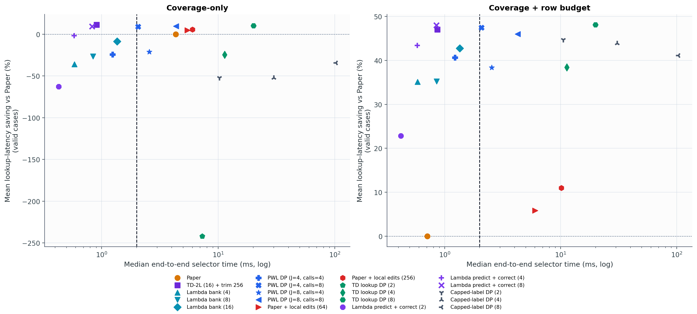
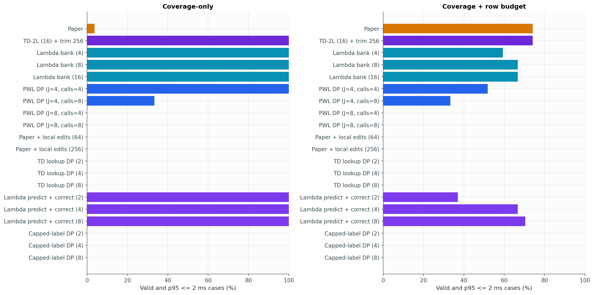

# Experiment 20 보고서: 남은 sub-2 ms 후보

실험 18에서 다루지 않은 여섯 후보 계열 18개 설정과 Paper/현 incumbent를 동일한 측정 계약으로 비교한다. Q는 외부 입력이며 실제 I/O와 compute는 selector 시간에서 제외된다. 따라서 이 결과는 host screening이지 Jetson 2 ms 확인이 아니다.

## Coverage-only

| 방법 | 중앙 runtime | case-p95 | 유효률 | 유효+2ms | Paper 대비 lookup | incumbent 대비 lookup | fallback |
|---|---:|---:|---:|---:|---:|---:|---:|
| Paper | 4.333 ms | 9.833 ms | 100.0% | 3.7% | 0.00% | -12.97% | 0.0% |
| TD-2L (16) + trim 256 | 0.905 ms | 1.266 ms | 100.0% | 100.0% | 11.28% | 0.00% | 0.0% |
| Lambda bank (4) | 0.584 ms | 0.821 ms | 100.0% | 100.0% | -36.05% | -52.42% | 0.0% |
| Lambda bank (8) | 0.845 ms | 1.154 ms | 100.0% | 100.0% | -26.47% | -41.89% | 0.0% |
| Lambda bank (16) | 1.356 ms | 1.810 ms | 100.0% | 100.0% | -8.54% | -21.93% | 0.0% |
| PWL DP (J=4, calls=4) | 1.245 ms | 1.578 ms | 100.0% | 100.0% | -24.35% | -39.35% | 0.0% |
| PWL DP (J=4, calls=8) | 2.060 ms | 2.494 ms | 100.0% | 33.3% | 8.93% | -2.64% | 0.0% |
| PWL DP (J=8, calls=4) | 2.568 ms | 2.972 ms | 100.0% | 0.0% | -21.22% | -35.85% | 0.0% |
| PWL DP (J=8, calls=8) | 4.341 ms | 5.115 ms | 100.0% | 0.0% | 9.65% | -1.83% | 0.0% |
| Paper + local edits (64) | 5.455 ms | 13.901 ms | 100.0% | 0.0% | 4.88% | -7.40% | 0.0% |
| Paper + local edits (256) | 6.014 ms | 17.496 ms | 100.0% | 0.0% | 5.54% | -6.63% | 0.0% |
| TD lookup DP (2) | 7.288 ms | 8.507 ms | 100.0% | 0.0% | -241.92% | -280.96% | 0.0% |
| TD lookup DP (4) | 11.368 ms | 13.058 ms | 100.0% | 0.0% | -24.54% | -39.60% | 0.0% |
| TD lookup DP (8) | 20.035 ms | 22.756 ms | 100.0% | 0.0% | 10.07% | -1.39% | 0.0% |
| Lambda predict + correct (2) | 0.428 ms | 0.623 ms | 100.0% | 100.0% | -62.62% | -82.26% | 0.0% |
| Lambda predict + correct (4) | 0.582 ms | 0.751 ms | 100.0% | 100.0% | -1.68% | -14.55% | 0.0% |
| Lambda predict + correct (8) | 0.827 ms | 1.055 ms | 100.0% | 100.0% | 9.27% | -2.23% | 0.0% |
| Capped-label DP (2) | 10.213 ms | 11.833 ms | 100.0% | 0.0% | -52.27% | -70.61% | 0.0% |
| Capped-label DP (4) | 29.952 ms | 32.350 ms | 100.0% | 0.0% | -52.27% | -70.61% | 0.0% |
| Capped-label DP (8) | 102.484 ms | 108.844 ms | 100.0% | 0.0% | -34.25% | -51.07% | 0.0% |

## Coverage + row budget

| 방법 | 중앙 runtime | case-p95 | 유효률 | 유효+2ms | Paper 대비 lookup | incumbent 대비 lookup | fallback |
|---|---:|---:|---:|---:|---:|---:|---:|
| Paper | 0.709 ms | 1.184 ms | 74.1% | 74.1% | 0.00% | -105.51% | 25.9% |
| TD-2L (16) + trim 256 | 0.864 ms | 1.210 ms | 74.1% | 74.1% | 47.05% | 0.00% | 0.0% |
| Lambda bank (4) | 0.583 ms | 0.761 ms | 59.3% | 59.3% | 35.12% | -36.99% | 0.0% |
| Lambda bank (8) | 0.851 ms | 1.164 ms | 66.7% | 66.7% | 35.21% | -31.80% | 0.0% |
| Lambda bank (16) | 1.349 ms | 1.796 ms | 66.7% | 66.7% | 42.76% | -16.83% | 0.0% |
| PWL DP (J=4, calls=4) | 1.224 ms | 1.391 ms | 51.9% | 51.9% | 40.62% | -19.53% | 0.0% |
| PWL DP (J=4, calls=8) | 2.070 ms | 2.363 ms | 70.4% | 33.3% | 47.45% | -3.04% | 0.0% |
| PWL DP (J=8, calls=4) | 2.539 ms | 2.948 ms | 59.3% | 0.0% | 38.37% | -18.09% | 0.0% |
| PWL DP (J=8, calls=8) | 4.260 ms | 5.168 ms | 74.1% | 0.0% | 46.01% | -2.17% | 0.0% |
| Paper + local edits (64) | 6.027 ms | 9.463 ms | 74.1% | 0.0% | 5.83% | -92.99% | 25.9% |
| Paper + local edits (256) | 10.144 ms | 27.948 ms | 74.1% | 0.0% | 10.97% | -82.43% | 25.9% |
| TD lookup DP (2) | 7.127 ms | 9.000 ms | 0.0% | 0.0% | n/a | n/a | 0.0% |
| TD lookup DP (4) | 11.294 ms | 13.958 ms | 55.6% | 0.0% | 38.42% | -19.01% | 0.0% |
| TD lookup DP (8) | 19.926 ms | 23.139 ms | 70.4% | 0.0% | 48.10% | -1.23% | 0.0% |
| Lambda predict + correct (2) | 0.419 ms | 0.594 ms | 37.0% | 37.0% | 22.82% | -56.19% | 0.0% |
| Lambda predict + correct (4) | 0.582 ms | 0.775 ms | 66.7% | 66.7% | 43.41% | -16.11% | 0.0% |
| Lambda predict + correct (8) | 0.849 ms | 1.069 ms | 70.4% | 70.4% | 47.97% | -2.22% | 0.0% |
| Capped-label DP (2) | 10.533 ms | 11.922 ms | 33.3% | 0.0% | 44.72% | -4.73% | 66.7% |
| Capped-label DP (4) | 30.717 ms | 32.837 ms | 37.0% | 0.0% | 43.88% | -18.27% | 63.0% |
| Capped-label DP (8) | 103.569 ms | 110.092 ms | 44.4% | 0.0% | 41.13% | -34.23% | 55.6% |

## 판정

Host 기준 모든 coverage case에서 유효하고 p95<=2 ms인 설정 중 lookup 품질 최고는 `TD-2L (16) + trim 256`이며 Paper 대비 평균 `11.28%`다.

남은 여섯 계열만 보면 전 case 2 ms를 통과한 최고 품질 설정은 `Lambda predict + correct (8)`이다. Paper 대비 `9.27%` 절감하지만 incumbent 대비로는 `-2.23%`다.

시간 제한을 무시한 남은 후보의 최고 lookup 품질은 `TD lookup DP (8)`의 Paper 대비 `10.07%`지만, case-p95가 `22.76 ms`라 2 ms 후보가 아니다.

시간 초과, coverage 실패, row-cap 실패, fallback은 제외하지 않고 전체 분모에 남겼다.

