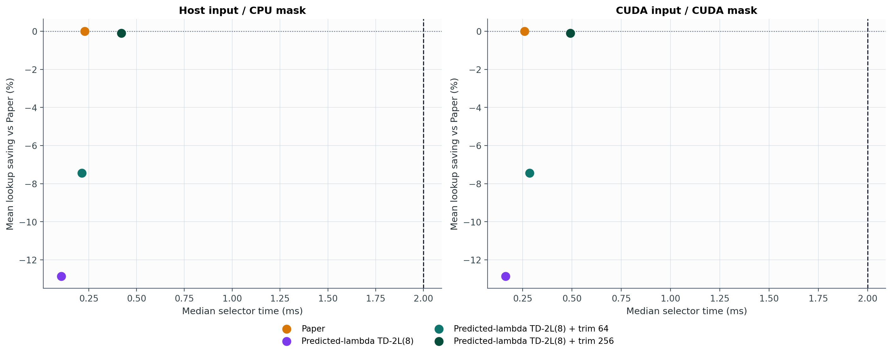
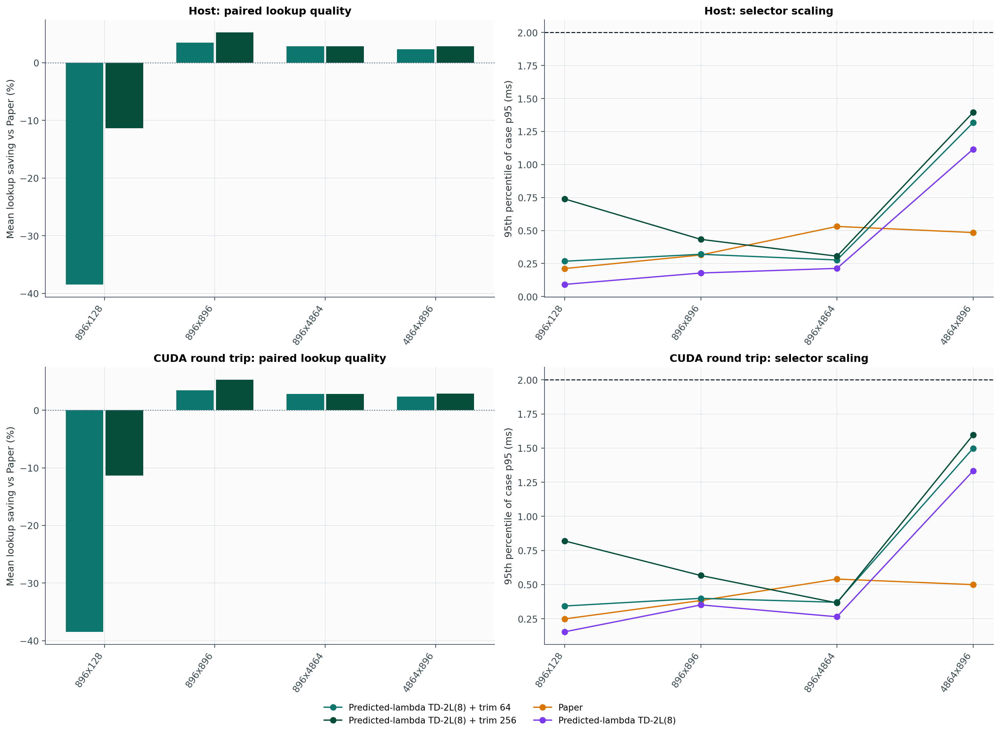

# Experiment 22 보고서: Paper vs Predicted-lambda TD-2L(8) + Endpoint Trim

Paper는 논문의 고정 row-budget 알고리즘을 그대로 실행했다. 각 paired input에서 Paper가 달성한 importance를 `Q = I(M_paper)`로 두고 proposed method가 최소한 같은 importance를 유지하도록 했다. 따라서 아래 lookup 비교는 importance-matched 비교다.

importance 입력은 `Qwen/Qwen2.5-0.5B-Instruct`의 dense forward에서 VLMFlash와 같은 정의인 `mean(abs(projection input))`로 직접 수집했다. 3개 실제 prompt에서 수집한 projection call 중 128개 trace, 4개 Table-2 shape를 평가했다. 모델 forward는 경쟁 selector가 뒤 레이어 activation을 오염시키지 않도록 all-true mask로 실행했다. lookup latency는 실제 NVMe 측정이 아니라 `orin-agx` profile의 예측값이다.

## 전체 결과

### Host input -> CPU mask

| 방법 | 중앙 runtime | case-p95 | worst case-p95 | 유효+2ms | Paper 대비 평균/가중 lookup | Paper보다 비악화 | trim 순증분 |
|---|---:|---:|---:|---:|---:|---:|---:|
| Paper | 0.229 ms | 0.458 ms | 0.825 ms | 100.0% | 0.00% / 0.00% | 100.0% | n/a |
| Predicted-lambda TD-2L(8) | 0.108 ms | 1.015 ms | 1.244 ms | 100.0% | -12.85% / 0.18% | 52.1% | n/a |
| Predicted-lambda TD-2L(8) + trim 64 | 0.214 ms | 1.213 ms | 1.692 ms | 100.0% | -7.45% / 2.36% | 75.3% | 4.41% |
| Predicted-lambda TD-2L(8) + trim 256 | 0.420 ms | 1.273 ms | 2.108 ms | 99.7% | -0.10% / 3.08% | 88.8% | 9.25% |

### CUDA input -> CUDA mask

| 방법 | 중앙 runtime | case-p95 | worst case-p95 | 유효+2ms | Paper 대비 평균/가중 lookup | Paper보다 비악화 | trim 순증분 |
|---|---:|---:|---:|---:|---:|---:|---:|
| Paper | 0.261 ms | 0.451 ms | 0.827 ms | 100.0% | 0.00% / 0.00% | 100.0% | n/a |
| Predicted-lambda TD-2L(8) | 0.164 ms | 1.121 ms | 1.472 ms | 100.0% | -12.85% / 0.18% | 52.1% | n/a |
| Predicted-lambda TD-2L(8) + trim 64 | 0.286 ms | 1.358 ms | 1.782 ms | 100.0% | -7.45% / 2.36% | 75.3% | 4.41% |
| Predicted-lambda TD-2L(8) + trim 256 | 0.492 ms | 1.389 ms | 1.901 ms | 100.0% | -0.10% / 3.08% | 88.8% | 9.25% |

## 판정

`cuda` track에서 모든 case가 유효하고 2 ms를 통과한 trim 설정 중 lookup 품질이 가장 높은 것은 `Predicted-lambda TD-2L(8) + trim 256`이다. Paper 대비 평균 lookup 절감은 `-0.10%`, case-p95는 `1.389 ms`다.

`Predicted-lambda TD-2L(8) + trim 256`은 384개 paired case 중 `43`개에서 Paper보다 느린 lookup을 보였고, 비악화율은 `88.8%`다. 절대 latency로 가중한 전체 절감은 `3.08%`다. Endpoint trim 자체는 평균 `9.25%`를 추가로 줄였지만, noisy lookup table 기준으로는 `0.3%` case에서 소폭 악화됐다. Two-line 목적의 악화는 0건이다.

Shape 단위로는 `4/4`개가 모든 case에서 2 ms를 통과했다. 평균 lookup이 Paper보다 나쁜 shape는 `896x128`다.

## Shape별 trim 256 (Host)

| Shape | rows | row KiB | runtime case-p95 | worst p95 | Paper 대비 lookup | 유효+2ms |
|---|---:|---:|---:|---:|---:|---:|
| 896x128 | 896 | 0.25 | 0.739 ms | 0.952 ms | -11.37% | 100.0% |
| 896x896 | 896 | 1.75 | 0.433 ms | 0.667 ms | 5.26% | 100.0% |
| 896x4864 | 896 | 9.50 | 0.306 ms | 0.573 ms | 2.84% | 100.0% |
| 4864x896 | 4,864 | 1.75 | 1.394 ms | 2.108 ms | 2.87% | 99.0% |

## Shape별 trim 256 (CUDA round trip)

| Shape | rows | row KiB | runtime case-p95 | worst p95 | Paper 대비 lookup | 유효+2ms |
|---|---:|---:|---:|---:|---:|---:|
| 896x128 | 896 | 0.25 | 0.820 ms | 0.943 ms | -11.37% | 100.0% |
| 896x896 | 896 | 1.75 | 0.567 ms | 0.610 ms | 5.26% | 100.0% |
| 896x4864 | 896 | 9.50 | 0.366 ms | 0.677 ms | 2.84% | 100.0% |
| 4864x896 | 4,864 | 1.75 | 1.597 ms | 1.901 ms | 2.87% | 100.0% |

## 측정 범위와 한계

- `host`: host float32 importance에서 CPU bool mask까지 측정했다. CUDA가 있으면 Paper native 구현의 GPU sort도 포함된다.
- `cuda`: 미리 만들어 둔 CUDA float32 importance에서 시작해 CPU proposal의 D2H, float64 변환, 8회 이하 DP, mask 복원, trim, H2D 및 synchronization을 모두 포함했다.
- importance는 실제 모델 activation이지만, trace를 만드는 dense LM forward는 selector timing에서 제외했다. 따라서 이 수치는 end-to-end token latency가 아니라 online selector latency다.
- 현재 결과는 Qwen2.5-0.5B와 짧은 text prompt 3개에 한정된다. 여러 모델, 실제 VLM frame-append workload, 대표 데이터셋으로의 일반화는 아직 검증하지 않았다.
- 실제 NVMe I/O와 sparse model accuracy/perplexity는 이 실험의 측정 범위가 아니다.
- lookup latency는 Orin AGX profile 기반이므로 RTX 3050 노트북 selector 시간과 서로 다른 축이다. Jetson의 2 ms 충족 여부는 Jetson에서 다시 측정해야 한다.
- endpoint trim은 two-line 목적을 단조 감소시키지만 측정 잡음이 있는 lookup table의 각 개별 점까지 단조 감소한다고 보장하지는 않는다.

