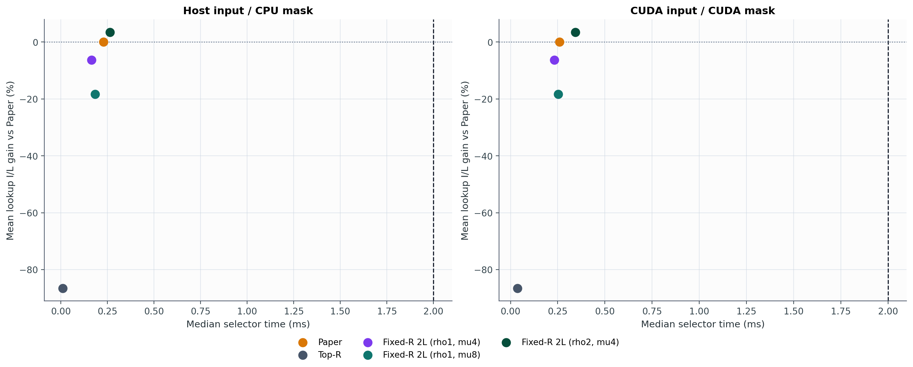
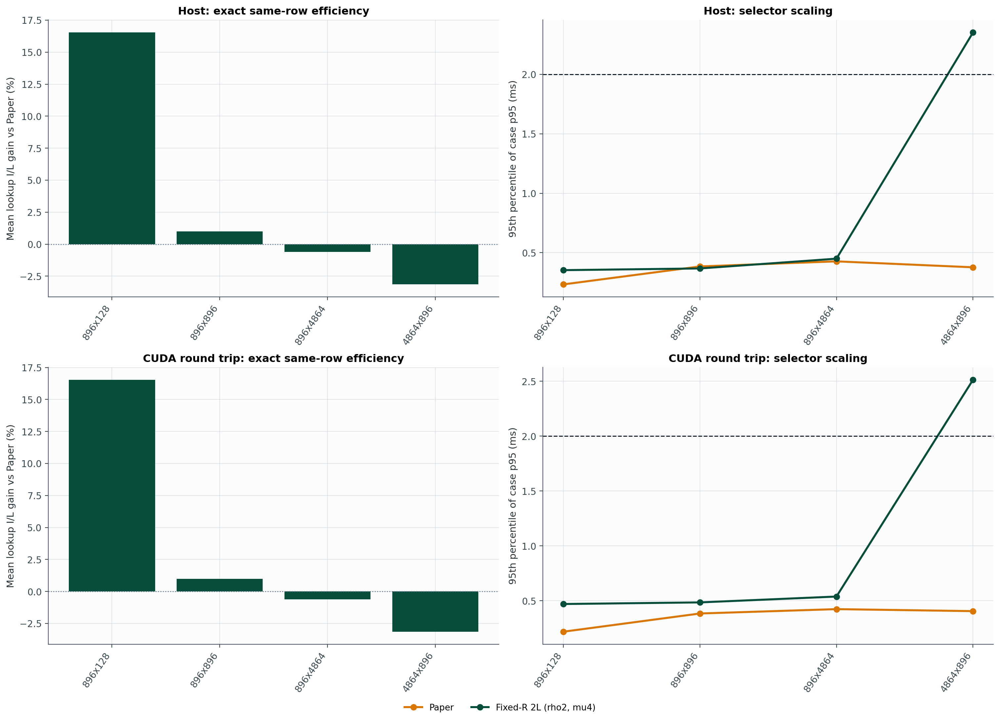
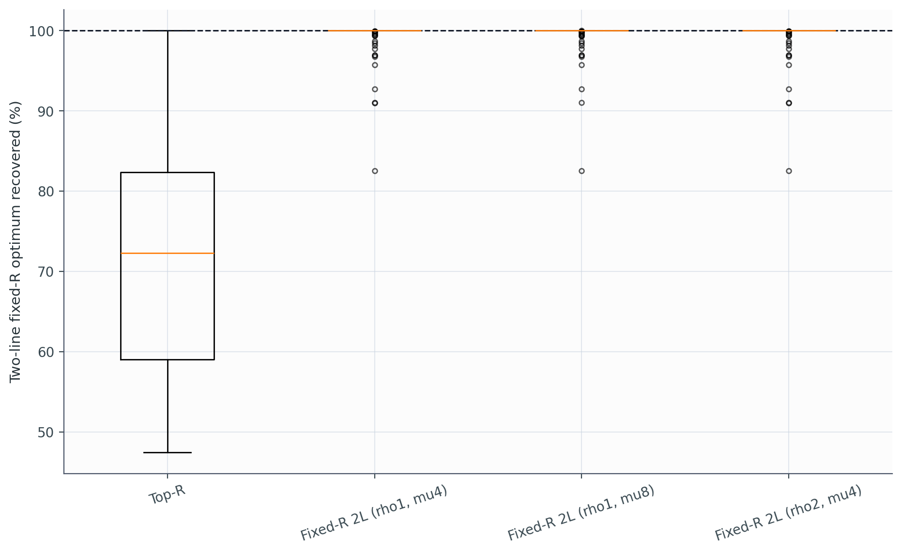

# Experiment 24 보고서: 동일 row 수의 fixed-R 비율 최적화

본 벤치마크 importance는 `vlm-flash`를 실제 `Qwen/Qwen2.5-0.5B-Instruct` projection에 attach한 뒤 dense forward에서 수집한 `mean(abs(projection input))`이다. Experiment 22와 동일한 trace archive를 사용해 selector 차이만 비교했다.

각 paired case에서 Paper를 원래 nominal budget으로 실행한 뒤 실제 선택 행 수 `R_eff = |M_paper|`를 측정했다. Top-R와 모든 proposed mask는 정확히 `R_eff`개를 선택한다. 따라서 Experiment 22와 달리 실제 row 수가 완전히 같다.

제안법은 two-line 목적 `I/L`을 최적화한다. 공개 lookup table의 `I/L`, importance, lookup latency는 별도 지표이며 서로 혼동하지 않는다.

## 전체 결과

### Host input -> CPU mask

| 방법 | 중앙 runtime | case-p95 | 유효+2ms | lookup I/L | two-line I/L | importance | lookup 절감 | 혼합 손익분기 |
|---|---:|---:|---:|---:|---:|---:|---:|---:|
| Paper | 0.228 ms | 0.392 ms | 100.0% | 0.00% | 0.00% | 0.00% | 0.00% | 0.0% |
| Top-R | 0.011 ms | 0.051 ms | 100.0% | -86.53% | -85.86% | 25.57% | -873.36% | 0.0% |
| Fixed-R 2L (rho1, mu4) | 0.165 ms | 1.390 ms | 100.0% | -6.33% | -5.27% | 1.47% | -6.43% | 52.3% |
| Fixed-R 2L (rho1, mu8) | 0.183 ms | 1.307 ms | 100.0% | -18.37% | -16.68% | 7.29% | -17.96% | 38.5% |
| Fixed-R 2L (rho2, mu4) | 0.263 ms | 2.176 ms | 93.2% | 3.44% | 4.81% | -3.52% | 0.84% | 21.1% |

### CUDA input -> CUDA mask

| 방법 | 중앙 runtime | case-p95 | 유효+2ms | lookup I/L | two-line I/L | importance | lookup 절감 | 혼합 손익분기 |
|---|---:|---:|---:|---:|---:|---:|---:|---:|
| Paper | 0.259 ms | 0.408 ms | 100.0% | 0.00% | 0.00% | 0.00% | 0.00% | 0.0% |
| Top-R | 0.037 ms | 0.092 ms | 100.0% | -86.53% | -85.86% | 25.57% | -873.36% | 0.0% |
| Fixed-R 2L (rho1, mu4) | 0.232 ms | 1.456 ms | 99.7% | -6.33% | -5.27% | 1.47% | -6.43% | 34.1% |
| Fixed-R 2L (rho1, mu8) | 0.252 ms | 1.378 ms | 100.0% | -18.37% | -16.68% | 7.29% | -17.96% | 26.3% |
| Fixed-R 2L (rho2, mu4) | 0.343 ms | 2.302 ms | 92.7% | 3.44% | 4.81% | -3.52% | 0.84% | 4.2% |

## Small-N exact oracle

`N=18` exhaustive fixed-R optimum과 비교했다.

| 방법 | 평균 optimum 회수 | 최악 회수 | p95 gap | exact hit |
|---|---:|---:|---:|---:|
| Top-R | 72.918% | 47.440% | 47.652% | 7.8% |
| Fixed-R 2L (rho1, mu4) | 99.264% | 82.529% | 3.830% | 68.9% |
| Fixed-R 2L (rho1, mu8) | 99.357% | 82.529% | 3.182% | 72.2% |
| Fixed-R 2L (rho2, mu4) | 99.264% | 82.529% | 3.830% | 68.9% |

## Shape-adaptive hybrid

각 timing track에서 모든 case가 2 ms를 통과한 shape에만 fixed-R selector를 사용하고 나머지는 Paper로 되돌리는 정적 정책이다.

| Track | 후보 | fixed-R shape | deadline | lookup I/L | importance | 가중 lookup 절감 | case-p95 | worst p95 |
|---|---|---:|---:|---:|---:|---:|---:|---:|
| host | Fixed-R 2L (rho1, mu4) | 4/4 | 100.0% | -6.33% | 1.47% | -6.43% | 1.390 ms | 1.677 ms |
| host | Fixed-R 2L (rho2, mu4) | 3/4 | 100.0% | 4.23% | -2.95% | 1.47% | 0.403 ms | 0.682 ms |
| cuda | Fixed-R 2L (rho1, mu4) | 3/4 | 100.0% | -4.04% | 1.27% | -2.50% | 0.362 ms | 0.560 ms |
| cuda | Fixed-R 2L (rho2, mu4) | 3/4 | 100.0% | 4.23% | -2.95% | 1.47% | 0.496 ms | 0.745 ms |

## 판정

lookup-table `I/L` 평균이 가장 높은 fixed-R 설정은 `Fixed-R 2L (rho2, mu4)`다. Paper 대비 lookup `I/L`은 평균 `3.44%`, two-line `I/L`은 `4.81%` 변했다.

모든 method case의 정확한 row-match와 deterministic rate는 각각 `100.0%`, `100.0%`다. `cuda` track에서 모든 case가 2 ms를 통과한 shape는 `3/4`개다.

importance가 Paper보다 낮지 않은 비율은 `9.1%`, lookup도 동시에 나쁘지 않은 Pareto 비악화율은 `4.7%`다. 따라서 비율 개선만으로 동일 accuracy를 주장할 수 없다.

노트북 selector overhead와 Orin lookup 예측을 섞은 진단적 손익분기 통과율은 `4.2%`다. 서로 다른 장치의 시간을 더한 값이므로 end-to-end 결과가 아니라 Jetson에서 검증할 조건이다.

2 ms 우선의 현실적인 선택은 `Fixed-R 2L (rho1, mu4)` shape hybrid다. 모든 case의 deadline을 지키면서 lookup `I/L` 평균 `-4.04%`, importance 평균 `1.27%`, 가중 lookup 절감 `-2.50%`를 보였다. 다만 case별 importance 비악화율은 `49.7%`라 동일 accuracy는 여전히 보장되지 않는다.

`mu=8`은 small-N oracle 평균을 소폭 높였지만 production-N에서는 `mu=4`보다 느리고 lookup `I/L`도 낮았다. `mu=4`도 한 ratio iteration당 평균 `736.3`개 endpoint를 repair하므로, 다음 최적화 지점은 더 촘촘한 row-price 탐색보다 repair 대상 cardinality를 줄이는 예측이다.

## Shape별 Fixed-R 2L (rho2, mu4) (cuda)

| Shape | rows | lookup I/L | importance | lookup 절감 | case-p95 | 유효+2ms |
|---|---:|---:|---:|---:|---:|---:|
| 896x128 | 896 | 16.54% | -5.36% | 20.38% | 0.471 ms | 100.0% |
| 896x896 | 896 | 0.98% | -3.66% | 3.95% | 0.486 ms | 100.0% |
| 896x4864 | 896 | -0.62% | -2.77% | 1.72% | 0.539 ms | 100.0% |
| 4864x896 | 4,864 | -3.15% | -2.28% | -1.42% | 2.513 ms | 70.8% |

## 측정 한계

- 실제 activation은 `Qwen/Qwen2.5-0.5B-Instruct`의 짧은 text prompt에서 얻었으며 다른 model, 긴 context, multimodal frame-append workload까지 대표하지 않는다.
- small-N exhaustive oracle만 algorithmic sanity check를 위해 별도의 synthetic lognormal(CV 3.30) 입력을 사용한다; production 결과에는 섞지 않았다.
- lookup은 released Orin AGX profile의 예측값이고 실제 NVMe I/O를 실행하지 않았다.
- `cuda` track은 D2H, CPU solve/repair, H2D와 synchronization을 포함하지만 model compute는 제외한다.
- row-price scalarization과 endpoint repair는 unsupported exact-R 해를 건너뛸 수 있으므로 전역 최적 알고리즘이 아니다.
- shape hybrid의 허용 목록은 같은 benchmark에서 사후 선택했으므로 별도 trace에서 재검증해야 한다.

