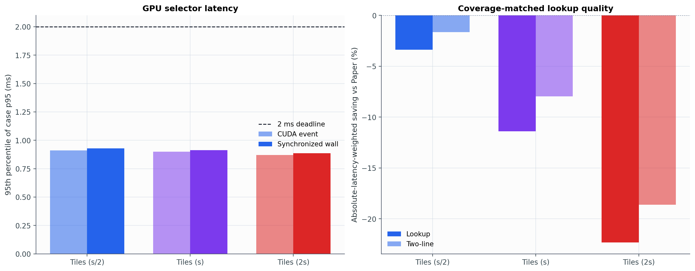
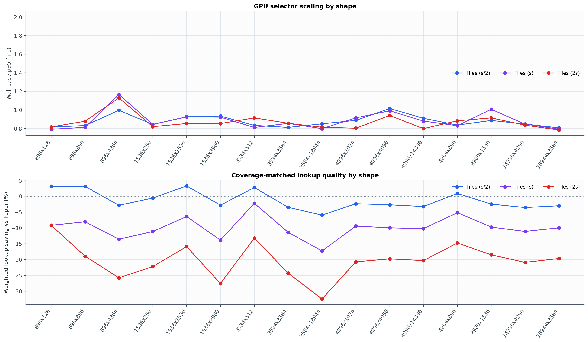

# Experiment 25 보고서: GPU Saturation Tiles

Experiment 18의 `Tiles(s/2)`, `Tiles(s)`, `Tiles(2s)`를 CUDA-resident PyTorch 연산으로 옮겼다. 입력 importance부터 최종 boolean mask까지 GPU에 머물며, data-dependent CPU readback은 없다.

## 한 문장 판정

\[\boxed{\text{세 GPU Tiles 모두 2 ms이지만, CPU보다 대체로 느리고 Paper lookup을 개선하지 못했다.}}\]

## 측정 설정

- GPU: NVIDIA GeForce RTX 3050 6GB Laptop GPU
- Table-2 shape: 16개
- trials × spatial modes × scenarios: 3 × 3 × 3
- case당 warm-up/repetitions: 5/30
- CUDA event: device 실행시간
- synchronized wall: Python dispatch + GPU 실행 + synchronization
- 2ms 판정: synchronized wall p95 <= 2 ms

## 전체 결과

| 방법 | GPU wall 중앙 | GPU wall case-p95 | CUDA-event case-p95 | CPU case-p95 | GPU/CPU | coverage | coverage+R | Paper 대비 lookup 평균/가중 | CPU mask 일치 |
|---|---:|---:|---:|---:|---:|---:|---:|---:|---:|
| Tiles (s/2) | 0.717 ms | 0.928 ms | 0.910 ms | 1.369 ms | 4.30× | 100.0% | 75.5% | -2.63% / -3.37% | 99.3% |
| Tiles (s) | 0.718 ms | 0.913 ms | 0.898 ms | 0.706 ms | 6.62× | 100.0% | 67.4% | -13.45% / -11.40% | 99.8% |
| Tiles (2s) | 0.717 ms | 0.886 ms | 0.871 ms | 0.399 ms | 9.42× | 100.0% | 59.3% | -27.91% / -22.32% | 98.4% |

## 판정

가중 lookup 품질이 가장 높은 설정은 `Tiles (s/2)`이지만 Paper coverage selector 대비 `3.37%` 악화했다. 즉 세 tile 크기 모두 전체 가중 lookup을 개선하지 못했다.

wall case-p95가 가장 낮은 설정은 `Tiles (2s)`의 `0.886 ms`다. 모든 설정의 2ms case 통과율은 Tiles (s/2) 100.0%, Tiles (s) 100.0%, Tiles (2s) 100.0%.

동일 입력의 Experiment 18 CPU 구현 대비 GPU wall/CPU 중앙시간 비율은 Tiles (s/2) 4.30×, Tiles (s) 6.62×, Tiles (2s) 9.42×다. 1보다 크면 현재 eager GPU 구현이 더 느리다는 뜻이다. GPU가 실제로 더 빠른 case 비율은 Tiles (s/2) 25.0%, Tiles (s) 3.0%, Tiles (2s) 0.0%다.

CPU와 GPU 모두 2ms를 통과한 비율은 각각 Tiles (s/2) CPU 100.0%/GPU 100.0%, Tiles (s) CPU 100.0%/GPU 100.0%, Tiles (2s) CPU 100.0%/GPU 100.0%다. `s/2` GPU는 일부 tile 수가 많은 큰 shape의 CPU tail을 줄였지만, 대부분의 case 중앙시간은 CPU가 더 짧았다.

Paper 대비 가중 lookup이 양수인 shape 수는 Tiles (s/2) 5/16, Tiles (s) 0/16, Tiles (2s) 0/16다. Case별 lookup 비악화율은 Tiles (s/2) 35.6%, Tiles (s) 19.2%, Tiles (2s) 13.4%다.

Experiment 18 CPU mask와는 `1285/1296`개가 정확히 일치했다. 나머지 `11`개는 float32 GPU와 float64 CPU의 정렬 경계 차이이며 coverage 위반은 없었고 최대 two-line 차이는 `0.005493 ms`였다.

row-budget은 알고리즘이 직접 강제하지 않는 audit이다. Paper fixed-R의 coverage+R 성공률은 `88.2%`이고, Tiles는 Tiles (s/2) 75.5%, Tiles (s) 67.4%, Tiles (2s) 59.3%다.

## Target별 결과

| Q/total | 방법 | wall case-p95 | coverage+R | 가중 lookup 절감 |
|---:|---|---:|---:|---:|
| 0.50 | Tiles (2s) | 0.899 ms | 54.2% | -44.55% |
| 0.50 | Tiles (s/2) | 0.944 ms | 71.5% | -9.50% |
| 0.50 | Tiles (s) | 0.913 ms | 63.9% | -22.97% |
| 0.70 | Tiles (2s) | 0.864 ms | 65.3% | -28.73% |
| 0.70 | Tiles (s/2) | 0.986 ms | 80.6% | -5.21% |
| 0.70 | Tiles (s) | 0.877 ms | 71.5% | -15.08% |
| 0.90 | Tiles (2s) | 0.888 ms | 58.3% | -13.68% |
| 0.90 | Tiles (s/2) | 0.888 ms | 74.3% | -0.96% |
| 0.90 | Tiles (s) | 0.952 ms | 66.7% | -6.74% |

## Shape별 wall case-p95

| Shape | rows | row KiB | s/2 | s | 2s |
|---|---:|---:|---:|---:|---:|
| 896x128 | 896 | 0.25 | 0.816 ms | 0.792 ms | 0.817 ms |
| 896x896 | 896 | 1.75 | 0.833 ms | 0.814 ms | 0.879 ms |
| 896x4864 | 896 | 9.50 | 0.996 ms | 1.166 ms | 1.129 ms |
| 1536x256 | 1,536 | 0.50 | 0.845 ms | 0.845 ms | 0.821 ms |
| 1536x1536 | 1,536 | 3.00 | 0.927 ms | 0.926 ms | 0.854 ms |
| 1536x8960 | 1,536 | 17.50 | 0.935 ms | 0.923 ms | 0.854 ms |
| 3584x512 | 3,584 | 1.00 | 0.834 ms | 0.812 ms | 0.915 ms |
| 3584x3584 | 3,584 | 7.00 | 0.813 ms | 0.856 ms | 0.857 ms |
| 3584x18944 | 3,584 | 37.00 | 0.851 ms | 0.799 ms | 0.814 ms |
| 4096x1024 | 4,096 | 2.00 | 0.888 ms | 0.915 ms | 0.804 ms |
| 4096x4096 | 4,096 | 8.00 | 1.015 ms | 0.991 ms | 0.941 ms |
| 4096x14336 | 4,096 | 28.00 | 0.910 ms | 0.881 ms | 0.800 ms |
| 4864x896 | 4,864 | 1.75 | 0.837 ms | 0.831 ms | 0.884 ms |
| 8960x1536 | 8,960 | 3.00 | 0.888 ms | 1.007 ms | 0.915 ms |
| 14336x4096 | 14,336 | 8.00 | 0.849 ms | 0.848 ms | 0.837 ms |
| 18944x3584 | 18,944 | 7.00 | 0.808 ms | 0.794 ms | 0.784 ms |

## 측정 한계

- importance는 CV 3.30 synthetic lognormal이며 실제 activation trace가 아니다.
- lookup latency는 released Orin AGX profile 예측값이고 실제 NVMe I/O를 실행하지 않았다.
- RTX 3050 GPU timing이므로 Jetson의 절대시간을 증명하지 않는다.
- static tile layout은 shape만으로 결정되어 online timing에서 제외했다.
- eager PyTorch 구현이며 CUDA graph나 custom fused kernel은 사용하지 않았다.
- row-budget 결과는 제약을 직접 푼 것이 아니라 coverage mask에 대한 사후 audit이다.

