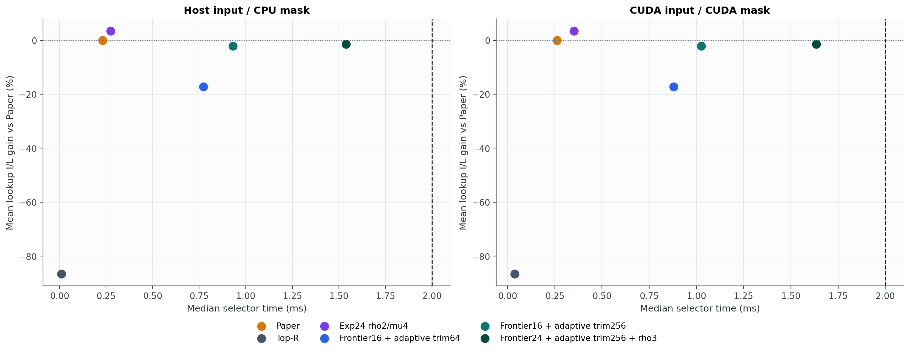
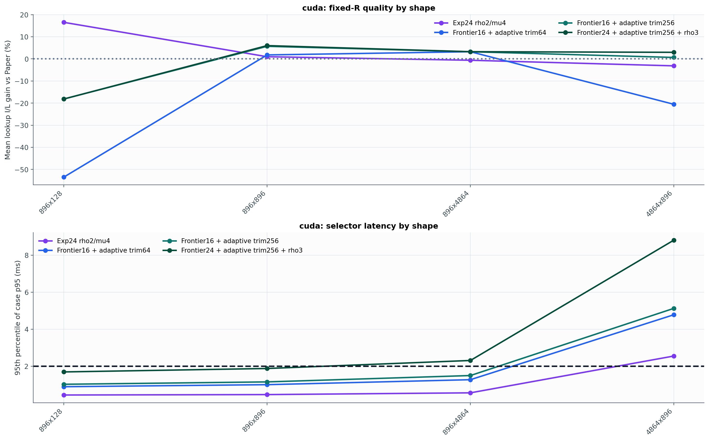
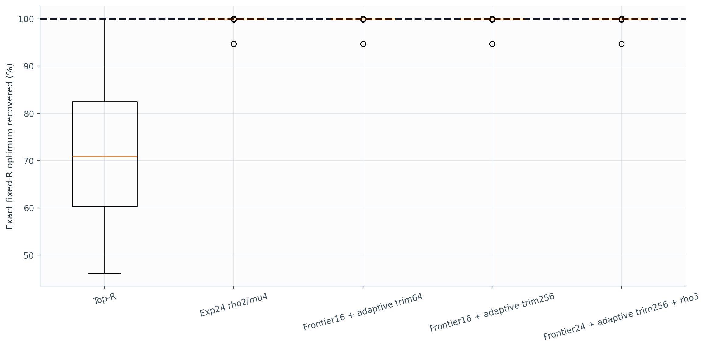

# Experiment 26 보고서: Frontier + Adaptive Fixed-R Trim

`Qwen/Qwen2.5-0.5B-Instruct`의 실제 `vlm-flash` activation trace에서 fixed-R `I/L`을 더 충실하게 탐색했다. selector는 importance vector, R, latency model만 사용하며 Paper mask나 `I(M_paper)`를 입력으로 사용하지 않는다. Paper는 paired 평가에서 R을 맞추고 품질을 비교하는 기준선일 뿐이다.

각 μ에서 나온 모든 서로 다른 eligible cardinality를 exact-R로 adaptive trim한 뒤 실제 I/L이 가장 높은 해를 보존한다. trim은 매 삭제마다 현재 비율을 다시 계산한다.

## 전체 결과

### Host input -> CPU mask

| 방법 | 중앙 runtime | case-p95 | 유효+2ms | lookup I/L | two-line I/L | importance | 가중 lookup 절감 | Top-R 반환 |
|---|---:|---:|---:|---:|---:|---:|---:|---:|
| Paper | 0.231 ms | 0.344 ms | 99.7% | 0.00% | 0.00% | 0.00% | 0.00% | 0.0% |
| Top-R | 0.011 ms | 0.053 ms | 100.0% | -86.53% | -85.86% | 25.57% | -873.36% | 0.0% |
| Exp24 rho2/mu4 | 0.275 ms | 2.246 ms | 93.5% | 3.44% | 4.81% | -3.52% | 0.84% | 0.0% |
| Frontier16 + adaptive trim64 | 0.773 ms | 4.099 ms | 75.0% | -17.25% | -14.44% | 4.59% | -92.29% | 3.6% |
| Frontier16 + adaptive trim256 | 0.932 ms | 4.545 ms | 75.0% | -2.14% | 0.37% | 0.79% | -11.43% | 0.5% |
| Frontier24 + adaptive trim256 + rho3 | 1.539 ms | 7.549 ms | 71.4% | -1.48% | 1.10% | 0.58% | 1.97% | 0.0% |

### CUDA input -> CUDA mask

| 방법 | 중앙 runtime | case-p95 | 유효+2ms | lookup I/L | two-line I/L | importance | 가중 lookup 절감 | Top-R 반환 |
|---|---:|---:|---:|---:|---:|---:|---:|---:|
| Paper | 0.261 ms | 0.368 ms | 99.7% | 0.00% | 0.00% | 0.00% | 0.00% | 0.0% |
| Top-R | 0.038 ms | 0.095 ms | 100.0% | -86.53% | -85.86% | 25.57% | -873.36% | 0.0% |
| Exp24 rho2/mu4 | 0.352 ms | 2.368 ms | 93.0% | 3.44% | 4.81% | -3.52% | 0.84% | 0.0% |
| Frontier16 + adaptive trim64 | 0.880 ms | 4.321 ms | 74.7% | -17.25% | -14.44% | 4.59% | -92.29% | 3.6% |
| Frontier16 + adaptive trim256 | 1.025 ms | 4.652 ms | 74.2% | -2.14% | 0.37% | 0.79% | -11.43% | 0.5% |
| Frontier24 + adaptive trim256 + rho3 | 1.634 ms | 7.740 ms | 67.7% | -1.48% | 1.10% | 0.58% | 1.97% | 0.0% |

## Small-N exact oracle

별도 synthetic `N=18` exhaustive optimum과 비교했다.

| 방법 | 평균 optimum 회수 | 최악 회수 | p95 gap | exact hit |
|---|---:|---:|---:|---:|
| Top-R | 72.991% | 46.159% | 52.271% | 11.1% |
| Exp24 rho2/mu4 | 99.937% | 94.700% | 0.007% | 84.4% |
| Frontier16 + adaptive trim64 | 99.937% | 94.700% | 0.004% | 86.7% |
| Frontier16 + adaptive trim256 | 99.937% | 94.700% | 0.004% | 86.7% |
| Frontier24 + adaptive trim256 + rho3 | 99.937% | 94.700% | 0.004% | 86.7% |

## 판정

새 adaptive-trim 후보 중 실제 trace의 평균 lookup I/L이 가장 높은 설정은 `Frontier24 + adaptive trim256 + rho3`다. Paper 대비 lookup I/L `-1.48%`, two-line I/L `1.10%`, importance `0.58%`다.

Experiment 24 기준선 `Exp24 rho2/mu4` 대비 lookup I/L 평균 변화는 `-4.92` percentage points이고, `cuda` 2ms 통과율은 `67.7%`다.

따라서 새 frontier/trim 후보는 기존 24의 평균 I/L `3.44%`를 넘지 못했다. 대신 새 후보의 importance 변화는 `0.58%`로 기존 기준선의 `-3.52%`보다 높아 다른 trade-off를 만들었다.

선택된 해가 Top-R로 되돌아간 비율은 `0.0%`, 평균 eligible frontier 후보 수는 `8.29`개, rho 반복에서 선택된 trim 삭제 수의 합은 평균 `190.4`개다.

## Shape별 Frontier24 + adaptive trim256 + rho3 (cuda)

| Shape | lookup I/L | two-line I/L | importance | 가중 lookup 절감 | case-p95 | 유효+2ms |
|---|---:|---:|---:|---:|---:|---:|
| 896x128 | -18.15% | -16.44% | 6.10% | -91.35% | 1.693 ms | 97.9% |
| 896x896 | 6.01% | 8.25% | -2.41% | 6.92% | 1.879 ms | 96.9% |
| 896x4864 | 3.25% | 7.78% | -1.32% | 3.85% | 2.312 ms | 76.0% |
| 4864x896 | 2.98% | 4.80% | -0.04% | 2.75% | 8.805 ms | 0.0% |

## 측정 한계

- 실제 activation은 `Qwen/Qwen2.5-0.5B-Instruct`의 세 짧은 text prompt와 한 모델에서 얻었다.
- small-N oracle만 synthetic이며 실제 trace 결과와 분리했다.
- lookup latency는 Orin AGX profile 예측값이며 실제 NVMe I/O가 아니다.
- adaptive endpoint trim은 interior deletion이나 cardinality-preserving swap을 탐색하지 않는다.
- μ scalarization이 unsupported exact-R 해를 건너뛸 수 있어 전역 최적 보장은 없다.

