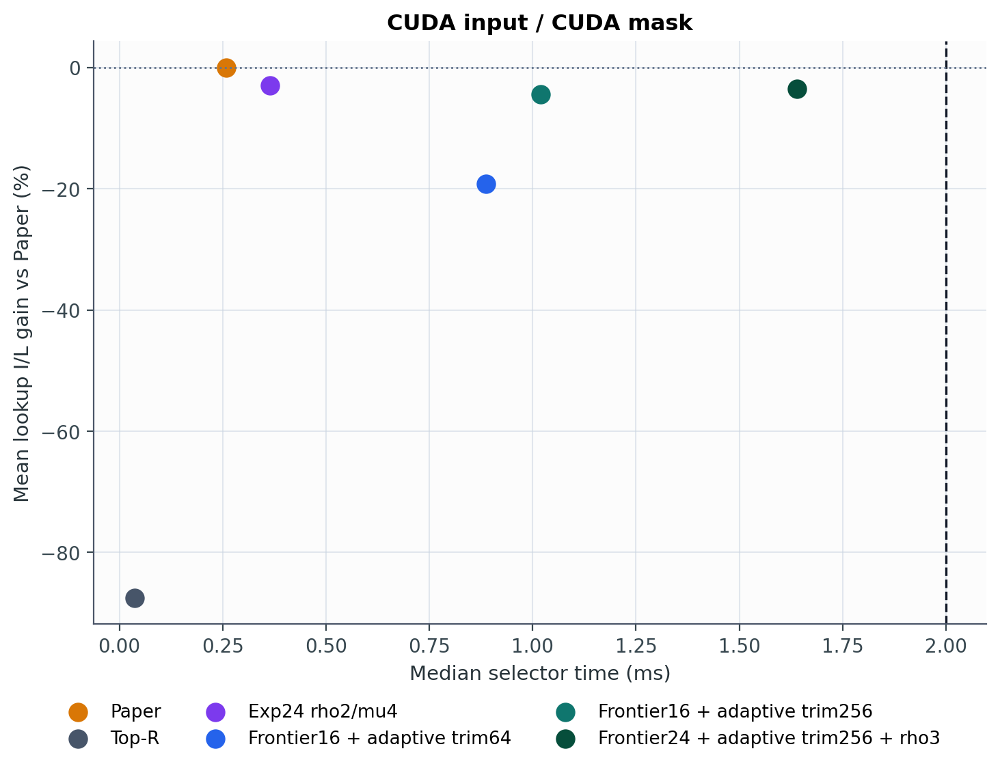
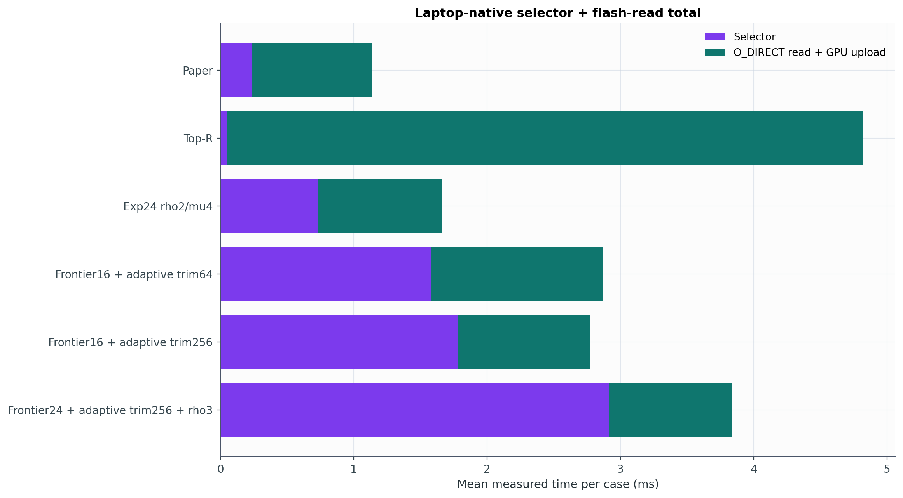
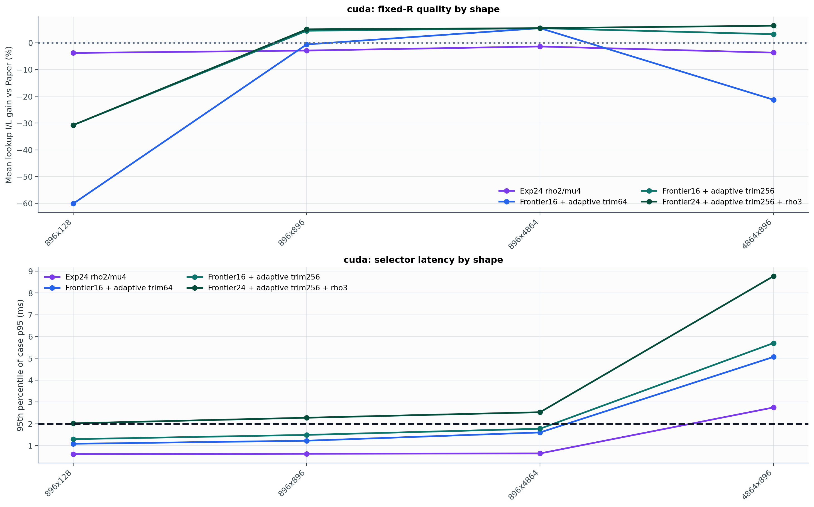
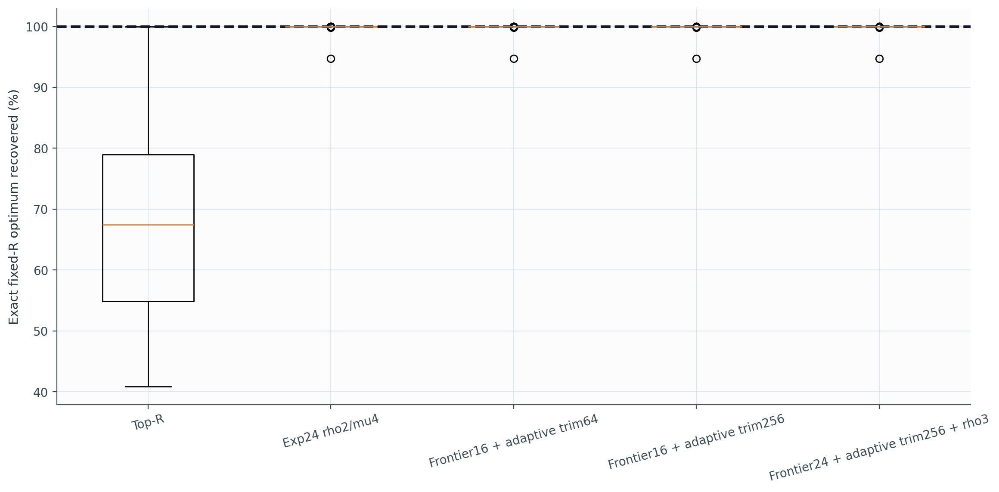

# Experiment 26 보고서: Frontier + Adaptive Fixed-R Trim

`Qwen/Qwen2.5-0.5B-Instruct`의 실제 `vlm-flash` activation trace에서 fixed-R `I/L`을 더 충실하게 탐색했다. selector는 importance vector, R, latency model만 사용하며 Paper mask나 `I(M_paper)`를 입력으로 사용하지 않는다. Paper는 paired 평가에서 R을 맞추고 품질을 비교하는 기준선일 뿐이다.

각 μ에서 나온 모든 서로 다른 eligible cardinality를 exact-R로 adaptive trim한 뒤 실제 I/L이 가장 높은 해를 보존한다. trim은 매 삭제마다 현재 비율을 다시 계산한다.

## 전체 결과

### CUDA input -> CUDA mask

| 방법 | 중앙 runtime | case-p95 | 유효+2ms | lookup I/L | two-line I/L | importance | 가중 lookup 절감 | Top-R 반환 |
|---|---:|---:|---:|---:|---:|---:|---:|---:|
| Paper | 0.259 ms | 0.416 ms | 100.0% | 0.00% | 0.00% | 0.00% | 0.00% | 0.0% |
| Top-R | 0.036 ms | 0.105 ms | 100.0% | -87.45% | -88.44% | 27.63% | -938.66% | 0.0% |
| Exp24 rho2/mu4 | 0.365 ms | 2.536 ms | 87.8% | -2.93% | -2.98% | -2.19% | -1.89% | 0.0% |
| Frontier16 + adaptive trim64 | 0.888 ms | 4.553 ms | 74.5% | -19.13% | -20.30% | 6.38% | -86.57% | 3.1% |
| Frontier16 + adaptive trim256 | 1.019 ms | 4.982 ms | 74.7% | -4.39% | -5.79% | 2.28% | -11.18% | 0.5% |
| Frontier24 + adaptive trim256 + rho3 | 1.639 ms | 8.131 ms | 56.8% | -3.46% | -5.00% | 2.09% | 2.95% | 0.0% |

## 노트북 실제 O_DIRECT 총시간

각 CUDA-track mask를 target SSD에서 직접 읽고 GPU로 upload했다. 아래 총시간은 case별 `selector median + native read wall median`의 평균이며 LM compute는 제외한다.

| 방법 | 실제 read wall | selector+read | Paper 대비 절감 | Paper보다 빠른 case |
|---|---:|---:|---:|---:|
| Paper | 0.901 ms | 1.140 ms | +0.000 ms | - |
| Top-R | 4.775 ms | 4.821 ms | -3.681 ms | 0.0% |
| Exp24 rho2/mu4 | 0.925 ms | 1.660 ms | -0.520 ms | 5.7% |
| Frontier16 + adaptive trim64 | 1.290 ms | 2.872 ms | -1.732 ms | 0.0% |
| Frontier16 + adaptive trim256 | 0.989 ms | 2.769 ms | -1.628 ms | 0.0% |
| Frontier24 + adaptive trim256 + rho3 | 0.918 ms | 3.835 ms | -2.695 ms | 0.0% |

직접 측정한 총시간이 가장 낮은 방법은 `Paper`로 평균 `1.140 ms`다.

Profile 예측과 native I/O-only 실측의 Pearson 상관은 `r=0.9972`지만, 실측/예측 비율 중앙값은 `1.701x`다. GPU upload와 reader 호출 전체를 포함한 wall-clock은 `r=0.9920`, 중앙값 `2.397x`다. 따라서 table은 mask 순위에는 유용하지만 노트북의 절대 총시간을 대신하지 못한다.

### Shape별 실제 총시간

| Shape | Paper | Exp24 rho2/mu4 | 가장 빠른 frontier | 해당 방법 |
|---|---:|---:|---:|---|
| 896x896 | 0.699 ms | 0.828 ms | 1.276 ms | Frontier16 + adaptive trim64 |
| 896x128 | 0.369 ms | 0.536 ms | 0.980 ms | Frontier16 + adaptive trim64 |
| 896x4864 | 1.778 ms | 1.855 ms | 2.453 ms | Frontier16 + adaptive trim64 |
| 4864x896 | 1.716 ms | 3.421 ms | 6.024 ms | Frontier16 + adaptive trim256 |

## Small-N exact oracle

별도 synthetic `N=18` exhaustive optimum과 비교했다.

| 방법 | 평균 optimum 회수 | 최악 회수 | p95 gap | exact hit |
|---|---:|---:|---:|---:|
| Top-R | 69.141% | 40.856% | 57.754% | 11.1% |
| Exp24 rho2/mu4 | 99.937% | 94.700% | 0.007% | 84.4% |
| Frontier16 + adaptive trim64 | 99.937% | 94.700% | 0.004% | 87.8% |
| Frontier16 + adaptive trim256 | 99.937% | 94.700% | 0.004% | 87.8% |
| Frontier24 + adaptive trim256 + rho3 | 99.937% | 94.700% | 0.004% | 87.8% |

## 판정

새 adaptive-trim 후보 중 실제 trace의 평균 lookup I/L이 가장 높은 설정은 `Frontier24 + adaptive trim256 + rho3`다. Paper 대비 lookup I/L `-3.46%`, two-line I/L `-5.00%`, importance `2.09%`다.

Experiment 24 기준선 `Exp24 rho2/mu4` 대비 lookup I/L 평균 변화는 `-0.53` percentage points이고, `cuda` 2ms 통과율은 `56.8%`다.

따라서 새 frontier/trim 후보는 기존 24의 평균 I/L `-2.93%`를 넘지 못했다. 대신 새 후보의 importance 변화는 `2.09%`로 기존 기준선의 `-2.19%`보다 높아 다른 trade-off를 만들었다.

선택된 해가 Top-R로 되돌아간 비율은 `0.0%`, 평균 eligible frontier 후보 수는 `8.18`개, rho 반복에서 선택된 trim 삭제 수의 합은 평균 `195.1`개다.

## Shape별 Frontier24 + adaptive trim256 + rho3 (cuda)

| Shape | lookup I/L | two-line I/L | importance | 가중 lookup 절감 | case-p95 | 유효+2ms |
|---|---:|---:|---:|---:|---:|---:|
| 896x128 | -30.75% | -32.28% | 7.86% | -124.88% | 2.019 ms | 94.8% |
| 896x896 | 5.03% | 4.72% | -0.56% | 4.65% | 2.274 ms | 79.2% |
| 896x4864 | 5.48% | 3.67% | 0.33% | 4.68% | 2.528 ms | 53.1% |
| 4864x896 | 6.40% | 3.89% | 0.71% | 5.40% | 8.769 ms | 0.0% |

## 측정 한계

- 실제 activation은 `Qwen/Qwen2.5-0.5B-Instruct`의 세 짧은 text prompt와 한 모델에서 얻었다.
- small-N oracle만 synthetic이며 실제 trace 결과와 분리했다.
- mask 선택의 lookup 목적은 `experiments/26_frontier_adaptive_trim/results_laptop/laptop_sn850x_profile.json` table을 사용했다.
- 별도 실제 read 결과는 native O_DIRECT와 GPU upload를 직접 측정했다.
- adaptive endpoint trim은 interior deletion이나 cardinality-preserving swap을 탐색하지 않는다.
- μ scalarization이 unsupported exact-R 해를 건너뛸 수 있어 전역 최적 보장은 없다.

