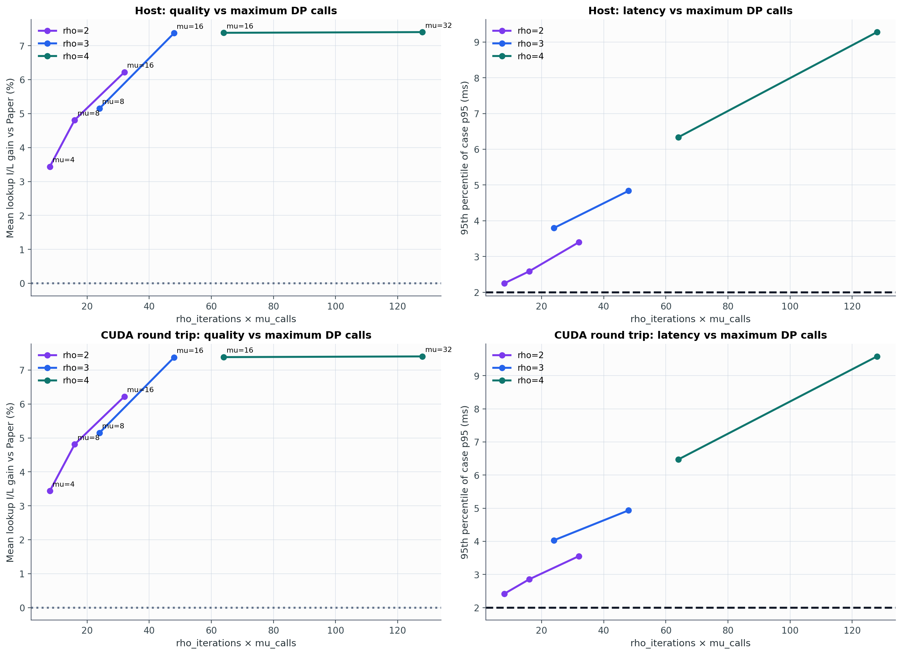
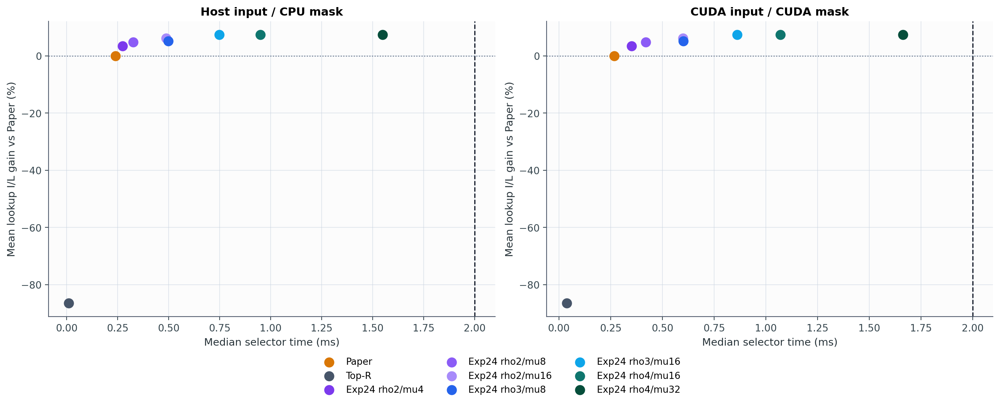
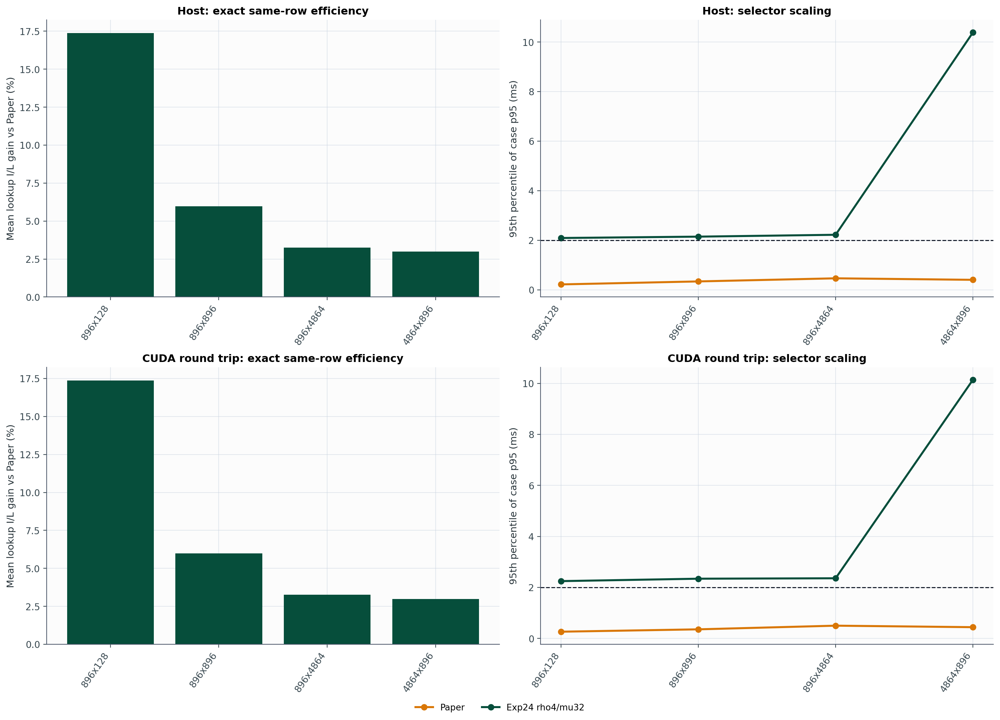
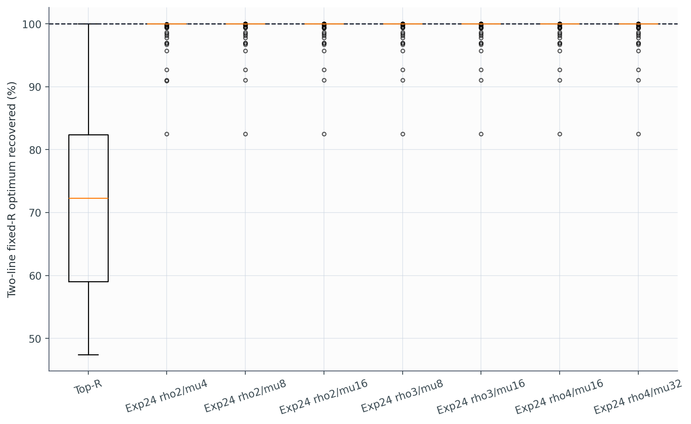

# Experiment 27 보고서: Exp24 계산량 스케일업

Experiment 24의 `fixed_r_ratio()`를 한 줄도 바꾸지 않고, `rho_iterations`와 `mu_calls`만 늘렸다. 모든 설정은 Paper mask나 `I(M_paper)`를 입력으로 받지 않는다. Paper가 실제로 반환한 행 수만 공통 fixed-R 예산으로 사용한다.

## 전체 결과

### Host input -> CPU mask

| 방법 | 최대 DP calls | 중앙 runtime | case-p95 | 유효+2ms | lookup I/L | two-line I/L | importance | 가중 lookup 절감 | Top-R 반환 |
|---|---:|---:|---:|---:|---:|---:|---:|---:|---:|
| Paper | - | 0.239 ms | 0.403 ms | 100.0% | 0.000% | 0.000% | 0.000% | 0.000% | 0.0% |
| Top-R | - | 0.011 ms | 0.053 ms | 100.0% | -86.532% | -85.859% | 25.568% | -873.357% | 0.0% |
| Exp24 rho2/mu4 | 8 | 0.273 ms | 2.250 ms | 93.2% | 3.439% | 4.812% | -3.520% | 0.842% | 0.0% |
| Exp24 rho2/mu8 | 16 | 0.326 ms | 2.586 ms | 81.2% | 4.812% | 6.304% | -1.936% | 1.181% | 0.0% |
| Exp24 rho2/mu16 | 32 | 0.487 ms | 3.400 ms | 75.0% | 6.221% | 8.472% | -1.217% | 3.625% | 0.0% |
| Exp24 rho3/mu8 | 24 | 0.498 ms | 3.799 ms | 75.0% | 5.153% | 6.688% | -2.053% | 1.304% | 0.0% |
| Exp24 rho3/mu16 | 48 | 0.749 ms | 4.837 ms | 75.0% | 7.372% | 9.532% | -2.088% | 3.879% | 0.0% |
| Exp24 rho4/mu16 | 64 | 0.950 ms | 6.336 ms | 74.7% | 7.382% | 9.546% | -2.083% | 3.882% | 0.0% |
| Exp24 rho4/mu32 | 128 | 1.548 ms | 9.279 ms | 69.3% | 7.402% | 9.581% | -2.084% | 3.914% | 0.0% |

### CUDA input -> CUDA mask

| 방법 | 최대 DP calls | 중앙 runtime | case-p95 | 유효+2ms | lookup I/L | two-line I/L | importance | 가중 lookup 절감 | Top-R 반환 |
|---|---:|---:|---:|---:|---:|---:|---:|---:|---:|
| Paper | - | 0.267 ms | 0.429 ms | 100.0% | 0.000% | 0.000% | 0.000% | 0.000% | 0.0% |
| Top-R | - | 0.039 ms | 0.096 ms | 100.0% | -86.532% | -85.859% | 25.568% | -873.357% | 0.0% |
| Exp24 rho2/mu4 | 8 | 0.351 ms | 2.420 ms | 90.6% | 3.439% | 4.812% | -3.520% | 0.842% | 0.0% |
| Exp24 rho2/mu8 | 16 | 0.420 ms | 2.854 ms | 77.1% | 4.812% | 6.304% | -1.936% | 1.181% | 0.0% |
| Exp24 rho2/mu16 | 32 | 0.599 ms | 3.554 ms | 75.0% | 6.221% | 8.472% | -1.217% | 3.625% | 0.0% |
| Exp24 rho3/mu8 | 24 | 0.602 ms | 4.034 ms | 75.0% | 5.153% | 6.688% | -2.053% | 1.304% | 0.0% |
| Exp24 rho3/mu16 | 48 | 0.862 ms | 4.936 ms | 75.0% | 7.372% | 9.532% | -2.088% | 3.879% | 0.0% |
| Exp24 rho4/mu16 | 64 | 1.071 ms | 6.472 ms | 74.5% | 7.382% | 9.546% | -2.083% | 3.882% | 0.0% |
| Exp24 rho4/mu32 | 128 | 1.662 ms | 9.582 ms | 66.1% | 7.402% | 9.581% | -2.084% | 3.914% | 0.0% |

## Small-N exact oracle

별도 synthetic `N=18` exhaustive optimum과 비교했다.

| 방법 | 평균 optimum 회수 | 최악 회수 | p95 gap | exact hit |
|---|---:|---:|---:|---:|
| Top-R | 72.918% | 47.440% | 47.652% | 7.8% |
| Exp24 rho2/mu4 | 99.264% | 82.529% | 3.830% | 68.9% |
| Exp24 rho2/mu8 | 99.368% | 82.529% | 3.182% | 73.3% |
| Exp24 rho2/mu16 | 99.361% | 82.529% | 3.182% | 73.3% |
| Exp24 rho3/mu8 | 99.368% | 82.529% | 3.182% | 73.3% |
| Exp24 rho3/mu16 | 99.361% | 82.529% | 3.182% | 73.3% |
| Exp24 rho4/mu16 | 99.361% | 82.529% | 3.182% | 73.3% |
| Exp24 rho4/mu32 | 99.361% | 82.529% | 3.182% | 73.3% |

## 판정

평균 lookup I/L이 가장 높은 scaled 설정은 `Exp24 rho4/mu32`다. Paper 대비 `7.402%`이며, Exp24 기준 `rho2/mu4` 대비 `+3.963` percentage points다.

이 설정의 `cuda` case-p95는 `9.582 ms`, 2ms 유효 통과율은 `66.1%`다.

계산량 대비 포화점은 `Exp24 rho3/mu16`다. 최고 설정보다 lookup I/L이 `0.030` percentage points만 낮지만, CUDA case-p95는 `4.936 ms`로 최고 설정의 `9.582 ms`보다 `48.5%` 낮다. 따라서 2ms를 완화하고 품질을 우선한다면 이 설정이 실용적인 scale-up이다.

95% 이상의 2ms 통과율을 만족하는 후보가 있으면 그 안에서, 없으면 통과율이 가장 높은 후보로 고른 latency 쪽 설정은 `Exp24 rho2/mu4`다 (lookup I/L `3.439%`, 통과율 `90.6%`).

## Shape별 Exp24 rho4/mu32 (cuda)

| Shape | lookup I/L | two-line I/L | importance | case-p95 | 유효+2ms |
|---|---:|---:|---:|---:|---:|
| 896x128 | 17.376% | 17.530% | -4.571% | 2.246 ms | 91.7% |
| 896x896 | 5.983% | 8.204% | -2.425% | 2.341 ms | 84.4% |
| 896x4864 | 3.259% | 7.780% | -1.320% | 2.358 ms | 88.5% |
| 4864x896 | 2.992% | 4.810% | -0.019% | 10.139 ms | 0.0% |

## 해석 범위

- 실제 activation은 `Qwen/Qwen2.5-0.5B-Instruct`의 저장된 Qwen forward trace다.
- 후보 간 차이는 오직 rho 반복 수와 각 반복의 mu bisection 호출 수다.
- small-N oracle만 synthetic이며 실제 trace 결론과 분리했다.
- lookup latency는 Orin AGX profile 예측값이며 실제 NVMe I/O 측정값이 아니다.
- selector timing은 warm importance-to-mask 구간이며 LM forward는 제외한다.

