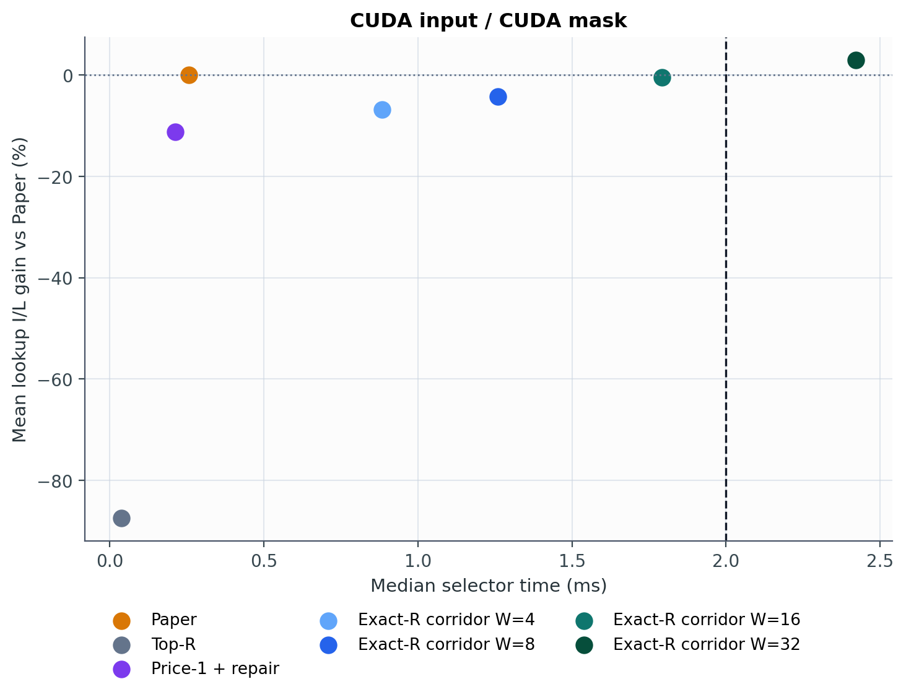
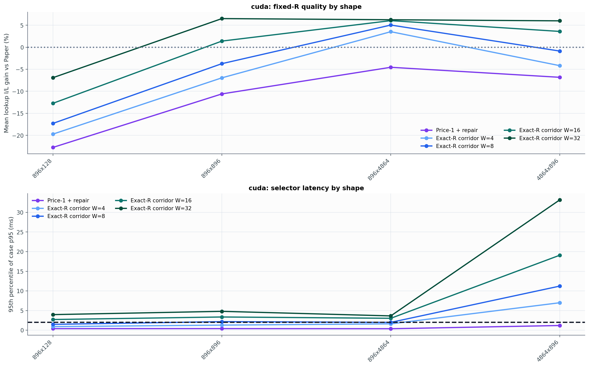
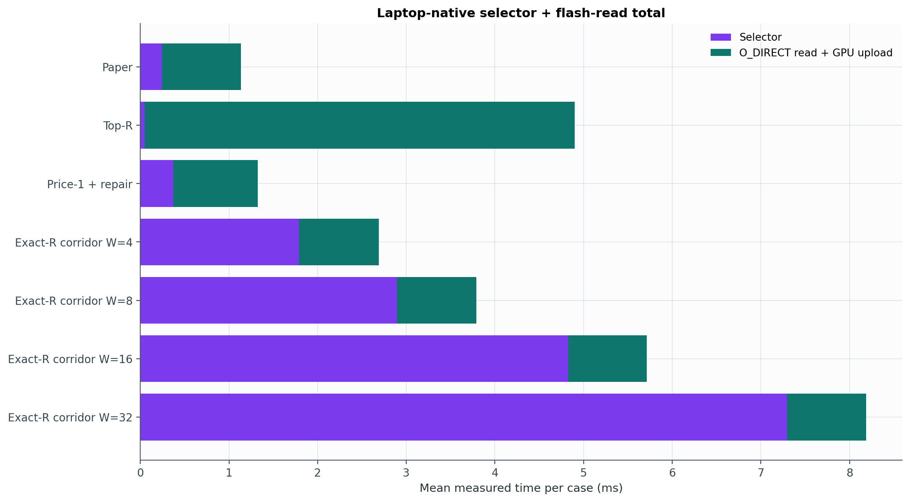
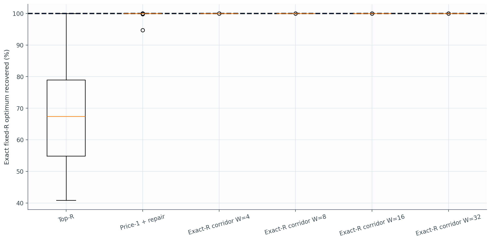

# Experiment 28 보고서: Exact-R Oracle + Sparse Corridor DP

Paper mask나 `I(M_paper)`를 selector 입력으로 사용하지 않았다. Paper가 반환한 행 수만 공통 exact-R 예산으로 사용했다. Full DP는 실제 activation 일부에서 two-line latency 목적의 전역 optimum을 계산하고, corridor DP는 그 문제를 작은 prefix-cardinality band에서 온라인으로 근사한다.

## 온라인 결과

Primary timing track: `cuda`.

| 방법 | selector median | case-p95 | lookup I/L vs Paper | two-line I/L vs Paper | importance | 실제 read wall | selector+read | Paper보다 빠른 case |
|---|---:|---:|---:|---:|---:|---:|---:|---:|
| Paper | 0.257 ms | 0.435 ms | 0.00% | 0.00% | 0.00% | 0.892 ms | 1.135 ms | - |
| Top-R | 0.039 ms | 0.111 ms | -87.45% | -88.44% | 27.63% | 4.852 ms | 4.900 ms | 0.0% |
| Price-1 + repair | 0.212 ms | 1.110 ms | -11.18% | -11.82% | 0.48% | 0.954 ms | 1.323 ms | 32.0% |
| Exact-R corridor W=4 | 0.884 ms | 6.370 ms | -6.83% | -7.74% | 0.27% | 0.902 ms | 2.692 ms | 0.0% |
| Exact-R corridor W=8 | 1.259 ms | 10.629 ms | -4.21% | -5.42% | 0.04% | 0.897 ms | 3.791 ms | 0.0% |
| Exact-R corridor W=16 | 1.791 ms | 18.402 ms | -0.42% | -2.03% | -0.42% | 0.892 ms | 5.715 ms | 0.0% |
| Exact-R corridor W=32 | 2.421 ms | 30.288 ms | 2.96% | 1.09% | -0.30% | 0.893 ms | 8.186 ms | 0.0% |

## 실제 trace full exact-R oracle

24개 실제 case에서 full state space를 계산했다. 모든 case converged: `True`.

| 판정량 | 평균 | 중앙값 | 최소 | Paper 초과 case |
|---|---:|---:|---:|---:|
| Exact two-line I/L gain | 4.72% | 4.29% | 0.55% | 100.0% |
| Exact lookup I/L gain | 6.72% | 7.51% | 0.55% | 100.0% |
| Exact solver runtime | 39.02 ms | 5.64 ms | 3.68 ms | - |

Corridor의 exact two-line optimum 회수율:

| 방법 | 평균 | p5 | 최소 |
|---|---:|---:|---:|
| Exact-R corridor W=4 | 90.320% | 62.409% | 24.187% |
| Exact-R corridor W=8 | 92.027% | 69.795% | 33.483% |
| Exact-R corridor W=16 | 94.590% | 80.536% | 40.274% |
| Exact-R corridor W=32 | 96.829% | 93.302% | 53.265% |

### Oracle mask의 실제 SSD read

Exact mask는 Paper보다 실제 read wall을 평균 `+0.016 ms` 줄였고, `66.7%`의 case에서 더 빨랐다. 이 값은 selector를 공짜로 가정한 최대 read-side 여유다.

## Holdout shape dispatch

각 shape의 앞 절반 trace에서 Paper와 Price-1 중 평균 총시간이 짧은 방법을 고르고, 뒤 절반에는 선택을 고정해 적용했다. Shape는 selector 전에 알려져 있으므로 dispatch 자체의 온라인 비용은 없다.

선택: `4864x896`→Paper, `896x128`→Paper, `896x4864`→Price-1 + repair, `896x896`→Paper.

192개 holdout case에서 Paper 평균은 `1.142 ms`, dispatch는 `1.121 ms`였다. 평균 `0.020 ms` (`1.79%`) 단축했고, non-regression rate는 `96.4%`다.

| Shape | train 선택 | train 절감 | holdout 절감 | holdout strict win |
|---|---|---:|---:|---:|
| 4864x896 | Paper | -0.724 ms | +0.000 ms | 0.0% |
| 896x128 | Paper | -0.083 ms | +0.000 ms | 0.0% |
| 896x4864 | Price-1 + repair | +0.039 ms | +0.082 ms | 85.4% |
| 896x896 | Paper | -0.008 ms | +0.000 ms | 0.0% |

## 판정

단일 전-shape 방법 중에는 Paper가 `1.135 ms`로 가장 짧아, 현재 CPU corridor 구현은 end-to-end Paper를 이기지 못했다.

온라인 mask 품질이 가장 높은 후보는 `Exact-R corridor W=32`이며 lookup I/L 변화는 `2.96%`다.

Full oracle가 Paper보다 높은 목적값을 보였으므로 Paper 알고리즘이 수학적으로 최적인 것은 아니다. 남은 문제는 optimum의 부재가 아니라 그 해를 Paper보다 싼 selector로 회수하는 것이다.

다만 사전 절반에서 정한 shape-only dispatch는 독립된 뒤 절반에서 Paper를 `1.79%` 이겼다. 따라서 이 노트북에서 우리 방법이 Paper를 전혀 이길 수 없다는 결론도 틀리다. 현재 확인된 실용적 승리는 `896x4864`에 Price-1을 쓰고 나머지에는 Paper를 쓰는 혼합 정책이다.

## 범위와 한계

- Full oracle는 two-line run-cost 모델에 대해 exact하며 arbitrary lookup table에 대한 exact oracle은 아니다.
- 최종 시스템 판정은 로컬 profile뿐 아니라 native O_DIRECT read+GPU upload 실측을 사용한다.
- corridor는 exact-R이지만 width가 유한할 때는 전역 optimality를 보장하지 않는다.
- selector timing에는 CUDA 입력의 D2H, CPU solve, bool mask H2D가 포함된다.

