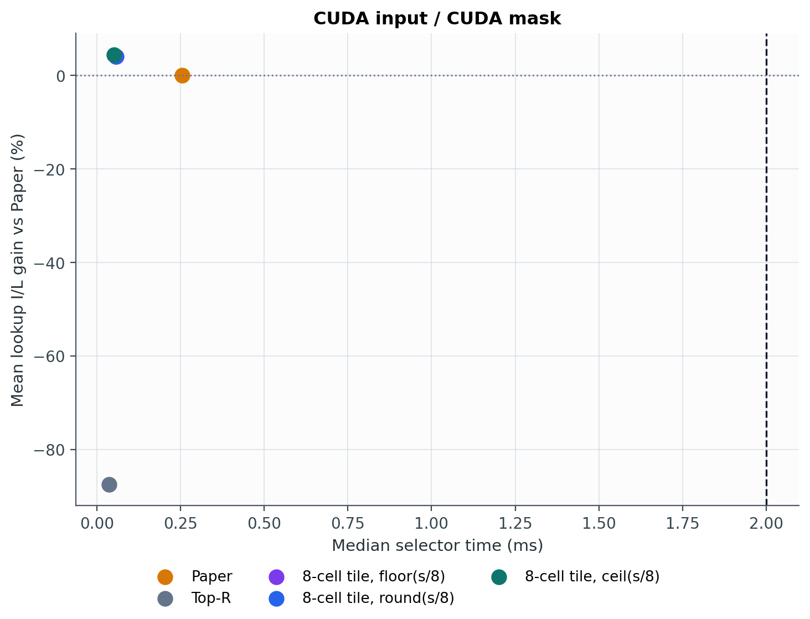
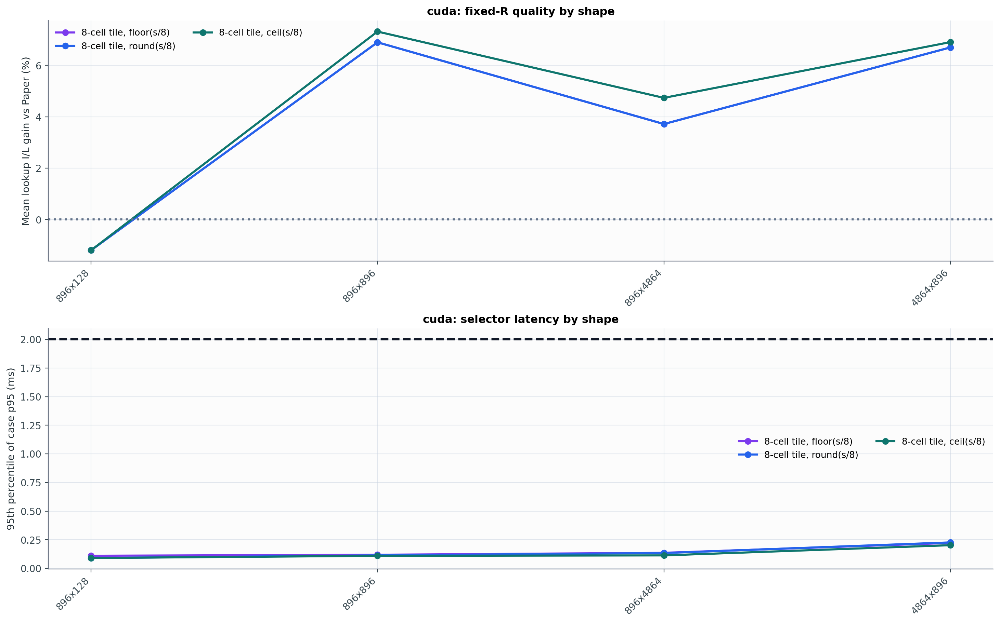
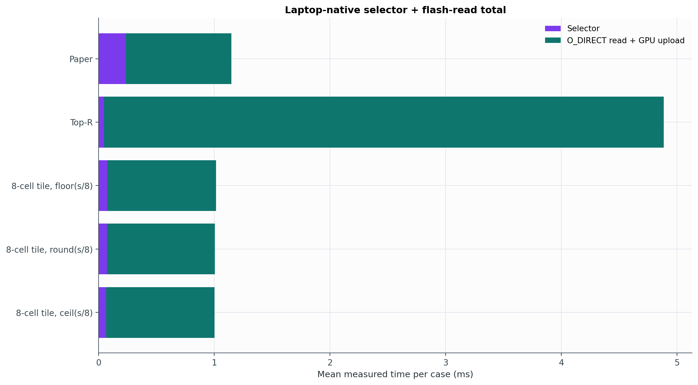
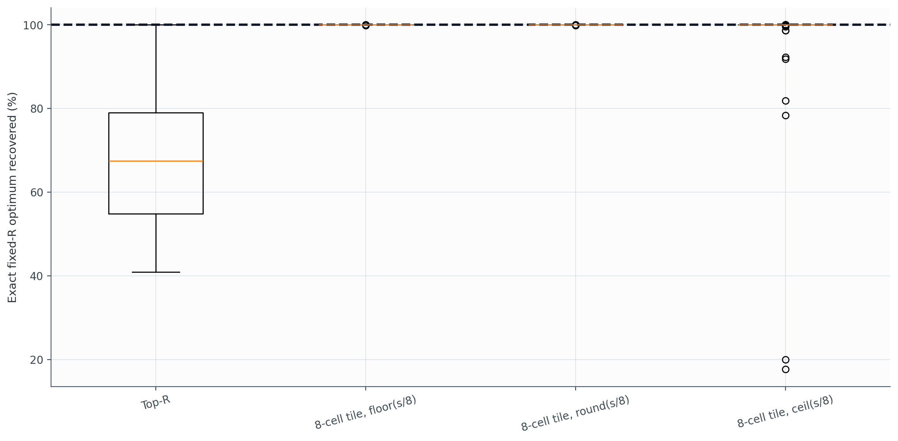

# Experiment 29 보고서: Saturation 8-Cell Tiles

`s/8`행을 한 cell로 양자화하고 길이 8 cell인 sliding chunk만 고려한다. 고정 길이 interval의 exact-K DP와 exact-R endpoint 보정만 사용하며, Paper mask나 `I(M_paper)`는 selector 입력이 아니다.

측정 환경은 `NVIDIA GeForce RTX 3050 6GB Laptop GPU`와 `WD_BLACK SN850X 1000GB`이며, 로컬 포화점은 `s=240 KiB`다.

## 실험 생성 직전 internal probe

Experiment 28의 384개 paired case에 Python reference를 적용했다. 이는 selector 시간과 실제 I/O를 재지 않은 모델 측 사전 결과이며, Experiment 29의 정식 결과와 분리한다.

| Shape | lookup I/L | lookup 절감 | importance | win rate |
|---|---:|---:|---:|---:|
| 896x896 | +6.99% | +9.53% | -3.47% | 93.8% |
| 896x128 | -1.20% | +0.00% | -1.20% | 4.2% |
| 896x4864 | +4.74% | +6.32% | -1.92% | 100.0% |
| 4864x896 | +6.79% | +6.96% | -0.66% | 100.0% |

전체 평균은 lookup I/L `+4.33%`, lookup latency `5.70%` 절감이었다.

## 노트북 정식 결과

| 방법 | selector median | case-p95 | lookup I/L | importance | 실제 read wall | selector+read | Paper보다 빠른 case |
|---|---:|---:|---:|---:|---:|---:|---:|
| Paper | 0.256 ms | 0.430 ms | 0.00% | 0.00% | 0.911 ms | 1.147 ms | - |
| Top-R | 0.036 ms | 0.115 ms | -87.45% | 27.63% | 4.840 ms | 4.885 ms | 0.0% |
| 8-cell tile, floor(s/8) | 0.059 ms | 0.180 ms | 4.03% | -1.48% | 0.941 ms | 1.014 ms | 94.8% |
| 8-cell tile, round(s/8) | 0.057 ms | 0.182 ms | 4.03% | -1.48% | 0.934 ms | 1.005 ms | 95.8% |
| 8-cell tile, ceil(s/8) | 0.051 ms | 0.182 ms | 4.44% | -1.64% | 0.937 ms | 1.002 ms | 95.3% |

실제 activation은 `384` case/방법이고, selector와 I/O를 각각 case당 `30`회와 `30`회 반복했다. 실제 I/O 기록은 총 `57,600`개이며 O_DIRECT 비율은 `100.0%`다.

### Paired 시간 분해

최선인 `8-cell tile, ceil(s/8)`는 case 평균으로 selector에서 `+0.172 ms`를 절감하고 실제 read에서는 `-0.026 ms`를 절감했다(음수는 tile이 더 느리다는 뜻). 따라서 순절감은 `+0.146 ms`이고, shape-stratified trace-cluster bootstrap 95% 구간은 `[0.138, 0.153] ms`다.

### Shape별 best tile

| Shape | best tile | lookup I/L | 실제 read | 총시간 | Paper 총시간 |
|---|---|---:|---:|---:|---:|
| 896x896 | 8-cell tile, ceil(s/8) | +7.32% | 0.502 ms | 0.554 ms | 0.696 ms |
| 896x128 | 8-cell tile, ceil(s/8) | -1.20% | 0.200 ms | 0.247 ms | 0.362 ms |
| 896x4864 | 8-cell tile, ceil(s/8) | +4.74% | 1.513 ms | 1.563 ms | 1.786 ms |
| 4864x896 | 8-cell tile, round(s/8) | +6.70% | 1.509 ms | 1.629 ms | 1.746 ms |

## Holdout shape dispatch

각 shape의 앞 절반 trace에서 Paper와 세 tile 방식 중 평균 총시간이 가장 짧은 방법을 선택하고, 뒤 절반에 고정 적용했다.

Holdout Paper `1.141 ms`, dispatch `0.992 ms`, 절감 `0.149 ms` (`13.06%`)다. Non-regression rate는 `95.8%`다.

| Shape | 선택 | holdout Paper | holdout dispatch | 절감 | strict win |
|---|---|---:|---:|---:|---:|
| 4864x896 | 8-cell tile, round(s/8) | 1.727 ms | 1.611 ms | +0.116 ms | 89.6% |
| 896x128 | 8-cell tile, ceil(s/8) | 0.361 ms | 0.246 ms | +0.114 ms | 100.0% |
| 896x4864 | 8-cell tile, ceil(s/8) | 1.784 ms | 1.548 ms | +0.236 ms | 100.0% |
| 896x896 | 8-cell tile, round(s/8) | 0.695 ms | 0.564 ms | +0.131 ms | 93.8% |

## 판정

`8-cell tile, ceil(s/8)`가 전체 평균 `1.002 ms`로 Paper `1.147 ms`를 `12.69%` 이겼다.
 Holdout shape dispatch도 Paper를 `13.06%` 이겼다.

## 범위와 한계

- mask 선택은 로컬 SN850X lookup table을 직접 사용한다.
- selector timing은 CUDA importance의 D2H, CPU Numba solve, bool mask H2D를 포함한다.
- 실제 read는 native O_DIRECT와 GPU upload를 반복 측정했다.
- `s>N` 또는 `R<8*cell_rows`이면 하나의 exact-R contiguous window로 퇴화한다.

