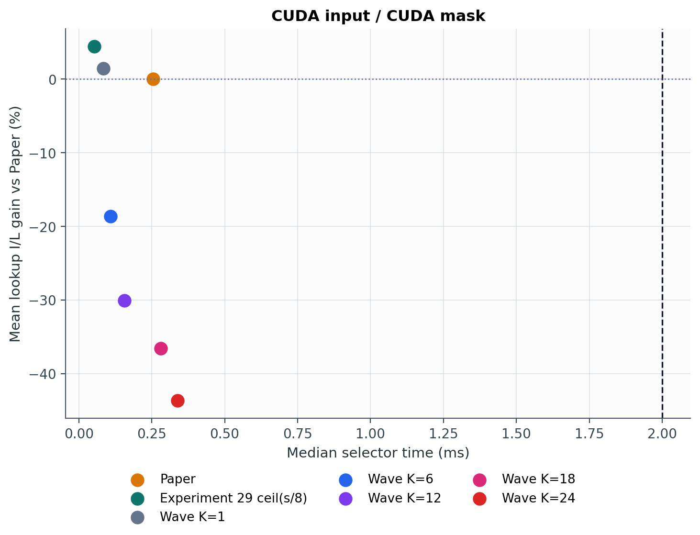
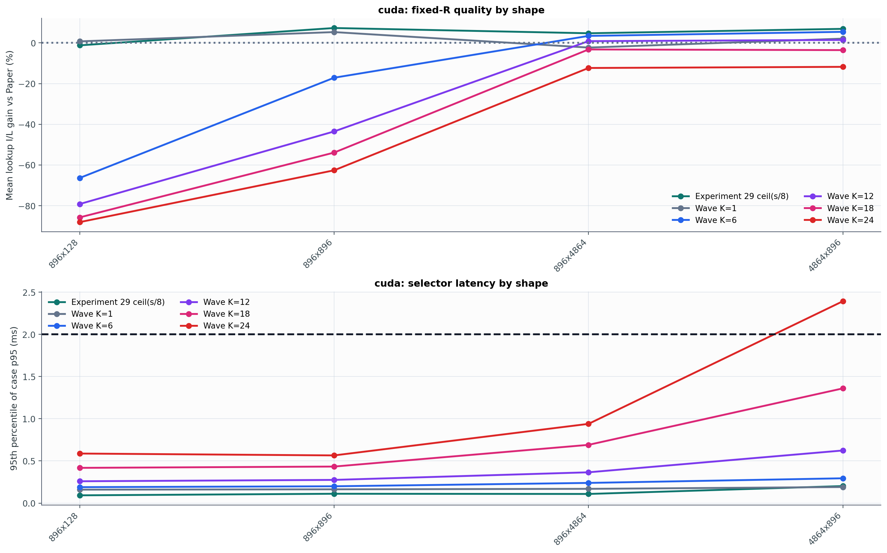
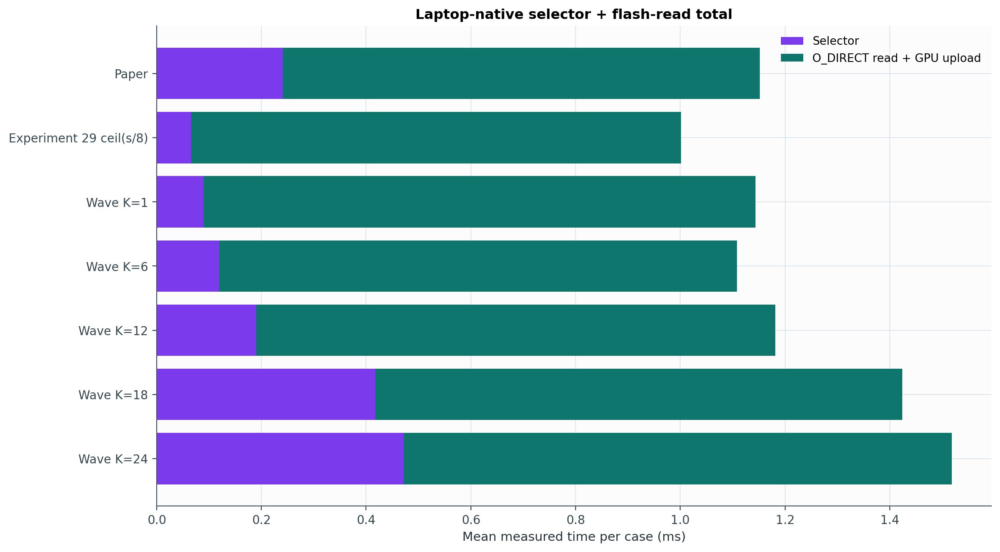

# Experiment 31 보고서: Wave-Balanced Exact-R DP

`NVIDIA GeForce RTX 3050 6GB Laptop GPU`와 `WD_BLACK SN850X 1000GB`에서 실제 측정했다. 512-byte 정렬 cell, 서로 분리된 near-equal run, exact-R DP를 사용한다. Paper mask나 `I(M_paper)`는 selector 입력 또는 wave dispatch 입력이 아니다.

## 전체 결과

| 방법 | selector median | case-p95 | importance vs Paper | lookup I/L | actual read | selector+read | Paper win |
|---|---:|---:|---:|---:|---:|---:|---:|
| Paper | 0.254 ms | 0.430 ms | 0.00% | 0.00% | 0.911 ms | 1.152 ms | - |
| Experiment 29 ceil(s/8) | 0.052 ms | 0.175 ms | -1.64% | 4.44% | 0.936 ms | 1.002 ms | 94.5% |
| Wave K=1 | 0.083 ms | 0.176 ms | -4.68% | 1.47% | 1.054 ms | 1.144 ms | 60.2% |
| Wave K=6 | 0.109 ms | 0.254 ms | 2.53% | -18.64% | 0.989 ms | 1.108 ms | 61.7% |
| Wave K=12 | 0.156 ms | 0.537 ms | 6.33% | -30.07% | 0.991 ms | 1.181 ms | 36.7% |
| Wave K=18 | 0.282 ms | 1.221 ms | 8.60% | -36.58% | 1.007 ms | 1.424 ms | 7.3% |
| Wave K=24 | 0.338 ms | 2.065 ms | 10.08% | -43.67% | 1.046 ms | 1.518 ms | 15.6% |

방법당 `384` case, selector `30`회, O_DIRECT+GPU upload `30`회 반복이며 기록된 실제 I/O 표본은 `80,640`개다.

## Holdout K dispatch

각 shape×budget의 앞 16개 trace에서 K를 고르고 뒤 16개에 고정했다. `max-efficiency`는 wave 후보 자신의 `importance/(selector+read)`만 사용한다.

| 정책 | Paper total | dispatch total | 절감 | importance vs Paper | Top-R retention | win rate |
|---|---:|---:|---:|---:|---:|---:|
| min_total | 1.149 ms | 1.027 ms | 10.63% | +0.04% | 80.38% | 94.3% |
| max_efficiency | 1.149 ms | 1.027 ms | 10.63% | +0.04% | 80.38% | 94.3% |

Max-efficiency 순절감의 shape-stratified trace-cluster bootstrap 95% 구간은 `[0.113, 0.131] ms`다.

같은 holdout에서 tile8은 `0.997 ms`, Paper 대비 `13.27%` 절감이지만 importance는 `-1.60%`다. Wave dispatch는 tile8보다 `0.030 ms` (`3.04%`) 느린 대신 importance를 `+1.64` percentage points 회복한다.

### Max-efficiency가 고른 K

| Shape | budget | 선택 | holdout total | Paper total | importance |
|---|---:|---|---:|---:|---:|
| 4864x896 | 0 | Wave K=6 | 1.079 ms | 1.221 ms | -2.71% |
| 4864x896 | 1 | Wave K=6 | 1.722 ms | 1.707 ms | -2.93% |
| 4864x896 | 2 | Wave K=24 | 2.156 ms | 2.262 ms | +0.45% |
| 896x128 | 0 | Wave K=1 | 0.259 ms | 0.340 ms | +0.86% |
| 896x128 | 1 | Wave K=1 | 0.277 ms | 0.376 ms | +0.47% |
| 896x128 | 2 | Wave K=1 | 0.323 ms | 0.412 ms | +0.95% |
| 896x4864 | 0 | Wave K=6 | 1.038 ms | 1.263 ms | -4.44% |
| 896x4864 | 1 | Wave K=12 | 1.656 ms | 1.783 ms | -1.79% |
| 896x4864 | 2 | Wave K=24 | 2.060 ms | 2.306 ms | +0.26% |
| 896x896 | 0 | Wave K=6 | 0.512 ms | 0.591 ms | +7.25% |
| 896x896 | 1 | Wave K=6 | 0.573 ms | 0.700 ms | +2.10% |
| 896x896 | 2 | Wave K=6 | 0.670 ms | 0.832 ms | +0.07% |

## 판정

단일 최속 방법은 `Experiment 29 ceil(s/8)`의 `1.002 ms`이며 Paper 대비 `13.04%` 절감이다.

Paper 수준의 평균 importance를 요구하면 holdout wave dispatch가 `1.027 ms`로 Paper보다 `10.63%` 빠르면서 importance는 `+0.04%`다.

## 해석

6-lane 균형화 자체는 유효하지만 충분하지 않았다. K=1의 실제 read `1.054 ms`가 K=6에서 `0.989 ms`로 줄었지만, Paper의 `0.911 ms`보다 여전히 느리다. K=6의 총 이득은 reader보다 Paper selector를 대체한 데서 주로 나온다.

K를 12 이상으로 늘리면 importance는 계속 오르지만 DP 시간과 thread/task 고정비가 더 빨리 증가한다. 따라서 이 노트북에서는 하나의 큰 K가 아니라 shape×budget별 K dispatch가 속도-품질 경계다.

## 범위

- selector timing은 importance GPU→CPU, CPU DP, dense bool mask CPU→GPU를 포함한다.
- reader는 아직 기존 dense-mask API와 매 호출 thread 생성을 사용한다.
- 실제 read는 native O_DIRECT와 GPU upload를 포함한다.
- 이는 selector+projection-weight-read 경로이며 전체 LLM end-to-end latency가 아니다.

