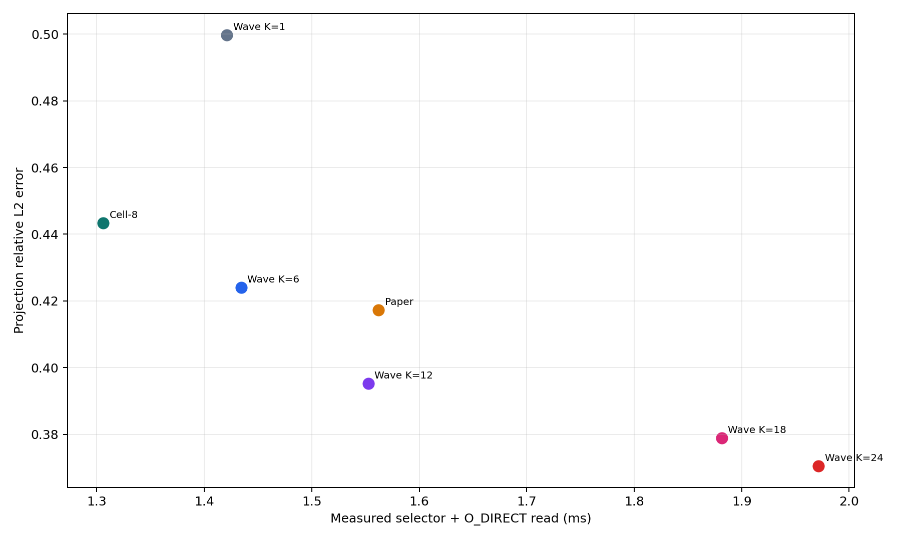
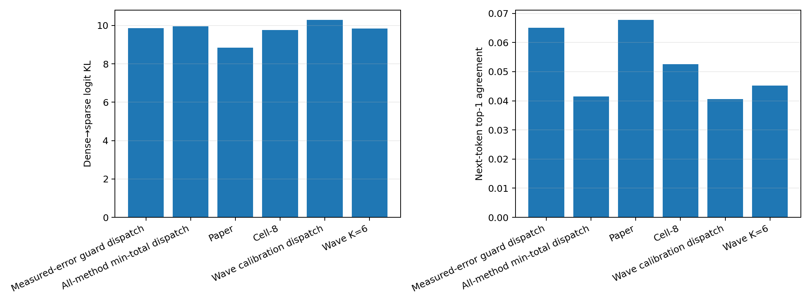

# Experiment 32 보고서: 다중 모델 실제 오차

`NVIDIA GeForce RTX 3050 6GB Laptop GPU`와 `WD_BLACK SN850X 1000GB`에서 세 실제 모델, calibration/holdout prompt, 세 row budget을 측정했다. Importance 외에 실제 projection 출력 오차와 전체 forward logit 오차를 직접 계산했다.

## Holdout projection 결과

| 방법 | actual total | relative L2 | cosine error | importance retention |
|---|---:|---:|---:|---:|
| Paper | 1.562 ms | 0.4173 | 0.1204 | 57.21% |
| Cell-8 | 1.306 ms | 0.4434 | 0.1310 | 56.08% |
| Wave K=1 | 1.421 ms | 0.4997 | 0.1594 | 53.56% |
| Wave K=6 | 1.434 ms | 0.4241 | 0.1214 | 57.35% |
| Wave K=12 | 1.553 ms | 0.3952 | 0.1088 | 58.90% |
| Wave K=18 | 1.881 ms | 0.3789 | 0.1019 | 59.84% |
| Wave K=24 | 1.972 ms | 0.3706 | 0.0983 | 60.37% |

최저 actual total은 **Cell-8**, 최저 projection relative L2 오차는 **Wave K=24**였다.

같은 projection×prompt×budget 안에서 방법만 바꾼 importance retention과 relative L2 error의 Spearman 상관은 평균 `-0.928`, 중앙값 `-0.964`이다. 완전한 대리변수라면 -1에 가까워야 한다.

## 모델별 Cell-8 대 Paper

| 모델 | Paper total | Cell-8 total | 시간 절감 | Paper rel-L2 | Cell-8 rel-L2 | 오차 변화 |
|---|---:|---:|---:|---:|---:|---:|
| qwen05 | 1.149 ms | 0.972 ms | 15.46% | 0.4315 | 0.4463 | +3.42% |
| smol360 | 1.081 ms | 0.815 ms | 24.64% | 0.4076 | 0.4396 | +7.87% |
| tiny11 | 2.456 ms | 2.132 ms | 13.19% | 0.4130 | 0.4443 | +7.58% |

## Calibration dispatch

Dispatcher는 calibration prompt에서만 model×shape×budget별 방법을 고르고 holdout에는 고정한다. Error guard는 calibration Paper relative L2의 1% 이내인 후보 중 actual total이 가장 작은 방법이다.

| 정책 | Paper | Cell-8 | Wave K | 총 선택 수 |
|---|---:|---:|---:|---:|
| Wave calibration dispatch | 0 | 0 | 36 | 36 |
| All-method min-total dispatch | 0 | 28 | 8 | 36 |
| Measured-error guard dispatch | 13 | 8 | 15 | 36 |

## Holdout end-to-end logit 오차

| 정책 | logit relative L2 | dense→sparse KL | top-1 agreement | NLL delta |
|---|---:|---:|---:|---:|
| Paper | 1.2634 | 8.8424 | 6.77% | +7.7712 |
| Cell-8 | 1.2717 | 9.7548 | 5.25% | +8.6794 |
| Wave K=6 | 1.2309 | 9.8361 | 4.52% | +8.6781 |
| Wave calibration dispatch | 1.3214 | 10.2809 | 4.06% | +9.2021 |
| All-method min-total dispatch | 1.2941 | 9.9575 | 4.15% | +8.8422 |
| Measured-error guard dispatch | 1.2723 | 9.8617 | 6.51% | +8.7153 |

### Budget별 Paper·Cell-8·Wave K=6

| budget | 정책 | KL | top-1 | NLL delta |
|---:|---|---:|---:|---:|
| 25% | Paper | 11.7896 | 1.96% | +10.7721 |
| 25% | Cell-8 | 11.8117 | 0.54% | +10.5528 |
| 25% | Wave K=6 | 12.4576 | 1.22% | +11.1814 |
| 50% | Paper | 9.7603 | 2.33% | +8.6083 |
| 50% | Cell-8 | 11.6578 | 2.33% | +10.6569 |
| 50% | Wave K=6 | 11.0015 | 1.85% | +9.8483 |
| 75% | Paper | 4.9773 | 16.03% | +3.9331 |
| 75% | Cell-8 | 5.7947 | 12.88% | +4.8284 |
| 75% | Wave K=6 | 6.0492 | 10.50% | +5.0045 |

### 모델별 주요 end-to-end 결과

| 모델 | 정책 | KL | top-1 | NLL delta |
|---|---|---:|---:|---:|
| qwen05 | Paper | 10.6404 | 4.14% | +9.3140 |
| qwen05 | Cell-8 | 11.1519 | 2.07% | +9.8654 |
| qwen05 | Wave K=6 | 10.8790 | 3.25% | +9.3138 |
| qwen05 | Measured-error guard dispatch | 13.2101 | 3.69% | +11.6793 |
| smol360 | Paper | 8.9428 | 5.67% | +7.9110 |
| smol360 | Cell-8 | 10.9251 | 5.08% | +9.7773 |
| smol360 | Wave K=6 | 10.5214 | 4.09% | +9.3744 |
| smol360 | Measured-error guard dispatch | 9.4124 | 5.61% | +8.2885 |
| tiny11 | Paper | 6.9439 | 10.51% | +6.0885 |
| tiny11 | Cell-8 | 7.1872 | 8.60% | +6.3954 |
| tiny11 | Wave K=6 | 8.1080 | 6.22% | +7.3460 |
| tiny11 | Measured-error guard dispatch | 6.9627 | 10.23% | +6.1782 |

## 판정

순수 actual_total에서는 Cell-8이 가장 좋다. Paper 대비 평균 `16.39%` 빠르고 paired case의 `96.8%`에서 이겼다. 대신 projection relative L2는 평균 `+6.24%` 악화됐고, 오차까지 개선한 case는 `18.5%`뿐이다.

Calibration projection-error guard도 end-to-end 보장은 못 했다. 평균 logit KL은 Paper `8.842`에서 guard `9.862`로 `+11.53%` 증가했다. 따라서 importance뿐 아니라 projection 오차조차 누적된 모델 오차의 완전한 대리변수가 아니다.

## 측정 범위

- 모델: Qwen2.5-0.5B-Instruct, SmolLM2-360M-Instruct, TinyLlama-1.1B-Chat-v1.0.
- 각 모델의 초·중·후반 layer에서 q/k/v/o/gate/up/down projection을 측정했다.
- Projection 오차는 원래 dense activation과 실제 checkpoint weight에서 계산했다.
- End-to-end 오차는 모든 decoder projection을 실제로 sparsify한 forward의 logits다.
- actual total은 selector와 동일 mask의 native O_DIRECT+GPU upload 합이며, 전체 LLM forward latency는 아니다.
- Paper는 원 알고리즘의 whole-window 제약 때문에 holdout case 일부에서 명목 row budget을 소폭 underfill할 수 있으며, 후보들은 exact-R이다.
- End-to-end 평가는 모든 text-prefill decoder projection을 동시에 sparsify한 stress scenario이며 논문의 visual-token 적용 조건과 동일하지 않다.
- Logit/NLL은 측정 가능한 모델 오차지만 downstream task 정확도 자체는 아니다.

