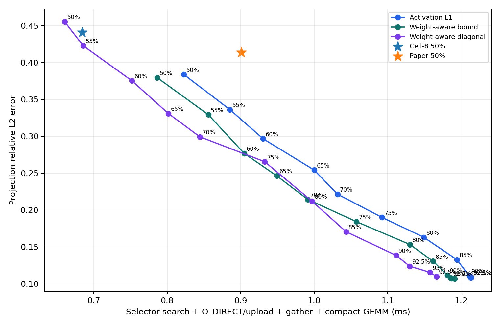

# Experiment 34 보고서: 품질 하한 기반 가변 R

고정된 row ratio를 목적함수로 사용하지 않고, calibration에서만 정한 품질 하한을 만족하는 후보 중 이 노트북의 실제 비용이 가장 작은 구조를 선택했다. Holdout의 Paper importance나 실제 오차는 정책 입력으로 사용하지 않았다.

## Holdout projection 정책

| 정책 | actual total | selector search | 선택 R | relative L2 | feasible |
|---|---:|---:|---:|---:|---:|
| Paper fixed 50% | 0.901 ms | 0.339 ms | 50.0% | 0.4138 | 100.0% |
| Cell-8 fixed 50% | 0.684 ms | 0.133 ms | 50.0% | 0.4409 | 100.0% |
| Variable-R activation | 0.857 ms | 0.237 ms | 60.6% | 0.3611 | 100.0% |
| Variable-R weight-bound | 0.838 ms | 0.214 ms | 60.1% | 0.3604 | 100.0% |
| Variable-R weight-diagonal | 0.801 ms | 0.202 ms | 54.0% | 0.3815 | 100.0% |

### 모델별 calibrated 정책

| 모델 | 정책 | actual total | 선택 R | relative L2 |
|---|---|---:|---:|---:|
| qwen05 | Variable-R weight-bound | 0.680 ms | 64.8% | 0.3482 |
| qwen05 | Variable-R weight-diagonal | 0.640 ms | 58.5% | 0.3746 |
| qwen05 | Paper fixed 50% | 0.666 ms | 50.0% | 0.4276 |
| qwen05 | Variable-R activation | 0.690 ms | 63.3% | 0.3542 |
| smol360 | Variable-R weight-bound | 0.503 ms | 58.4% | 0.3531 |
| smol360 | Variable-R weight-diagonal | 0.463 ms | 49.9% | 0.3908 |
| smol360 | Paper fixed 50% | 0.664 ms | 50.0% | 0.4110 |
| smol360 | Variable-R activation | 0.543 ms | 64.0% | 0.3287 |
| tiny11 | Variable-R weight-bound | 1.332 ms | 57.1% | 0.3798 |
| tiny11 | Variable-R weight-diagonal | 1.301 ms | 53.7% | 0.3792 |
| tiny11 | Paper fixed 50% | 1.372 ms | 50.0% | 0.4028 |
| tiny11 | Variable-R activation | 1.339 ms | 54.3% | 0.4005 |

### Paper와 paired 비교

| 정책 | latency win | local-error win | 둘 다 win |
|---|---:|---:|---:|
| Cell-8 fixed 50% | 97.9% | 16.4% | 15.9% |
| Variable-R activation | 65.6% | 78.8% | 46.0% |
| Variable-R weight-bound | 70.4% | 78.3% | 49.7% |
| Variable-R weight-diagonal | 78.8% | 51.9% | 32.8% |

Calibration의 projection relative-L2 ceiling은 `0.420`이다. 아래 target은 Paper의 온라인 importance가 아니라 각 score의 보존율 하한이다.

## 품질 하한 sweep

| score | 하한 | actual total | 선택 R | relative L2 | 탐색 수 | feasible |
|---|---:|---:|---:|---:|---:|---:|
| Weight-aware bound | 50% | 0.786 ms | 57.5% | 0.3793 | 1.00 | 100.0% |
| Weight-aware bound | 55% | 0.856 ms | 64.3% | 0.3292 | 1.00 | 100.0% |
| Weight-aware bound | 60% | 0.905 ms | 71.1% | 0.2767 | 1.00 | 100.0% |
| Weight-aware bound | 65% | 0.949 ms | 75.3% | 0.2462 | 1.00 | 100.0% |
| Weight-aware bound | 70% | 0.991 ms | 80.0% | 0.2142 | 1.00 | 100.0% |
| Weight-aware bound | 75% | 1.057 ms | 83.5% | 0.1842 | 1.00 | 100.0% |
| Weight-aware bound | 80% | 1.130 ms | 87.9% | 0.1532 | 1.00 | 100.0% |
| Weight-aware bound | 85% | 1.162 ms | 90.8% | 0.1306 | 1.01 | 100.0% |
| Weight-aware bound | 90% | 1.181 ms | 93.2% | 0.1116 | 1.00 | 100.0% |
| Weight-aware bound | 92.5% | 1.186 ms | 94.1% | 0.1078 | 1.00 | 100.0% |
| Weight-aware bound | 95% | 1.187 ms | 94.4% | 0.1073 | 1.00 | 97.9% |
| Weight-aware bound | 97.5% | 1.191 ms | 94.8% | 0.1070 | 1.00 | 14.3% |
| Weight-aware diagonal | 50% | 0.660 ms | 44.7% | 0.4551 | 1.00 | 100.0% |
| Weight-aware diagonal | 55% | 0.685 ms | 48.3% | 0.4226 | 1.00 | 100.0% |
| Weight-aware diagonal | 60% | 0.752 ms | 54.5% | 0.3752 | 1.00 | 100.0% |
| Weight-aware diagonal | 65% | 0.801 ms | 60.4% | 0.3308 | 1.00 | 100.0% |
| Weight-aware diagonal | 70% | 0.844 ms | 65.1% | 0.2991 | 1.00 | 100.0% |
| Weight-aware diagonal | 75% | 0.933 ms | 69.7% | 0.2654 | 1.00 | 100.0% |
| Weight-aware diagonal | 80% | 0.997 ms | 76.3% | 0.2119 | 1.00 | 100.0% |
| Weight-aware diagonal | 85% | 1.043 ms | 82.3% | 0.1705 | 1.01 | 100.0% |
| Weight-aware diagonal | 90% | 1.112 ms | 86.7% | 0.1385 | 1.00 | 99.5% |
| Weight-aware diagonal | 92.5% | 1.130 ms | 89.0% | 0.1237 | 1.02 | 98.9% |
| Weight-aware diagonal | 95% | 1.158 ms | 90.5% | 0.1153 | 1.02 | 97.9% |
| Weight-aware diagonal | 97.5% | 1.167 ms | 91.9% | 0.1097 | 1.01 | 64.6% |
| Activation L1 | 50% | 0.823 ms | 57.7% | 0.3835 | 1.00 | 100.0% |
| Activation L1 | 55% | 0.885 ms | 64.1% | 0.3360 | 1.00 | 100.0% |
| Activation L1 | 60% | 0.930 ms | 69.9% | 0.2965 | 1.00 | 100.0% |
| Activation L1 | 65% | 1.000 ms | 75.4% | 0.2541 | 1.00 | 100.0% |
| Activation L1 | 70% | 1.032 ms | 80.2% | 0.2214 | 1.00 | 100.0% |
| Activation L1 | 75% | 1.092 ms | 84.1% | 0.1899 | 1.01 | 100.0% |
| Activation L1 | 80% | 1.149 ms | 87.6% | 0.1629 | 1.00 | 100.0% |
| Activation L1 | 85% | 1.195 ms | 91.4% | 0.1324 | 1.00 | 100.0% |
| Activation L1 | 90% | 1.211 ms | 94.2% | 0.1109 | 1.00 | 100.0% |
| Activation L1 | 92.5% | 1.213 ms | 94.7% | 0.1091 | 1.00 | 100.0% |
| Activation L1 | 95% | 1.214 ms | 94.9% | 0.1084 | 1.00 | 100.0% |
| Activation L1 | 97.5% | 1.213 ms | 95.0% | 0.1084 | 1.00 | 11.1% |

## Calibration이 선택한 하한

| 모델 | shape | score | target | calibration error | R | ceiling 충족 |
|---|---|---|---:|---:|---:|---:|
| qwen05 | 4864x896 | Weight-aware bound | 55% | 0.3846 | 62.2% | yes |
| qwen05 | 4864x896 | Weight-aware diagonal | 70% | 0.3891 | 60.0% | yes |
| qwen05 | 4864x896 | Activation L1 | 55% | 0.3637 | 64.4% | yes |
| qwen05 | 896x128 | Weight-aware bound | 50% | 0.3907 | 66.7% | yes |
| qwen05 | 896x128 | Weight-aware diagonal | 55% | 0.4072 | 66.6% | yes |
| qwen05 | 896x128 | Activation L1 | 55% | 0.3895 | 69.5% | yes |
| qwen05 | 896x4864 | Weight-aware bound | 60% | 0.3887 | 64.1% | yes |
| qwen05 | 896x4864 | Weight-aware diagonal | 70% | 0.3862 | 63.1% | yes |
| qwen05 | 896x4864 | Activation L1 | 60% | 0.4144 | 61.1% | yes |
| qwen05 | 896x896 | Weight-aware bound | 50% | 0.2431 | 65.3% | yes |
| qwen05 | 896x896 | Weight-aware diagonal | 50% | 0.3371 | 43.3% | yes |
| qwen05 | 896x896 | Activation L1 | 50% | 0.2581 | 58.3% | yes |
| smol360 | 2560x960 | Weight-aware bound | 50% | 0.3361 | 55.6% | yes |
| smol360 | 2560x960 | Weight-aware diagonal | 55% | 0.3972 | 48.3% | yes |
| smol360 | 2560x960 | Activation L1 | 50% | 0.3206 | 61.7% | yes |
| smol360 | 960x2560 | Weight-aware bound | 50% | 0.3589 | 49.4% | yes |
| smol360 | 960x2560 | Weight-aware diagonal | 65% | 0.3987 | 38.9% | yes |
| smol360 | 960x2560 | Activation L1 | 50% | 0.3632 | 53.9% | yes |
| smol360 | 960x320 | Weight-aware bound | 50% | 0.3858 | 71.1% | yes |
| smol360 | 960x320 | Weight-aware diagonal | 60% | 0.3943 | 65.6% | yes |
| smol360 | 960x320 | Activation L1 | 55% | 0.3701 | 72.8% | yes |
| smol360 | 960x960 | Weight-aware bound | 50% | 0.3403 | 53.3% | yes |
| smol360 | 960x960 | Weight-aware diagonal | 55% | 0.3962 | 42.8% | yes |
| smol360 | 960x960 | Activation L1 | 50% | 0.2702 | 63.6% | yes |
| tiny11 | 2048x2048 | Weight-aware bound | 55% | 0.4072 | 45.0% | yes |
| tiny11 | 2048x2048 | Weight-aware diagonal | 60% | 0.3909 | 40.8% | yes |
| tiny11 | 2048x2048 | Activation L1 | 50% | 0.4016 | 45.0% | yes |
| tiny11 | 2048x256 | Weight-aware bound | 50% | 0.3195 | 66.7% | yes |
| tiny11 | 2048x256 | Weight-aware diagonal | 55% | 0.3646 | 61.1% | yes |
| tiny11 | 2048x256 | Activation L1 | 50% | 0.3963 | 56.1% | yes |
| tiny11 | 2048x5632 | Weight-aware bound | 55% | 0.3971 | 58.9% | yes |
| tiny11 | 2048x5632 | Weight-aware diagonal | 65% | 0.4067 | 55.6% | yes |
| tiny11 | 2048x5632 | Activation L1 | 55% | 0.4057 | 57.8% | yes |
| tiny11 | 5632x2048 | Weight-aware bound | 50% | 0.3989 | 52.8% | yes |
| tiny11 | 5632x2048 | Weight-aware diagonal | 70% | 0.3782 | 52.8% | yes |
| tiny11 | 5632x2048 | Activation L1 | 50% | 0.3854 | 56.7% | yes |

## 사후 error oracle (정책 아님)

Holdout의 실제 projection error를 사후에 볼 수 있다고 가정하면 Paper 50%와 같거나 작은 오차에서 평균 `24.45%`를 절약했다. strict latency win rate는 `96.8%`, feasible rate는 `100.0%`다. 이는 가능한 headroom의 상한이며 배포 가능한 결과로 해석하면 안 된다.

## Holdout end-to-end 오차

| 정책 | 선택 R | logit rel-L2 | KL | top-1 | NLL delta | feasible |
|---|---:|---:|---:|---:|---:|---:|
| Variable-R weight-bound | 59.1% | 1.2066 | 10.8971 | 1.78% | +9.6275 | 100.0% |
| bound_t0.9 | 94.7% | 0.4450 | 1.0289 | 64.92% | +0.5789 | 100.0% |
| Cell-8 fixed 50% | 50.0% | 1.5235 | 11.6578 | 2.33% | +10.6569 | 100.0% |
| Variable-R weight-diagonal | 55.1% | 1.2171 | 10.6591 | 1.48% | +9.4535 | 100.0% |
| diag_t0.9 | 91.8% | 0.5871 | 1.9991 | 42.91% | +1.3564 | 100.0% |
| Paper fixed 50% | 50.0% | 1.3492 | 9.7603 | 2.33% | +8.6083 | 100.0% |
| Variable-R activation | 59.5% | 1.2099 | 9.2979 | 2.78% | +8.3257 | 100.0% |
| raw_t0.9 | 94.6% | 0.5264 | 1.5156 | 53.29% | +0.9486 | 100.0% |

### 모델별 Paper 대 calibrated activation

| 모델 | 정책 | 선택 R | KL | top-1 | NLL delta |
|---|---|---:|---:|---:|---:|
| qwen05 | Paper fixed 50% | 50.0% | 11.1981 | 2.50% | +9.7759 |
| qwen05 | Variable-R activation | 62.2% | 11.5363 | 3.31% | +10.0783 |
| smol360 | Paper fixed 50% | 50.0% | 9.8743 | 2.34% | +8.7744 |
| smol360 | Variable-R activation | 64.3% | 8.8876 | 1.28% | +8.1836 |
| tiny11 | Paper fixed 50% | 50.0% | 8.2085 | 2.15% | +7.2748 |
| tiny11 | Variable-R activation | 51.8% | 7.4698 | 3.74% | +6.7154 |

## 판정

Calibration 기반 가변 정책 중 최저 시간은 **Variable-R weight-diagonal**로 `0.801 ms`이다. Paper fixed 50%의 `0.901 ms` 대비 `11.05%` 빨랐고, projection relative-L2는 `0.4138`에서 `0.3815`로 변했다.

End-to-end까지 함께 보면 activation 기반 가변 정책이 핵심 결과다. Paper보다 `4.82%` 빠르면서 local error는 `-12.73%`, logit KL은 `-4.74%`, NLL delta는 `-3.28%` 변했다. 음수인 오차 변화는 개선을 뜻한다. 반면 weight-bound와 diagonal은 local error를 줄였지만 평균 end-to-end KL을 악화시켰다.

따라서 **고정 R 대신 측정 가능한 품질 하한에서 R을 결정한다**는 통찰은 aggregate 결과에서 지지된다. 그러나 activation 정책이 개별 projection에서 latency와 local error를 동시에 이긴 비율은 `46.0%`이고, 모델별 end-to-end 결과도 일관되지 않다. 아직 per-case 또는 모델 보편적 우월성을 주장할 수는 없다.

사후 error oracle의 Paper 대비 절약은 `24.45%`로 deployable 정책보다 크다. 이는 더 좋은 threshold calibration과 global layer allocation에 남은 여지가 있음을 보여준다.

## 측정 범위와 제한

- 세 checkpoint의 초·중·후반 layer와 q/k/v/o/gate/up/down projection을 calibration 3 prompts, holdout 3 prompts에서 측정했다.
- actual total은 projection 하나의 selector, O_DIRECT+upload, activation gather, compact GEMM 합이다. 전체 LLM wall-clock latency가 아니다.
- 모든 정책에서 activation score 자체를 만드는 reduction은 selector 밖으로 두었다. Paper와 activation 정책에는 같은 관례지만, weight-aware score의 추가 L2/norm 연산도 제외되어 그 두 정책의 latency는 다소 낙관적이다.
- `0.420`은 projection-level 설계 허용치이며 task accuracy 보장이 아니다.
- End-to-end 표는 resident checkpoint weight로 모든 decoder projection을 동시에 sparsify한 quality stress test다. 논문의 visual-token 조건과 같지 않다.
- O_DIRECT는 동일 mask의 byte geometry를 실제 NVMe/GPU 경로에서 측정했고, projection 오차는 실제 checkpoint weight로 계산했다.

이 비교에는 selector 탐색, native O_DIRECT+GPU upload, activation gather, 실제 compact GEMM이 모두 포함된다. End-to-end 표는 실제 sparse forward의 품질 측정이며 resident-weight 구현 특성상 전체 LLM wall-clock speedup 표는 아니다.

