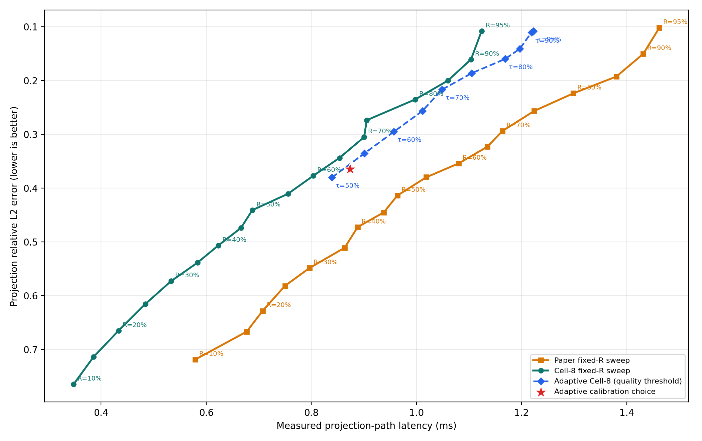
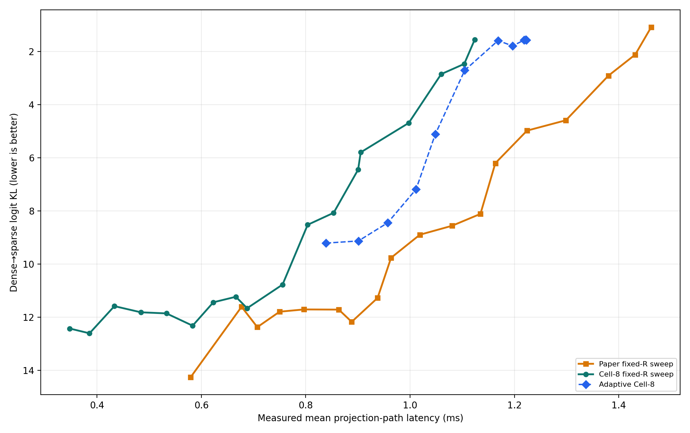

# Experiment 35 보고서: R을 제거한 full frontier

Paper와 Cell-8을 모두 `R=10%..95%`에서 측정하고, R은 curve를 만드는 숨은 매개변수로만 사용했다. 최종 비교축은 실제 latency와 실제 error다. Adaptive 정책은 calibration prompt만으로 threshold와 structured margin을 고정한 뒤 holdout에서 평가했다.

## Quality-constrained value

각 error ceiling에서 이를 만족하는 최소 latency를 고른 결과다. 따라서 아래 표에는 특정 R을 먼저 고정하는 가정이 없다.

| error ceiling | Paper | Cell-8 | Adaptive |
|---:|---:|---:|---:|
| 0.50 | 0.888 ms | 0.666 ms | 0.839 ms |
| 0.45 | 0.938 ms | 0.688 ms | 0.839 ms |
| 0.42 | 0.964 ms | 0.756 ms | 0.839 ms |
| 0.40 | 1.019 ms | 0.804 ms | 0.839 ms |
| 0.35 | 1.135 ms | 0.854 ms | 0.901 ms |
| 0.30 | 1.163 ms | 0.905 ms | 0.957 ms |
| 0.25 | 1.299 ms | 0.997 ms | 1.048 ms |
| 0.20 | 1.380 ms | 1.104 ms | 1.105 ms |
| 0.15 | 1.462 ms | 1.124 ms | 1.197 ms |

## Fixed-R 측정 곡선

| R | Paper time | Paper error | Cell-8 time | Cell-8 error |
|---:|---:|---:|---:|---:|
| 10% | 0.579 ms | 0.7183 | 0.348 ms | 0.7643 |
| 15% | 0.677 ms | 0.6666 | 0.386 ms | 0.7136 |
| 20% | 0.707 ms | 0.6281 | 0.433 ms | 0.6648 |
| 25% | 0.750 ms | 0.5815 | 0.484 ms | 0.6154 |
| 30% | 0.797 ms | 0.5484 | 0.533 ms | 0.5728 |
| 35% | 0.863 ms | 0.5108 | 0.583 ms | 0.5386 |
| 40% | 0.888 ms | 0.4724 | 0.623 ms | 0.5066 |
| 45% | 0.938 ms | 0.4452 | 0.666 ms | 0.4740 |
| 50% | 0.964 ms | 0.4138 | 0.688 ms | 0.4409 |
| 55% | 1.019 ms | 0.3798 | 0.756 ms | 0.4105 |
| 60% | 1.080 ms | 0.3541 | 0.804 ms | 0.3770 |
| 65% | 1.135 ms | 0.3231 | 0.854 ms | 0.3439 |
| 70% | 1.163 ms | 0.2939 | 0.900 ms | 0.3052 |
| 75% | 1.224 ms | 0.2566 | 0.905 ms | 0.2739 |
| 80% | 1.299 ms | 0.2239 | 0.997 ms | 0.2354 |
| 85% | 1.380 ms | 0.1928 | 1.060 ms | 0.2004 |
| 90% | 1.432 ms | 0.1505 | 1.104 ms | 0.1608 |
| 95% | 1.462 ms | 0.1023 | 1.124 ms | 0.1084 |

## Adaptive sweep

| quality threshold | time | error | selected R | attempts | feasible |
|---:|---:|---:|---:|---:|---:|
| τ=50% | 0.839 ms | 0.3804 | 58.0% | 1.00 | 100.0% |
| τ=55% | 0.901 ms | 0.3355 | 64.3% | 1.00 | 100.0% |
| τ=60% | 0.957 ms | 0.2953 | 69.9% | 1.00 | 100.0% |
| τ=65% | 1.011 ms | 0.2566 | 75.4% | 1.00 | 100.0% |
| τ=70% | 1.048 ms | 0.2172 | 80.4% | 1.00 | 100.0% |
| τ=75% | 1.105 ms | 0.1867 | 84.3% | 1.00 | 100.0% |
| τ=80% | 1.169 ms | 0.1601 | 87.9% | 1.00 | 100.0% |
| τ=85% | 1.197 ms | 0.1413 | 90.7% | 1.00 | 100.0% |
| τ=90% | 1.219 ms | 0.1109 | 94.2% | 1.00 | 100.0% |
| τ=92.5% | 1.222 ms | 0.1091 | 94.7% | 1.00 | 100.0% |
| τ=95% | 1.223 ms | 0.1084 | 94.9% | 1.00 | 100.0% |

## Calibration 선택

Shape별 calibration target을 적용한 holdout 평균은 `0.874 ms`, error `0.3645`, 선택 R `60.1%`다.

| 모델 | shape | target | calibration error | R | ceiling 충족 |
|---|---|---:|---:|---:|---:|
| qwen05 | 4864x896 | 55% | 0.3637 | 64.4% | yes |
| qwen05 | 896x128 | 55% | 0.3882 | 70.0% | yes |
| qwen05 | 896x4864 | 60% | 0.4144 | 61.1% | yes |
| qwen05 | 896x896 | 50% | 0.2581 | 58.3% | yes |
| smol360 | 2560x960 | 50% | 0.3284 | 61.1% | yes |
| smol360 | 960x2560 | 50% | 0.3733 | 51.1% | yes |
| smol360 | 960x320 | 50% | 0.4127 | 67.8% | yes |
| smol360 | 960x960 | 50% | 0.2542 | 64.7% | yes |
| tiny11 | 2048x2048 | 50% | 0.4016 | 45.0% | yes |
| tiny11 | 2048x256 | 50% | 0.3769 | 57.8% | yes |
| tiny11 | 2048x5632 | 55% | 0.4057 | 57.8% | yes |
| tiny11 | 5632x2048 | 50% | 0.3854 | 56.7% | yes |

## 판정

Adaptive threshold 점 `11`개 중 같은 수준 이하의 error를 내는 5%-간격 fixed Cell-8 실측점보다 빨랐던 점은 **`1`개**다. 측정점 사이를 선형 보간한 진단에서는 **`0`개**다. 보간은 실측값이 아니지만, coarse grid의 빈틈을 전략의 승리로 오인하는지 검사한다.

유일한 실측-grid 승리는 `τ=70%`에서 `0.011 ms`였지만, 같은 error의 보간 Cell-8은 `1.030 ms`로 adaptive `1.048 ms`보다 빠르다. 따라서 현재 증거는 adaptive R 전략이 fixed Cell-8 frontier 자체를 개선한다는 주장을 지지하지 않는다. Paper 대비 개선과 Cell-8 대비 전략 개선은 구분해야 한다.

End-to-end sparse forward는 `432`개를 실행했다. 실제 dense→sparse logit KL 기준으로 adaptive threshold가 fixed Cell-8 실측 frontier를 이긴 점은 `0`/`11`개다. Calibration 선택도 `0.874 ms`, KL `9.295`이고, 이를 지배하는 fixed Cell-8 실측점은 `0.804 ms`, KL `8.520`이다. 상세 결과는 `end_to_end_summary.csv`, `adaptive_vs_fixed_cell_e2e.csv`, `end_to_end_frontier.pdf`에 있다.

## 측정 범위

- 후보 case: `13608`, adaptive decision: `4158`.
- 모든 native read는 O_DIRECT였고 fallback은 `0`건이다.
- latency는 projection 하나의 selector + O_DIRECT/upload + activation gather + compact GEMM이며 전체 LLM wall-clock은 아니다.
- Error 축은 시각적 quality 방향을 맞추기 위해 뒤집었다. 따라서 작은 error가 그래프 위쪽에 있다.
- 평균 curve는 per-case tail guarantee를 증명하지 않는다.

