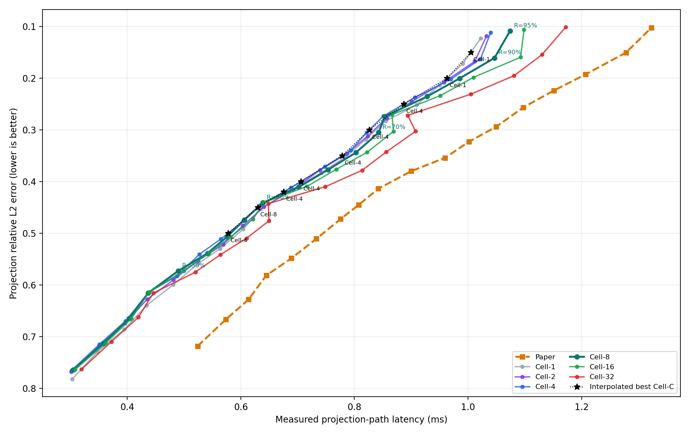
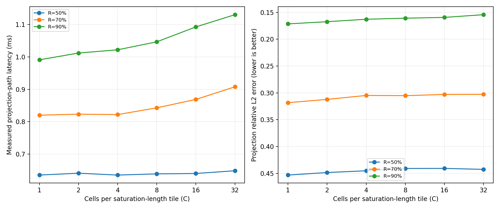
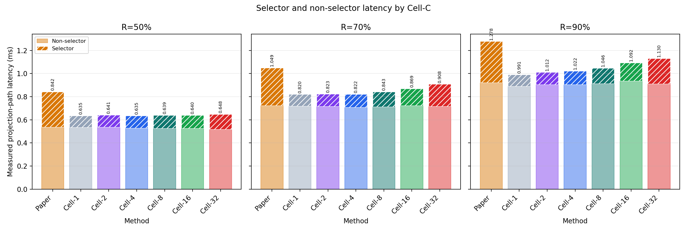
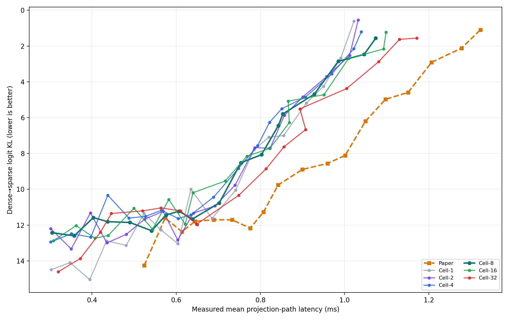

# Experiment 36 보고서: Cell-C parameter sweep

Cell-8의 숫자 `8`을 고정하지 않고 `C={1,2,4,8,16,32}`를 실제 노트북에서 측정했다. 각 Cell-C는 saturation 길이를 C개 cell로 나누며, 모든 방법은 동일하게 `R=10%..95%`를 5% 간격으로 sweep했다. 최종 비교는 특정 R이 아니라 측정된 quality-latency frontier다.

## Projection quality-constrained 결과

| error ceiling | Paper | Cell-8 | best measured Cell-C | R | vs Cell-8 |
|---:|---:|---:|---:|---:|---:|
| 0.50 | 0.776 ms | 0.606 ms | Cell-2 0.604 ms | 45% | +0.4% |
| 0.45 | 0.807 ms | 0.639 ms | Cell-4 0.635 ms | 50% | +0.6% |
| 0.42 | 0.842 ms | 0.702 ms | Cell-1 0.685 ms | 55% | +2.4% |
| 0.40 | 0.900 ms | 0.754 ms | Cell-2 0.740 ms | 60% | +1.8% |
| 0.35 | 1.001 ms | 0.803 ms | Cell-2 0.787 ms | 65% | +2.0% |
| 0.30 | 1.049 ms | 0.853 ms | Cell-4 0.851 ms | 75% | +0.3% |
| 0.25 | 1.151 ms | 0.928 ms | Cell-2 0.901 ms | 80% | +2.9% |
| 0.20 | 1.207 ms | 1.046 ms | Cell-1 0.991 ms | 90% | +5.3% |
| 0.15 | 1.323 ms | 1.074 ms | Cell-1 1.022 ms | 95% | +4.8% |

Quality ceiling별 최적 Cell-C 횟수는 Cell-2: 4, Cell-1: 3, Cell-4: 2.

## 동일 error 보간 진단

5% R grid의 빈틈을 승리로 오인하지 않도록 각 Cell-C 곡선을 동일 error에서 선형 보간했다. 이 값은 실측점이 아니라 곡선 사이 진단값이다.

| error | best Cell-C | interpolated time | Cell-8 time | vs Cell-8 |
|---:|---:|---:|---:|---:|
| 0.50 | Cell-4 | 0.578 ms | 0.582 ms | +0.8% |
| 0.45 | Cell-8 | 0.630 ms | 0.630 ms | +0.0% |
| 0.42 | Cell-4 | 0.675 ms | 0.682 ms | +1.0% |
| 0.40 | Cell-4 | 0.706 ms | 0.718 ms | +1.8% |
| 0.35 | Cell-4 | 0.778 ms | 0.794 ms | +1.9% |
| 0.30 | Cell-4 | 0.826 ms | 0.844 ms | +2.2% |
| 0.25 | Cell-4 | 0.887 ms | 0.900 ms | +1.4% |
| 0.20 | Cell-1 | 0.963 ms | 0.986 ms | +2.3% |
| 0.15 | Cell-1 | 1.005 ms | 1.052 ms | +4.5% |

보간 기준 winner 횟수는 Cell-4: 6, Cell-1: 2, Cell-8: 1. 따라서 Cell-8은 강한 baseline이지만 이 노트북의 단일 최적값은 아니다.

## 모델별 선택

| model | error ceiling | best Cell-C | R | time | error |
|---|---:|---:|---:|---:|---:|
| qwen05 | 0.42 | Cell-8 | 55% | 0.528 ms | 0.4083 |
| qwen05 | 0.25 | Cell-8 | 80% | 0.663 ms | 0.2498 |
| qwen05 | 0.15 | Cell-1 | 95% | 0.737 ms | 0.1307 |
| smol360 | 0.42 | Cell-2 | 55% | 0.402 ms | 0.4148 |
| smol360 | 0.25 | Cell-2 | 80% | 0.466 ms | 0.2435 |
| smol360 | 0.15 | Cell-1 | 95% | 0.529 ms | 0.1342 |
| tiny11 | 0.42 | Cell-1 | 55% | 1.117 ms | 0.4100 |
| tiny11 | 0.25 | Cell-2 | 80% | 1.574 ms | 0.2256 |
| tiny11 | 0.15 | Cell-2 | 95% | 1.799 ms | 0.1018 |

## End-to-end logit KL

| KL ceiling | Paper | Cell-8 | best Cell-C | R | achieved KL |
|---:|---:|---:|---:|---:|---:|
| 12 | 0.574 ms | 0.403 ms | Cell-2 0.396 ms | 20% | 11.318 |
| 10 | 0.842 ms | 0.754 ms | Cell-16 0.716 ms | 55% | 9.538 |
| 8 | 1.049 ms | 0.843 ms | Cell-1 0.785 ms | 65% | 7.789 |
| 6 | 1.097 ms | 0.853 ms | Cell-4 0.851 ms | 75% | 5.503 |
| 4 | 1.207 ms | 0.985 ms | Cell-2 0.957 ms | 85% | 3.705 |
| 2 | 1.323 ms | 1.074 ms | Cell-1 1.022 ms | 95% | 0.612 |
| 1.6 | 1.323 ms | 1.074 ms | Cell-1 1.022 ms | 95% | 0.612 |

## 측정 범위

- 후보 case: `47628`, end-to-end case: `1134`.
- O_DIRECT fallback: `0`건.
- latency는 selector + O_DIRECT/upload + activation gather + compact GEMM의 projection 경로이며 전체 LLM wall-clock은 아니다.
- 두 error 그래프 모두 작은 error가 위에 오도록 축을 뒤집었다.

