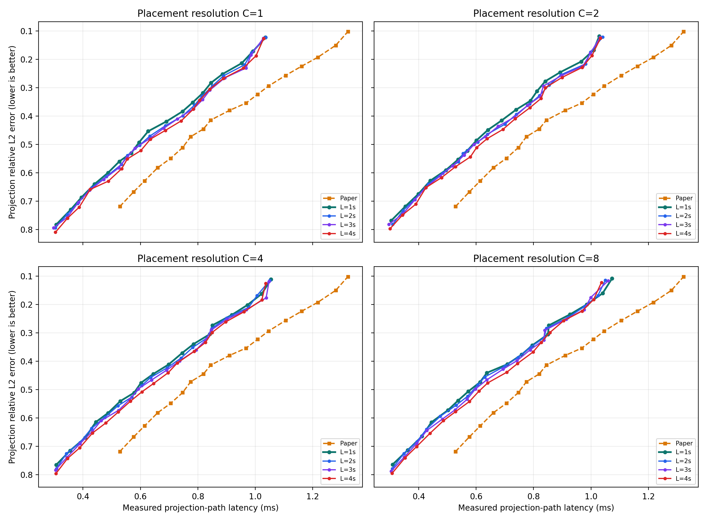
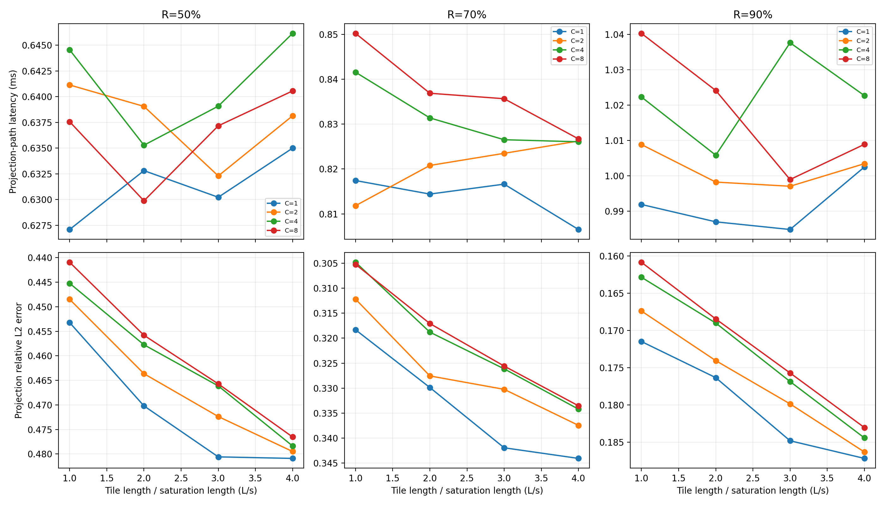
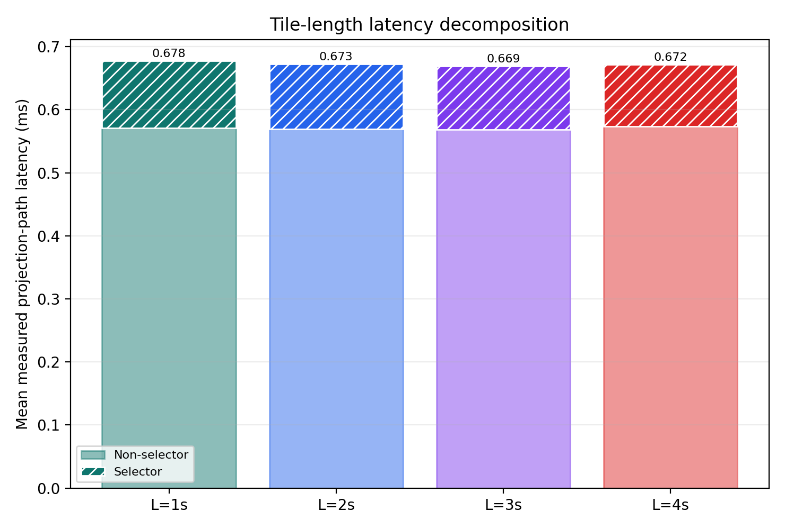
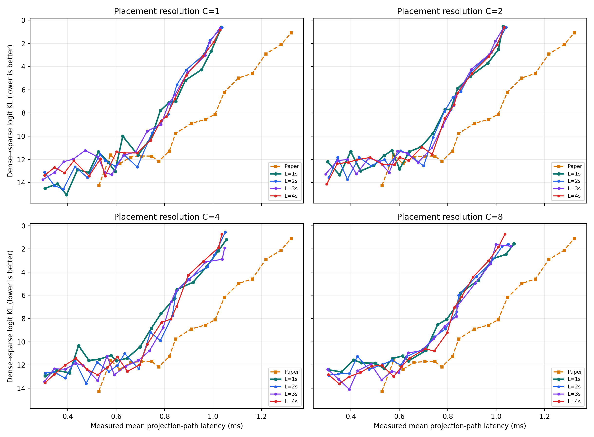

# Experiment 37 보고서: saturation보다 긴 tile

Experiment 36의 시작점 해상도 C와 tile 길이를 분리했다. `C={1,2,4,8}`에서 시작점 간격은 계속 약 `s/C`이고, tile 길이만 `L={s,2s,3s,4s}`로 늘렸다. 모든 조합은 R=10%..95%에서 실제 측정했다.

## 동일 error 보간 비교

보간은 5% R grid 빈틈을 제거하기 위한 진단이며 실측점 자체는 아니다.

| error | best L=s | best L>s | L>s gain | winner |
|---:|---:|---:|---:|---:|
| 0.50 | C8 · 1s 0.581 ms | C4 · 3s 0.591 ms | -1.7% | C8 · 1s |
| 0.45 | C8 · 1s 0.631 ms | C8 · 2s 0.641 ms | -1.5% | C8 · 1s |
| 0.42 | C2 · 1s 0.682 ms | C8 · 2s 0.696 ms | -2.0% | C2 · 1s |
| 0.40 | C2 · 1s 0.709 ms | C4 · 2s 0.726 ms | -2.4% | C2 · 1s |
| 0.35 | C4 · 1s 0.772 ms | C4 · 2s 0.784 ms | -1.6% | C4 · 1s |
| 0.30 | C2 · 1s 0.822 ms | C2 · 3s 0.832 ms | -1.3% | C2 · 1s |
| 0.25 | C2 · 1s 0.885 ms | C4 · 2s 0.897 ms | -1.3% | C2 · 1s |
| 0.20 | C1 · 1s 0.965 ms | C1 · 2s 0.974 ms | -0.9% | C1 · 1s |
| 0.15 | C1 · 1s 1.011 ms | C1 · 3s 1.010 ms | +0.1% | C1 · 3s |

## 실측 grid 비교

| error | Paper | best L=s | best L>s | R(L>s) | error(L>s) |
|---:|---:|---:|---:|---:|---:|
| 0.50 | 0.775 ms | C1 · 1s 0.595 ms | C4 · 3s 0.592 ms | 45% | 0.4977 |
| 0.45 | 0.819 ms | C8 · 1s 0.638 ms | C2 · 3s 0.677 ms | 55% | 0.4358 |
| 0.42 | 0.845 ms | C2 · 1s 0.689 ms | C8 · 2s 0.700 ms | 55% | 0.4178 |
| 0.40 | 0.910 ms | C2 · 1s 0.739 ms | C4 · 3s 0.737 ms | 60% | 0.3988 |
| 0.35 | 1.008 ms | C4 · 1s 0.785 ms | C1 · 4s 0.807 ms | 70% | 0.3441 |
| 0.30 | 1.046 ms | C2 · 1s 0.841 ms | C2 · 3s 0.834 ms | 75% | 0.2941 |
| 0.25 | 1.162 ms | C2 · 1s 0.893 ms | C4 · 2s 0.900 ms | 80% | 0.2479 |
| 0.20 | 1.217 ms | C1 · 1s 0.992 ms | C1 · 3s 0.985 ms | 90% | 0.1848 |
| 0.15 | 1.322 ms | C2 · 1s 1.028 ms | C1 · 3s 1.028 ms | 95% | 0.1253 |

## Selector / non-selector 분해

| tile length | selector | non-selector | total | projection error |
|---:|---:|---:|---:|---:|
| 1s | 0.1066 ms | 0.5709 ms | 0.6775 ms | 0.4345 |
| 2s | 0.1028 ms | 0.5697 ms | 0.6725 ms | 0.4464 |
| 3s | 0.1003 ms | 0.5685 ms | 0.6688 ms | 0.4546 |
| 4s | 0.0981 ms | 0.5738 ms | 0.6719 ms | 0.4614 |

## End-to-end logit KL

| KL ceiling | Paper | best L=s | best L>s |
|---:|---:|---:|---:|
| 12 | Paper 0.577 ms | C2 · 1s 0.400 ms | C2 · 2s 0.346 ms |
| 10 | Paper 0.845 ms | C2 · 1s 0.739 ms | C1 · 3s 0.728 ms |
| 8 | Paper 1.046 ms | C1 · 1s 0.782 ms | C2 · 2s 0.787 ms |
| 6 | Paper 1.105 ms | C2 · 1s 0.841 ms | C8 · 2s 0.845 ms |
| 4 | Paper 1.217 ms | C2 · 1s 0.966 ms | C1 · 4s 0.958 ms |
| 2 | Paper 1.322 ms | C2 · 1s 1.028 ms | C1 · 3s 0.985 ms |
| 1 | — | C2 · 1s 1.028 ms | C1 · 3s 1.028 ms |

## 판정

동일-error 보간 winner의 길이 분포는 L=1s: 8, L=3s: 1이다. L>s가 이긴 ceiling은 `1`/`9`개다. End-to-end logit KL의 discrete value에서는 L>s가 `5`/`7`개 ceiling에서 빨랐다. 전자는 국소 projection 평균이고 후자는 비선형 누적 오차이므로 두 결론을 구분해야 한다.

## 측정 범위

- projection 후보 `115668`, end-to-end `2754`개.
- O_DIRECT fallback `0`건.
- latency는 selector + O_DIRECT/upload + activation gather + compact GEMM이다.
- error 축은 작은 값이 위에 오도록 뒤집었다.

