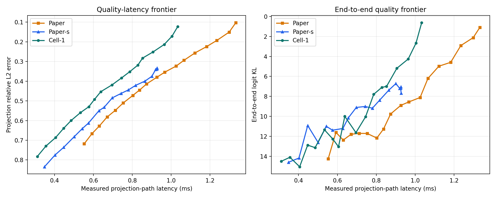
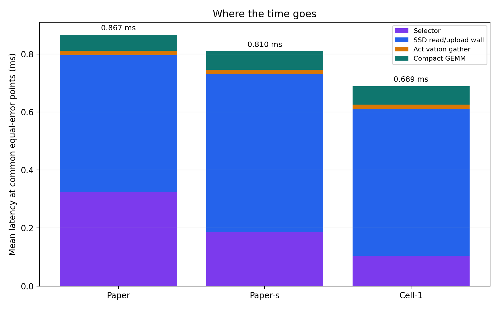
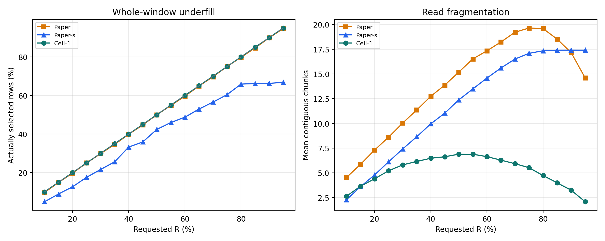

# Experiment 38 보고서: Paper vs Paper-s vs Cell-1

`Paper-s`는 논문 Algorithm 1의 utility score, greedy non-overlap 선택, projection별 jump cap, whole-window budget 규칙을 유지하고 후보 window 길이만 노트북 saturation 길이 `s` 하나로 고정한다. `Cell-1`도 기본 tile 길이는 `s`지만 시작점 격자가 `s`이고 floor-expand/ceil-trim으로 exact-R을 반환한다.

## 동일 projection error 보간

5% R grid 사이를 선형 보간한 진단값이다. 실측점 자체는 아니다.

| error | Paper | Paper-s | vs Paper | Cell-1 | vs Paper |
|---:|---:|---:|---:|---:|---:|
| 0.50 | 0.767 ms | 0.684 ms | 10.851% | 0.600 ms | 21.814% |
| 0.45 | 0.831 ms | 0.768 ms | 7.595% | 0.643 ms | 22.575% |
| 0.42 | 0.866 ms | 0.820 ms | 5.413% | 0.694 ms | 19.943% |
| 0.40 | 0.895 ms | 0.864 ms | 3.424% | 0.722 ms | 19.374% |
| 0.35 | 0.975 ms | 0.915 ms | 6.149% | 0.789 ms | 19.065% |
| 0.30 | 1.057 ms | — | — | 0.841 ms | 20.446% |
| 0.25 | 1.134 ms | — | — | 0.909 ms | 19.882% |
| 0.20 | 1.223 ms | — | — | 0.977 ms | 20.106% |
| 0.15 | 1.299 ms | — | — | 1.017 ms | 21.677% |

## 동일-error 구성요소 평균

모든 세 방법이 보간 가능한 error ceiling만 평균했다.

| method | selector | SSD/upload wall | gather | GEMM | total | chunks |
|---|---:|---:|---:|---:|---:|---:|
| Paper | 0.3258 ms | 0.4701 ms | 0.0150 ms | 0.0558 ms | 0.8669 ms | 14.71 |
| Paper-s | 0.1846 ms | 0.5464 ms | 0.0146 ms | 0.0645 ms | 0.8101 ms | 15.12 |
| Cell-1 | 0.1041 ms | 0.5066 ms | 0.0150 ms | 0.0637 ms | 0.6895 ms | 6.68 |

## 요청 R 충족

| method | mean selected/requested | exact-R case rate |
|---|---:|---:|
| Paper | 99.40% | 66.14% |
| Paper-s | 74.80% | 12.67% |
| Cell-1 | 100.00% | 100.00% |

## End-to-end logit KL

여기서 end-to-end는 모든 decoder projection을 동시에 sparsify한 forward의 logit 품질이고, 표의 시간은 projection-path 평균이다.

| KL ceiling | Paper | Paper-s | Cell-1 |
|---:|---:|---:|---:|
| 12 | 0.593 ms (KL 11.604) | 0.447 ms (KL 10.920) | 0.534 ms (KL 11.347) |
| 10 | 0.874 ms (KL 9.760) | 0.697 ms (KL 9.109) | 0.787 ms (KL 7.789) |
| 8 | 1.066 ms (KL 6.203) | 0.865 ms (KL 7.373) | 0.787 ms (KL 7.789) |
| 6 | 1.122 ms (KL 4.977) | — | 0.906 ms (KL 5.184) |
| 4 | 1.235 ms (KL 2.908) | — | 1.004 ms (KL 2.671) |
| 2 | 1.333 ms (KL 1.091) | — | 1.034 ms (KL 0.612) |
| 1 | — | — | 1.034 ms (KL 0.612) |

## 판정

공통 동일-error 구간 평균에서 Paper-s의 Paper 대비 변화는 `6.548%`, Cell-1의 Paper 대비 변화는 `20.464%`다. selector만 보면 Paper-s는 `43.339%`, Cell-1은 `68.048%` 빠르다.

그러나 strict Paper-s는 평균 projection error를 `0.3336` 아래로 내리지 못했다. 후보 길이 `s`가 R 또는 projection 전체 길이보다 크면 원 Paper의 whole-window 규칙상 아무것도 선택하지 못하기 때문이다. 전체 Paper-s case 중 `1080`개가 empty selection이다. 따라서 `s` 고정만으로 얻는 이득은 공통 저·중품질 구간의 일부 selector 개선이며, Cell-1의 나머지 이득은 coarse start grid와 exact-R repair에서 나온다.

## 측정 범위

- projection 후보 `20412`개.
- non-empty read의 O_DIRECT fallback `0`건.
- Paper-s empty selection `1080`건(빈 read의 direct flag는 O_DIRECT 실패로 세지 않았다).
- 모델 3개, prompt 6개, 모델당 표본 layer 3개, decoder projection 7종.
- R=10%..95%를 5% 간격으로 측정했다.
- latency는 selector + native O_DIRECT/GPU-upload wall + activation gather + compact GEMM이며 전체 LLM wall-clock은 아니다.

