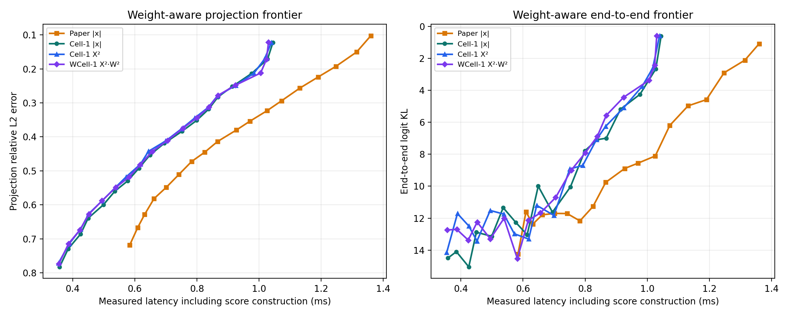
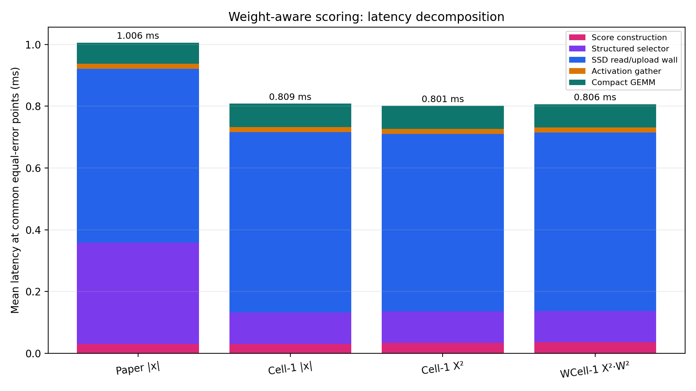
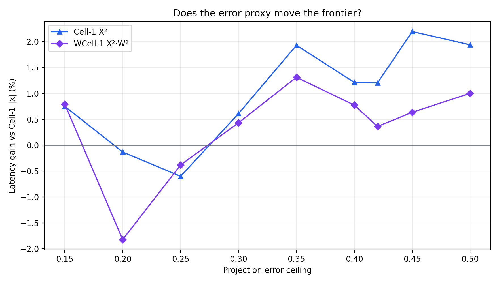

# Experiment 39 보고서: weight-aware Cell-1

기존 Cell-1의 `mean(|X_i|)` 점수를 실제 projection squared-error의 대각 근사 `q_i = mean(X_i^2) * ||W[:,i]||_2^2`로 교체했다. `Cell-1 X²`를 추가해 activation-energy 변경과 weight norm 효과를 분리했다. 모든 latency에는 온라인 score 생성 시간이 포함되고, weight norm은 모델 로딩 때 한 번 사전 계산하므로 포함하지 않는다.

## 동일 projection error 보간

5% R grid 사이의 선형 보간 진단이다. 양수 gain은 기존 Cell-1보다 빠르다는 뜻이다.

| error | Paper | Cell-1 | Cell-1 X² | gain | WCell-1 | gain |
|---:|---:|---:|---:|---:|---:|---:|
| 0.50 | 0.754 ms | 0.606 ms | 0.594 ms | 1.937% | 0.600 ms | 1.003% |
| 0.45 | 0.818 ms | 0.653 ms | 0.639 ms | 2.194% | 0.649 ms | 0.636% |
| 0.42 | 0.858 ms | 0.694 ms | 0.685 ms | 1.203% | 0.691 ms | 0.361% |
| 0.40 | 0.891 ms | 0.726 ms | 0.717 ms | 1.213% | 0.720 ms | 0.774% |
| 0.35 | 0.978 ms | 0.801 ms | 0.786 ms | 1.928% | 0.791 ms | 1.311% |
| 0.30 | 1.063 ms | 0.853 ms | 0.848 ms | 0.610% | 0.850 ms | 0.433% |
| 0.25 | 1.143 ms | 0.917 ms | 0.922 ms | -0.600% | 0.920 ms | -0.382% |
| 0.20 | 1.234 ms | 0.993 ms | 0.994 ms | -0.131% | 1.011 ms | -1.822% |
| 0.15 | 1.315 ms | 1.035 ms | 1.027 ms | 0.751% | 1.027 ms | 0.795% |

## 동일-error 구성요소 평균

| method | score | selector | SSD/upload | gather | GEMM | total |
|---|---:|---:|---:|---:|---:|---:|
| Paper |x| | 0.0307 ms | 0.3277 ms | 0.5625 ms | 0.0164 ms | 0.0685 ms | 1.0058 ms |
| Cell-1 |x| | 0.0307 ms | 0.1020 ms | 0.5836 ms | 0.0163 ms | 0.0761 ms | 0.8086 ms |
| Cell-1 X² | 0.0335 ms | 0.1019 ms | 0.5743 ms | 0.0163 ms | 0.0754 ms | 0.8014 ms |
| WCell-1 X²·W² | 0.0367 ms | 0.1006 ms | 0.5778 ms | 0.0162 ms | 0.0752 ms | 0.8065 ms |

## 모델별 실측-grid 최적점

| model | error | Cell-1 | Cell-1 X² | WCell-1 |
|---|---:|---:|---:|---:|
| qwen05 | 0.15 | 0.780 ms (R 95%) | 0.792 ms (R 95%) | 0.779 ms (R 95%) |
| qwen05 | 0.25 | 0.718 ms (R 85%) | 0.727 ms (R 85%) | 0.735 ms (R 85%) |
| qwen05 | 0.42 | 0.585 ms (R 60%) | 0.579 ms (R 60%) | 0.591 ms (R 60%) |
| smol360 | 0.15 | 0.540 ms (R 95%) | 0.533 ms (R 95%) | 0.533 ms (R 95%) |
| smol360 | 0.25 | 0.516 ms (R 85%) | 0.516 ms (R 85%) | 0.520 ms (R 85%) |
| smol360 | 0.42 | 0.417 ms (R 55%) | 0.416 ms (R 55%) | 0.418 ms (R 55%) |
| tiny11 | 0.15 | 1.813 ms (R 95%) | 1.794 ms (R 95%) | 1.779 ms (R 95%) |
| tiny11 | 0.25 | 1.554 ms (R 80%) | 1.571 ms (R 80%) | 1.576 ms (R 80%) |
| tiny11 | 0.42 | 1.109 ms (R 55%) | 1.120 ms (R 55%) | 1.132 ms (R 55%) |

## End-to-end logit KL

| KL ceiling | Paper | Cell-1 | Cell-1 X² | WCell-1 |
|---:|---:|---:|---:|---:|
| 12 | 0.610 ms (KL 11.604) | 0.536 ms (KL 11.347) | 0.389 ms (KL 11.713) | 0.656 ms (KL 11.674) |
| 10 | 0.866 ms (KL 9.760) | 0.799 ms (KL 7.789) | 0.750 ms (KL 8.928) | 0.755 ms (KL 8.996) |
| 8 | 1.072 ms (KL 6.203) | 0.799 ms (KL 7.789) | 0.836 ms (KL 7.089) | 0.800 ms (KL 7.917) |
| 6 | 1.131 ms (KL 4.977) | 0.914 ms (KL 5.184) | 0.925 ms (KL 5.084) | 0.868 ms (KL 5.572) |
| 4 | 1.247 ms (KL 2.908) | 1.027 ms (KL 2.671) | 0.984 ms (KL 3.760) | 1.005 ms (KL 3.383) |
| 2 | 1.360 ms (KL 1.091) | 1.045 ms (KL 0.612) | 1.040 ms (KL 0.585) | 1.030 ms (KL 0.589) |
| 1 | — | 1.045 ms (KL 0.612) | 1.040 ms (KL 0.585) | 1.030 ms (KL 0.589) |

## 판정

**projection frontier에서는 weight norm 가설이 지지되지 않았다.** WCell-1의 기존 Cell-1 대비 동일-error gain 범위는 `-1.82%..1.31%`, 평균 `0.35%`다. X²-only gain 평균은 `1.01%`다. ceiling별 전체 winner 횟수는 `{'wcell1': 1, 'cell1_abs': 2, 'cell1_x2': 6}`다.

W²를 곱하면 X²-only와 다른 mask를 `57.1%` 선택했지만, 같은 R에서 projection error 변화는 평균 `+0.00004`에 그쳤다. 즉 weight norm의 영향이 너무 작아서가 아니라, mask 순서를 상당히 바꾸고도 실제 오차를 거의 줄이지 못했다. 대각 점수는 neuron 간 Gram off-diagonal 항, 부호와 cancellation을 무시하며 Cell-1의 s-row 집계가 개별 row 점수의 이득도 평균화한다.

End-to-end에서는 WCell-1이 엄격한 KL ceiling 6/2/1에서 가장 빨랐지만, R 간격이 5%이고 holdout prompt가 모델당 3개라 grid 선택 효과일 수 있다. 따라서 현재의 안정적인 후속 기본값은 **Cell-1 X²**이며, WCell-1의 end-to-end 이득은 더 촘촘한 R과 추가 prompt로 재검증해야 한다.

## 측정 범위

- projection 후보 `27216`개.
- non-empty O_DIRECT fallback `0`건.
- 모델 3개, prompt 6개, 모델당 표본 layer 3개, projection 7종.
- R=10%..95%, 5% 간격; actual total은 score + selector + O_DIRECT/upload wall + gather + compact GEMM이다.
- weight norm metadata는 GPU에 상주하며 사전 계산 시간은 online latency에서 제외했다.
- laptop-safe 실행은 모델당 별도 프로세스, CUDA allocator 55%, 128-output-row FP32 norm slab, CPU/O_DIRECT thread 2개, projection 사이 25 ms 양보를 사용했다.

