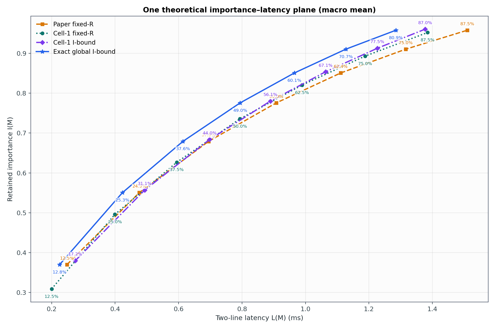
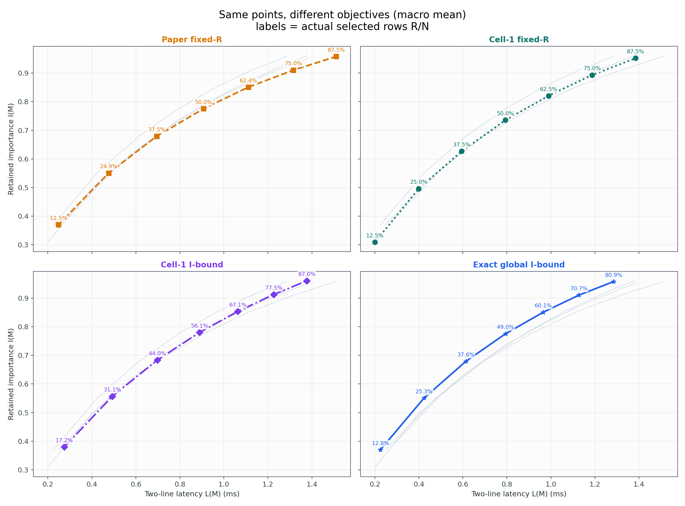
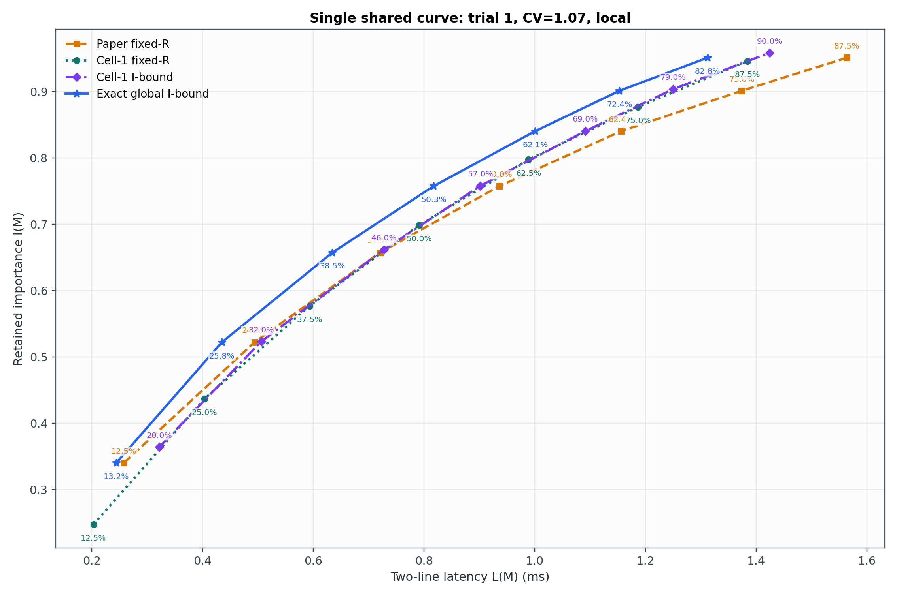
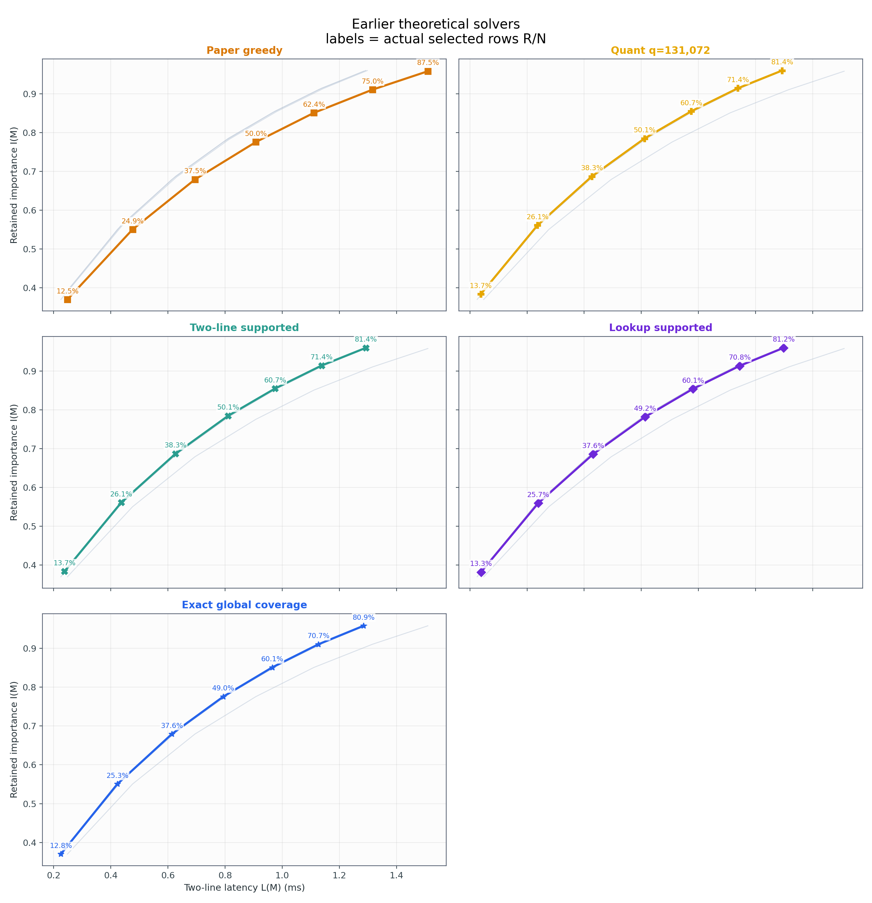
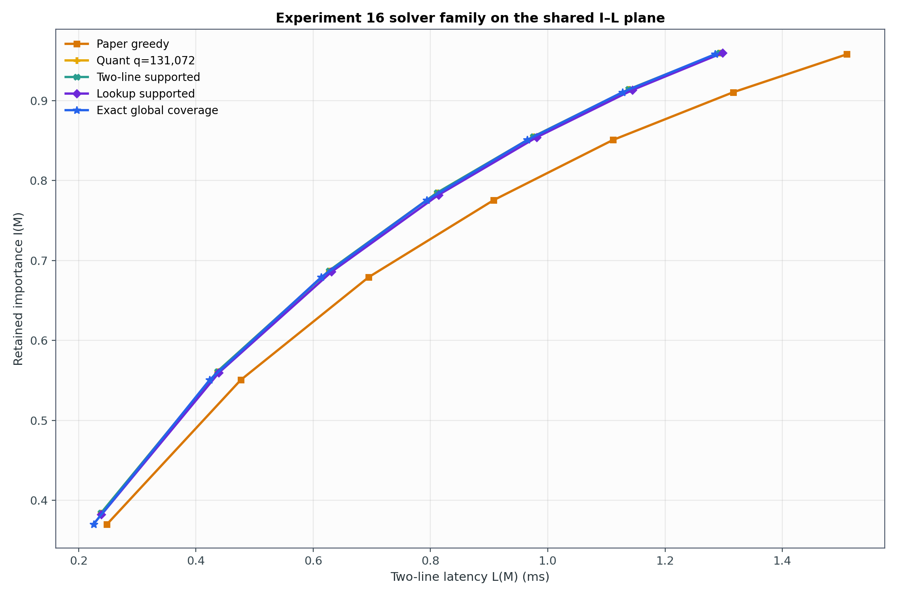
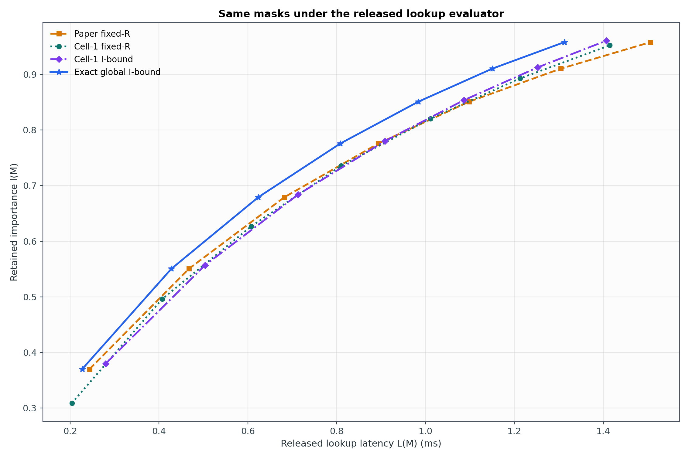

# Experiment 40 보고서: 이론 I–L objective map

GPU, selector 실행시간, upload, gather, GEMM을 모두 제거하고 동일한 importance vector와 latency model 위에서 mask만 비교했다. 주 목적은 `I(M) >= Q`에서 `L(M)`을 최소화하는 문제다.

## 점과 % 라벨의 의미

그래프의 x는 mask의 예측 I/O latency, y는 실제 retained importance다. **각 점 위의 `%`는 speedup이나 importance target이 아니라 그 점이 실제로 선택한 행 비율 `R(M)/N`이다.** 모든 방법은 같은 축과 evaluator를 사용한다.

- Paper fixed-R: 논문 greedy에 R을 입력한다.
- Cell-1 fixed-R: saturation 길이 한 칸 격자에서 같은 R을 채운다.
- Cell-1 I-bound: Cell-1의 `1%` R sweep 중 `I>=Q`인 최소 two-line latency 점을 고른다.
- Exact global I-bound: 모든 binary mask를 대상으로 two-line `min L subject to I>=Q`를 푼 Experiment 16의 전역해다.

## 전체 378개 target 결과

같은 nominal R에서 Cell-1 fixed-R은 Paper보다 importance가 평균 `-6.26%`, two-line latency가 `+12.40%` 절감됐다. 다만 Paper importance target을 직접 만족한 비율은 `27.2%`뿐이다.

목적을 I 하한으로 바꾸면 Cell-1은 평균 R `54.3%`를 선택했고 Paper 대비 two-line latency를 `1.40%` 줄였다. 전역해는 평균 R `48.1%`, Paper 대비 `12.10%` 절감이다. Cell-1 I-bound에서 전역해까지 남은 latency headroom은 평균 `10.31%`다.

## 앞선 전역 solver들과의 연결

Experiment 16의 dense Quant와 complete two-line supported 점은 이 저장 지표 기준 `99.5%`가 일치한다. 그러나 supported 점에서 unsupported point까지 포함하는 Exact coverage로 가면 two-line latency가 추가로 평균 `2.14%` 줄어든다. 따라서 이론 곡선에서 `supported frontier = 전역 coverage frontier`는 아니다.

## target별 평균

| Paper nominal R | Paper actual R | Cell-1 fixed: I 변화 | fixed 절감 | Cell-1 I-bound R | bound 절감 | Exact R | Exact 절감 | 남은 headroom |
|---:|---:|---:|---:|---:|---:|---:|---:|---:|
| 12.5% | 12.5% | -14.74% | +17.97% | 17.2% | -9.22% | 12.8% | +9.05% | 15.61% |
| 25.0% | 24.9% | -9.64% | +15.12% | 31.1% | -2.81% | 25.3% | +10.79% | 12.60% |
| 37.5% | 37.5% | -7.83% | +13.61% | 44.0% | -0.09% | 37.6% | +11.23% | 10.94% |
| 50.0% | 50.0% | -5.32% | +12.01% | 56.1% | +2.13% | 49.0% | +12.14% | 10.01% |
| 62.5% | 62.4% | -3.71% | +10.56% | 67.1% | +4.34% | 60.1% | +12.82% | 8.72% |
| 75.0% | 75.0% | -1.99% | +9.44% | 77.5% | +6.76% | 70.7% | +14.04% | 7.76% |
| 87.5% | 87.5% | -0.62% | +8.08% | 87.0% | +8.67% | 80.9% | +14.63% | 6.54% |

## 해석

이 그림은 목적함수가 달라도 결과 mask는 같은 I–L 공간의 점이라는 관점을 그대로 보여준다. R 고정은 곡선의 x축 위치를 미리 정하는 전략이고, I 하한은 필요한 품질에 도달하는 가장 왼쪽 점을 고르는 전략이다. Exact와 Cell-1 I-bound의 차이는 그 다음 단계인 **허용 mask 공간의 차이**다.

Exact global은 two-line 모델에서만 전역 최적이다. released lookup 그래프는 같은 mask를 다른 evaluator로 재평가한 sensitivity 결과이며 그 축에서는 최적성 인증이 없다. Cell-1 I-bound도 1% R grid 내부의 최적점이지 모든 R 또는 모든 mask의 전역해가 아니다.

## 범위

- 입력 54개 × target 7개 = `378`개 paired target.
- N=`4864`, CV 6개, ordering 3개, trial/CV 3개.
- selector 계산시간은 0으로 둔다. 이 실험은 online algorithm runtime 비교가 아니라 mask geometry와 objective 비교다.
- importance는 synthetic activation surrogate이며 downstream 품질이 아니다.

