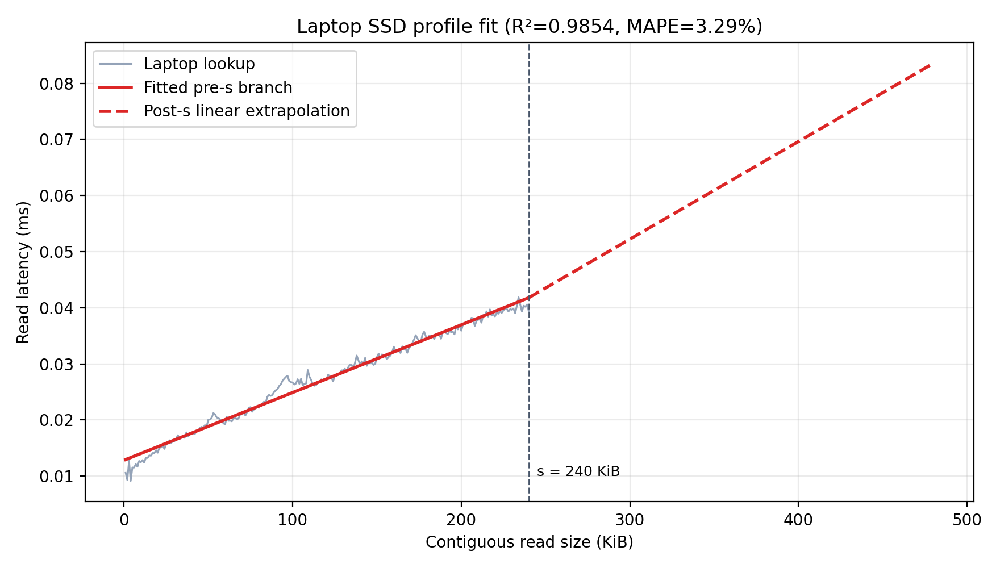
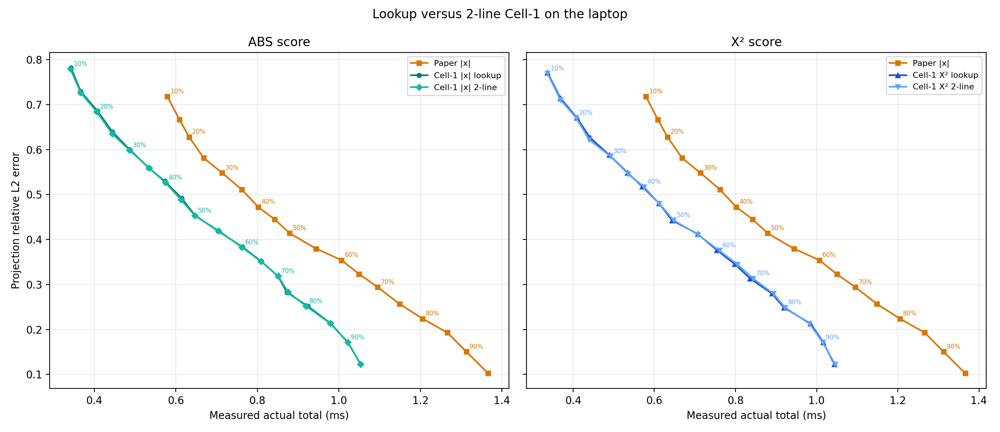
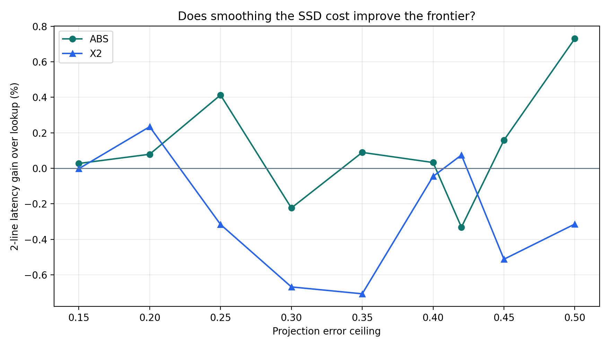
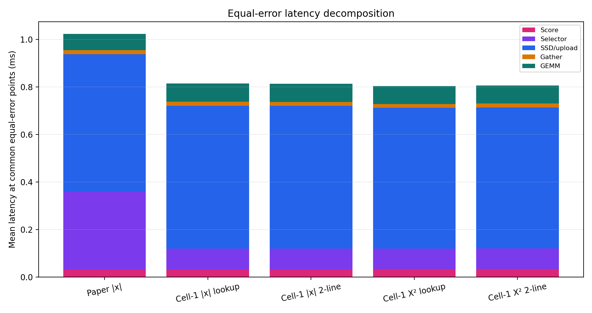

# Experiment 41: 노트북 Cell-1 lookup vs 2-line

실험 39의 실제 노트북 측정 경로를 그대로 사용하고, Cell-1 selector가 청크 비용을 평가할 때만 SSD lookup table과 아래 2-line 근사를 교체했다.

```text
T(r) = a + c1*r   (r <= s)
     = c2*r       (r > s)
```

노트북 SSD profile fit은 `a=0.012833 ms`, `c1=0.000120629 ms/KiB`, `c2=0.000174100 ms/KiB`, `s=240 KiB`이다. 적합도는 `R²=0.98541`, `MAPE=3.29%`다.

저장된 laptop lookup은 profiler가 throughput saturation에서 trim했기 때문에 1–240 KiB만 포함한다. 따라서 pre-s branch는 240개 실측점에 적합했지만, post-s의 `c2*r`은 continuity가 정하는 선형 외삽이다. 기존 lookup도 240 KiB 밖에서는 마지막 점을 크기에 비례해 외삽한다.

## 동일 projection error

양수 gain은 2-line이 lookup보다 빠르다는 뜻이다. R=5% grid 사이를 선형 보간했으므로 작은 차이는 보간 오차로 해석해야 한다.

| error | score | lookup | 2-line | gain | selector Δ | SSD Δ | chunk Δ |
|---:|:---:|---:|---:|---:|---:|---:|---:|
| 0.50 | ABS | 0.606 ms | 0.601 ms | 0.730% | 0.0000 ms | -0.0043 ms | 0.06 |
| 0.50 | X2 | 0.590 ms | 0.592 ms | -0.314% | 0.0013 ms | 0.0003 ms | 0.02 |
| 0.45 | ABS | 0.653 ms | 0.652 ms | 0.158% | -0.0014 ms | 0.0004 ms | -0.00 |
| 0.45 | X2 | 0.638 ms | 0.641 ms | -0.512% | 0.0013 ms | 0.0019 ms | -0.00 |
| 0.42 | ABS | 0.702 ms | 0.704 ms | -0.332% | -0.0009 ms | 0.0031 ms | -0.01 |
| 0.42 | X2 | 0.691 ms | 0.690 ms | 0.075% | 0.0014 ms | -0.0019 ms | -0.01 |
| 0.40 | ABS | 0.736 ms | 0.735 ms | 0.032% | -0.0006 ms | 0.0003 ms | -0.01 |
| 0.40 | X2 | 0.723 ms | 0.724 ms | -0.046% | 0.0019 ms | -0.0015 ms | 0.00 |
| 0.35 | ABS | 0.811 ms | 0.811 ms | 0.089% | 0.0008 ms | -0.0018 ms | 0.00 |
| 0.35 | X2 | 0.792 ms | 0.797 ms | -0.707% | 0.0020 ms | 0.0038 ms | -0.01 |
| 0.30 | ABS | 0.862 ms | 0.864 ms | -0.223% | 0.0011 ms | 0.0009 ms | 0.00 |
| 0.30 | X2 | 0.858 ms | 0.863 ms | -0.668% | 0.0020 ms | 0.0037 ms | -0.00 |
| 0.25 | ABS | 0.926 ms | 0.923 ms | 0.413% | -0.0004 ms | -0.0034 ms | 0.00 |
| 0.25 | X2 | 0.918 ms | 0.921 ms | -0.316% | 0.0009 ms | 0.0021 ms | -0.00 |
| 0.20 | ABS | 0.993 ms | 0.993 ms | 0.079% | -0.0005 ms | -0.0001 ms | 0.00 |
| 0.20 | X2 | 0.995 ms | 0.992 ms | 0.234% | 0.0013 ms | -0.0036 ms | 0.00 |
| 0.15 | ABS | 1.036 ms | 1.035 ms | 0.027% | -0.0010 ms | 0.0007 ms | 0.01 |
| 0.15 | X2 | 1.028 ms | 1.028 ms | -0.002% | 0.0020 ms | -0.0020 ms | -0.00 |

## 같은 R에서 마스크가 얼마나 바뀌었나

| score | cases | same mask | mean error Δ | mean |error Δ| | total Δ | selector Δ | SSD Δ | chunk Δ |
|:---:|---:|---:|---:|---:|---:|---:|---:|---:|
| ABS | 3402 | 80.31% | -0.001066 | 0.001450 | -0.0004 ms | -0.0002 ms | -0.0001 ms | +0.031 |
| X2 | 3402 | 76.93% | -0.001068 | 0.001353 | +0.0018 ms | +0.0013 ms | +0.0005 ms | +0.016 |

## End-to-end logit KL (같은 R)

음수 KL Δ는 2-line의 logit error가 더 작다는 뜻이다. KL은 R에 대해 단조롭지 않고 holdout이 모델당 3개뿐이므로 방향성 진단이다.

| score | R points | 2-line better | mean KL Δ | median KL Δ | mean latency Δ |
|:---:|---:|---:|---:|---:|---:|
| ABS | 18 | 13/18 | -0.2895 | -0.3656 | -0.0004 ms |
| X2 | 18 | 10/18 | +0.0952 | -0.0129 | +0.0018 ms |

## 판정

**공정하게 캐시를 맞춘 뒤에는 2-line이 lookup frontier를 의미 있게 줄이지 못했다. 두 곡선은 측정 노이즈 범위에서 사실상 같다.**

2-line의 동일-error 평균 gain은 ABS `+0.108%`, X² `-0.251%`이며, ceiling 승수는 `{'abs:2-line': 7, 'x2:lookup': 7, 'abs:lookup': 2, 'x2:2-line': 2}`다. 같은 R의 마스크 일치율은 두 score 평균 `78.62%`다.

2-line은 실제 측정치를 대체하는 latency 예측기가 아니라 **Cell-1의 repair 결정을 위한 목적함수**로만 사용했다. 최종 x축은 두 방법 모두 동일하게 실제 O_DIRECT SSD read/upload, activation gather, compact GEMM을 재측정한 `actual_total_ms`다. 따라서 결과 차이는 비용모델이 선택한 마스크 차이이며, 2-line 예측값을 성능값으로 그린 것이 아니다.

두 경로는 같은 로컬 cost-array cache와 같은 Cell-1 kernel을 사용한다. 따라서 lookup table을 매 호출마다 hash하는 구현 비용은 비교에서 제거했다.

Cell-1의 본체는 동일 길이 s-cell을 고르므로 두 비용모델의 차이는 주로 exact-R을 맞추는 floor-expand 대 ceil-trim에서 발생한다. 따라서 높은 마스크 일치율과 작은 frontier 차이가 나와도 버그가 아니라 구조적으로 예상되는 결과다.

## 측정 범위

- projection 후보 `34020`개, holdout aggregate point `90`개.
- Cell-1 selector fallback `0`건, Cell-1 row mismatch `0`건. Paper는 원 논문의 8-row chunk granularity 때문에 exact-R 대상이 아니다.
- score 생성 + selector + 실제 SSD/upload + gather + compact GEMM을 total에 포함했다.
- 모델별 별도 프로세스, CUDA allocator 55%, CPU/O_DIRECT thread 2개, projection 사이 25 ms 양보를 사용했다.

- end-to-end aggregate point `90`개도 저장했다.







