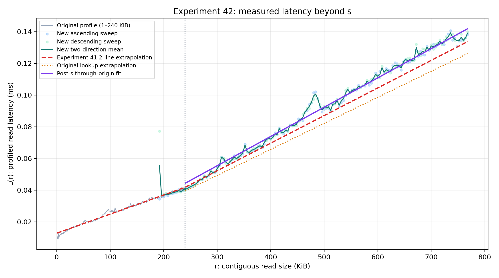
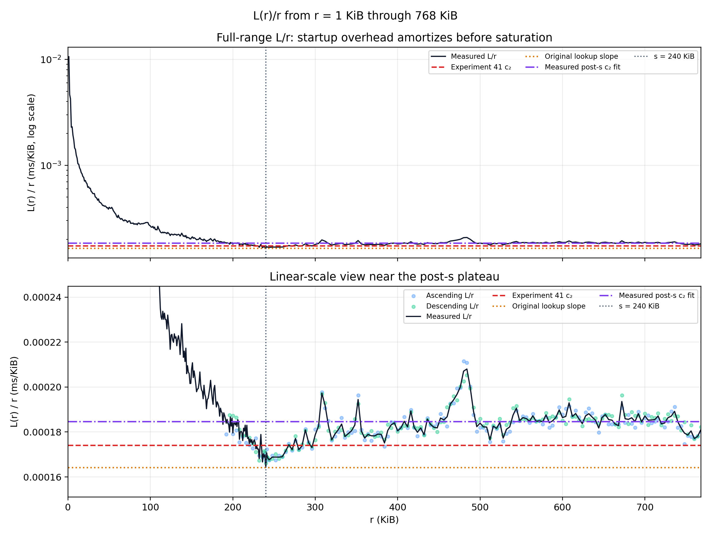
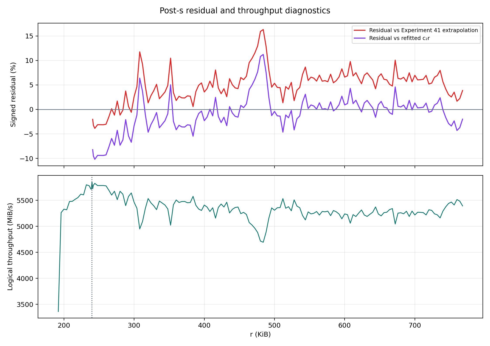

# Experiment 42: s 이후 SSD latency 선형성

노트북 SN850X에서 기존 saturation `s=240 KiB` 전후를 실제 O_DIRECT로 다시 측정했다. 크기 순서에 따른 열·시간 drift를 보기 위해 같은 점을 오름차순과 내림차순으로 각각 측정하고 평균했다.

## 판정

**측정 범위에서는 post-s latency가 `c₂r`에 충분히 가깝다.**

240 KiB 이후 `134`개 점에서 origin-constrained fit은 `L(r)=0.000184678r`이며, `R²=0.99086`, `MAPE=2.71%`, 최대 절대오차 `11.22%`다.

직접적인 선형성 지표인 `L/r`의 평균은 `0.000183347 ms/KiB`, CV는 `3.72%`다. 선형 trend가 예측하는 측정 구간 처음→끝 drift는 `+5.40%`다.

오름/내림 방향 차이가 10%를 넘은 점 `[]`을 제외해도 `c₂=0.000184678`, `R²=0.99086`, `MAPE=2.71%`로 결론은 변하지 않는다.

## 기존 Experiment 41 외삽 검증

기존 `c₂=0.000174100 ms/KiB`의 post-s 실측 MAPE는 `5.30%`, bias는 `+4.92%`다. 새 post-s fit과의 c₂ 차이는 `+6.08%`다.

원래 lookup의 범위 밖 규칙은 마지막 점을 비례 확장하므로 slope가 `0.000164268 ms/KiB`다. 이 extrapolation의 post-s MAPE는 `10.28%`, bias는 `+10.28%`로, 기존 2-line보다 오차가 크다.

기존 1–240 KiB와 새 241–768 KiB를 함께 연속 2-line으로 다시 적합하면 `a=0.011665 ms`, `c₁=0.000135164 ms/KiB`, `c₂=0.000183769 ms/KiB`다. 전체 `R²=0.99665`, MAPE `3.75%` (pre-s `4.36%`, post-s `2.66%`)다.

## 모델 비교

| model | parameters | R² | MAPE | RMSE | BIC |
|:---|---:|---:|---:|---:|---:|
| `c₂r` | 1 | 0.99086 | 2.71% | 0.002814 ms | -1569.1 |
| `b₀+b₁r` | 2 | 0.99156 | 2.18% | 0.002703 ms | -1575.0 |
| quadratic | 3 | 0.99334 | 1.85% | 0.002403 ms | -1601.7 |

Quadratic의 BIC가 `c₂r`보다 `32.6` 낮으므로 작은 곡률은 검출된다. 따라서 `c₂r`은 좋은 공학적 근사이지 정확한 물리 법칙은 아니다.

## 구간별 L/r

| range (KiB) | points | fitted c₂ (ms/KiB) | mean L/r | CV |
|:---|---:|---:|---:|---:|
| (240, 384] | 38 | 0.000178536 | 0.000177564 | 3.85% |
| (384, 512] | 32 | 0.000187182 | 0.000186738 | 4.25% |
| (512, 640] | 32 | 0.000185867 | 0.000185690 | 1.58% |
| (640, 768] | 32 | 0.000184292 | 0.000184481 | 1.87% |

## 대표 실측값

| r (KiB) | L(r) (ms) | L/r (ms/KiB) | throughput (MiB/s) |
|---:|---:|---:|---:|
| 240 | 0.040020 | 0.000166750 | 5856.5 |
| 241 | 0.041130 | 0.000170663 | 5722.2 |
| 242 | 0.040809 | 0.000168634 | 5791.0 |
| 256 | 0.043218 | 0.000168821 | 5784.6 |
| 320 | 0.056471 | 0.000176473 | 5533.8 |
| 384 | 0.067244 | 0.000175115 | 5576.7 |
| 512 | 0.090370 | 0.000176505 | 5532.8 |
| 640 | 0.118544 | 0.000185225 | 5272.3 |
| 768 | 0.139079 | 0.000181092 | 5392.6 |

## 반복성

- 오름차순/내림차순 MAPE: `1.85%`; 방향 bias: `-0.82%`.
- 방향별 c₂ 차이: `0.36%`.
- 최대 방향 불일치: `76.74%` at `r=192 KiB`.
- 192–240 KiB overlap의 기존 profile 대비 MAPE: `4.85%`; bias: `+4.65%`.

이 실험의 L(r)은 논문 profiler와 동일하게 여러 chunk-count에서 얻은 포화 throughput을 단일 chunk latency로 환산한 값이다. 단일 read의 wall-clock latency 자체는 아니다.

- 측정점: `149`개 × 두 방향.
- 범위: `192–768 KiB`; 기본 간격 `4 KiB`와 s 주변 추가점.
- 각 chunk-count마다 warmup `3`, sample `10`, O_DIRECT thread `6`.

