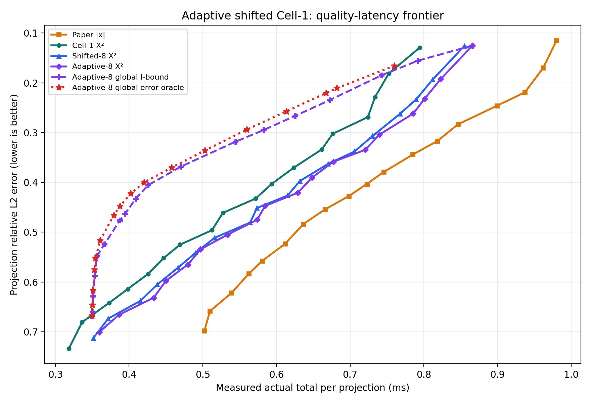
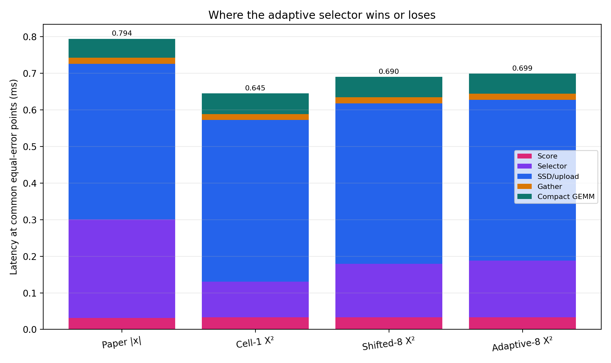
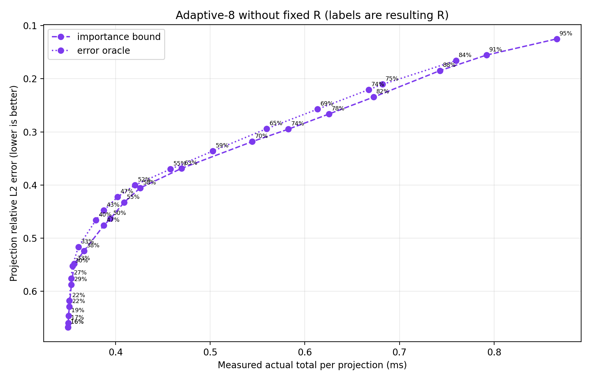

# Experiment 43: adaptive shifted Cell-1

고정된 원점의 s-cell만 쓰는 Cell-1을 8개 offset으로 확장하고, 가장 
불확실한 selected/unselected cell 각각 4개만 s/2 subcell로 다시 
최적화했다. 모든 방법은 실제 score + selector + O_DIRECT/upload + 
activation gather + compact GEMM 시간을 포함한다.

## 동일 projection error

양수 gain은 기존 Cell-1 X²보다 빠르다는 뜻이다.

| error | Paper | Cell-1 X² | Shifted-8 | gain | Adaptive-8 | gain |
|---:|---:|---:|---:|---:|---:|---:|
| 0.15 | 0.969 ms | 0.778 ms | 0.840 ms | -7.98% | 0.850 ms | -9.32% |
| 0.20 | 0.947 ms | 0.745 ms | 0.808 ms | -8.48% | 0.819 ms | -9.89% |
| 0.25 | 0.894 ms | 0.729 ms | 0.777 ms | -6.63% | 0.792 ms | -8.66% |
| 0.30 | 0.833 ms | 0.680 ms | 0.736 ms | -8.31% | 0.744 ms | -9.49% |
| 0.35 | 0.779 ms | 0.645 ms | 0.689 ms | -6.80% | 0.693 ms | -7.44% |
| 0.40 | 0.726 ms | 0.596 ms | 0.630 ms | -5.68% | 0.642 ms | -7.68% |
| 0.42 | 0.706 ms | 0.581 ms | 0.619 ms | -6.49% | 0.630 ms | -8.36% |
| 0.45 | 0.671 ms | 0.545 ms | 0.576 ms | -5.75% | 0.584 ms | -7.12% |
| 0.50 | 0.626 ms | 0.507 ms | 0.534 ms | -5.39% | 0.540 ms | -6.64% |

## 동일-error 구성요소 평균

| method | score | selector | SSD/upload | gather | GEMM | total |
|---|---:|---:|---:|---:|---:|---:|
| Paper |x| | 0.0314 | 0.2689 | 0.4252 | 0.0168 | 0.0521 | 0.7944 |
| Cell-1 X² | 0.0328 | 0.0974 | 0.4419 | 0.0164 | 0.0564 | 0.6450 |
| Shifted-8 X² | 0.0328 | 0.1461 | 0.4388 | 0.0164 | 0.0557 | 0.6899 |
| Adaptive-8 X² | 0.0328 | 0.1553 | 0.4393 | 0.0165 | 0.0554 | 0.6992 |

## R을 없앤 전역 allocation

각 workload의 sampled projection 전체에서 하나의 quality 
budget을 공유한다. `importance_bound`는 공통 mean-|x| retention 
하한만 사용하며, `error_oracle`은 실측 projection error를 직접 
사용하는 비배포형 상한이다.

| objective | paper target R | method | resulting R | error | latency |
|---|---:|---|---:|---:|---:|
| error_oracle | 30% | Adaptive-8 X² | 29.8% | 0.5521 | 0.3545 ms |
| error_oracle | 30% | Cell-1 X² | 32.0% | 0.5492 | 0.3133 ms |
| error_oracle | 50% | Adaptive-8 X² | 47.5% | 0.4225 | 0.4021 ms |
| error_oracle | 50% | Cell-1 X² | 46.3% | 0.4267 | 0.3474 ms |
| error_oracle | 70% | Adaptive-8 X² | 64.5% | 0.2940 | 0.5597 ms |
| error_oracle | 70% | Cell-1 X² | 64.6% | 0.2988 | 0.4868 ms |
| error_oracle | 90% | Adaptive-8 X² | 83.9% | 0.1659 | 0.7597 ms |
| error_oracle | 90% | Cell-1 X² | 85.8% | 0.1593 | 0.7007 ms |
| importance_bound | 30% | Adaptive-8 X² | 33.3% | 0.5480 | 0.3565 ms |
| importance_bound | 30% | Cell-1 X² | 33.5% | 0.5770 | 0.3129 ms |
| importance_bound | 50% | Adaptive-8 X² | 54.9% | 0.4328 | 0.4090 ms |
| importance_bound | 50% | Cell-1 X² | 54.6% | 0.4344 | 0.3545 ms |
| importance_bound | 70% | Adaptive-8 X² | 74.0% | 0.2950 | 0.5824 ms |
| importance_bound | 70% | Cell-1 X² | 74.5% | 0.2808 | 0.5295 ms |
| importance_bound | 90% | Adaptive-8 X² | 91.3% | 0.1555 | 0.7919 ms |
| importance_bound | 90% | Cell-1 X² | 91.5% | 0.1561 | 0.7234 ms |

## 판정

동일-error에서 Shifted-8의 Cell-1 대비 평균 gain은 `-6.83%`, Adaptive-8은 `-8.29%`다.
결론은 selector 자체의 mask 개선이 추가 selector 시간보다 큰지, 그리고 
고정 R을 없앤 전역 quality allocation이 그보다 더 큰지로 나누어 해석해야 
한다. error oracle은 달성 가능한 상한이지 배포 가능한 알고리즘이 아니다.

## 측정 범위

- projection 후보 `9072`개; fallback `0`건.
- offset `8`개, boundary cell 방향당 `4`개, refine divisor `2`.
- R=10%..95%, 5% 간격. 그래프의 allocation 점 위 %는 최적화 결과로 
나온 평균 selected fraction이다.

