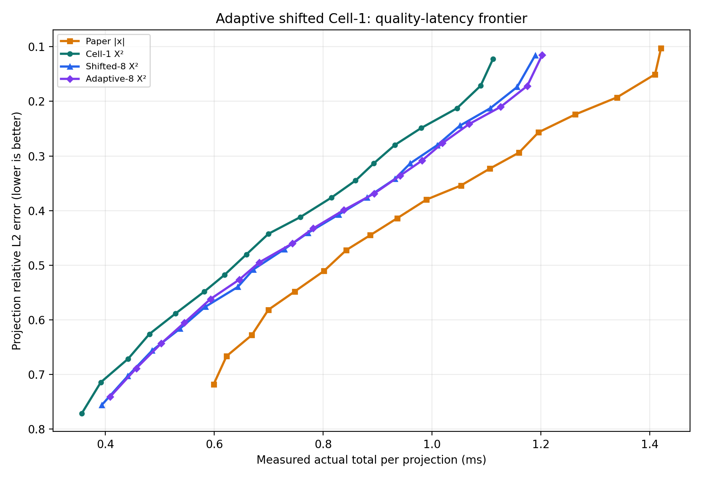
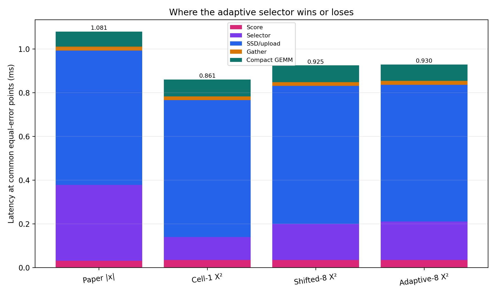
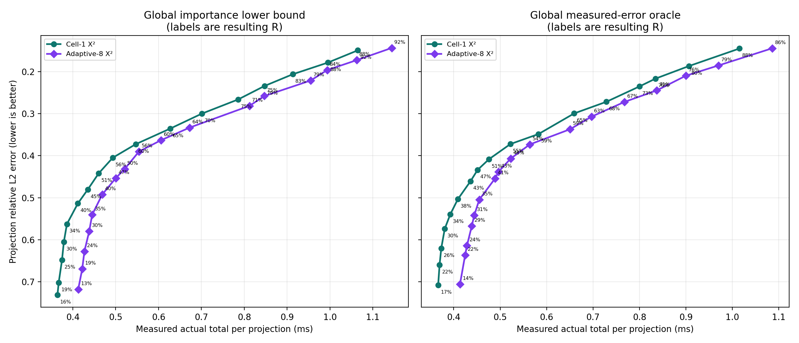

# Experiment 43: adaptive shifted Cell-1

고정된 원점의 s-cell만 쓰는 Cell-1을 8개 offset으로 확장하고, 가장 
불확실한 selected/unselected cell 각각 4개만 s/2 subcell로 다시 
최적화했다. 모든 방법은 실제 score + selector + O_DIRECT/upload + 
activation gather + compact GEMM 시간을 포함한다.

## 동일 projection error

양수 gain은 기존 Cell-1 X²보다 빠르다는 뜻이다.

| error | Paper | Cell-1 X² | Shifted-8 | gain | Adaptive-8 | gain |
|---:|---:|---:|---:|---:|---:|---:|
| 0.15 | 1.410 ms | 1.099 ms | 1.170 ms | -6.43% | 1.185 ms | -7.85% |
| 0.20 | 1.322 ms | 1.059 ms | 1.123 ms | -6.03% | 1.139 ms | -7.53% |
| 0.25 | 1.209 ms | 0.978 ms | 1.045 ms | -6.80% | 1.056 ms | -7.98% |
| 0.30 | 1.149 ms | 0.909 ms | 0.980 ms | -7.87% | 0.992 ms | -9.13% |
| 0.35 | 1.060 ms | 0.853 ms | 0.920 ms | -7.92% | 0.921 ms | -8.05% |
| 0.40 | 0.958 ms | 0.777 ms | 0.841 ms | -8.17% | 0.836 ms | -7.62% |
| 0.42 | 0.927 ms | 0.743 ms | 0.807 ms | -8.68% | 0.803 ms | -8.11% |
| 0.45 | 0.879 ms | 0.692 ms | 0.759 ms | -9.73% | 0.758 ms | -9.56% |
| 0.50 | 0.813 ms | 0.638 ms | 0.684 ms | -7.20% | 0.677 ms | -6.08% |

## 동일-error 구성요소 평균

| method | score | selector | SSD/upload | gather | GEMM | total |
|---|---:|---:|---:|---:|---:|---:|
| Paper |x| | 0.0319 | 0.3475 | 0.6138 | 0.0177 | 0.0698 | 1.0807 |
| Cell-1 X² | 0.0349 | 0.1054 | 0.6263 | 0.0175 | 0.0767 | 0.8608 |
| Shifted-8 X² | 0.0349 | 0.1660 | 0.6306 | 0.0176 | 0.0763 | 0.9254 |
| Adaptive-8 X² | 0.0349 | 0.1767 | 0.6251 | 0.0175 | 0.0755 | 0.9297 |

## R을 없앤 전역 allocation

각 workload의 sampled projection 전체에서 하나의 quality 
budget을 공유한다. 선택 cost는 holdout 실측값이 아니라 동일 
calibration prompt에서 측정한 module별 median latency를 사용한다. 
`importance_bound`는 공통 mean-|x| retention 하한을 쓰는 measurable 
proxy 상한이며, `error_oracle`은 실측 projection error를 직접 
사용하는 비배포형 상한이다.

| objective | paper target R | method | resulting R | error | latency |
|---|---:|---|---:|---:|---:|
| error_oracle | 30% | Adaptive-8 X² | 31.4% | 0.5415 | 0.4443 ms |
| error_oracle | 30% | Cell-1 X² | 33.6% | 0.5393 | 0.3926 ms |
| error_oracle | 50% | Adaptive-8 X² | 48.2% | 0.4069 | 0.5226 ms |
| error_oracle | 50% | Cell-1 X² | 50.9% | 0.4084 | 0.4759 ms |
| error_oracle | 70% | Adaptive-8 X² | 67.2% | 0.2721 | 0.7678 ms |
| error_oracle | 70% | Cell-1 X² | 68.1% | 0.2718 | 0.7288 ms |
| error_oracle | 90% | Adaptive-8 X² | 86.4% | 0.1445 | 1.0863 ms |
| error_oracle | 90% | Cell-1 X² | 88.4% | 0.1452 | 1.0154 ms |
| importance_bound | 30% | Adaptive-8 X² | 34.7% | 0.5402 | 0.4452 ms |
| importance_bound | 30% | Cell-1 X² | 34.5% | 0.5624 | 0.3862 ms |
| importance_bound | 50% | Adaptive-8 X² | 55.9% | 0.3901 | 0.5544 ms |
| importance_bound | 50% | Cell-1 X² | 55.7% | 0.4048 | 0.4932 ms |
| importance_bound | 70% | Adaptive-8 X² | 74.5% | 0.2581 | 0.8470 ms |
| importance_bound | 70% | Cell-1 X² | 74.7% | 0.2663 | 0.7856 ms |
| importance_bound | 90% | Adaptive-8 X² | 91.7% | 0.1438 | 1.1439 ms |
| importance_bound | 90% | Cell-1 X² | 91.6% | 0.1495 | 1.0650 ms |

## 모델별 진단

same-R error improvement는 양수가 좋고, 나머지 delta는 음수가 좋다.

| model | method | error improvement | selector Δ | SSD/upload Δ | total Δ | chunks Δ |
|---|---|---:|---:|---:|---:|---:|
| qwen05 | Shifted-8 X² | 1.33% | +0.0461 ms | -0.0001 ms | +0.0458 ms | +0.02 |
| qwen05 | Adaptive-8 X² | 2.46% | +0.0564 ms | +0.0020 ms | +0.0583 ms | +1.58 |
| smol360 | Shifted-8 X² | 1.85% | +0.0268 ms | +0.0114 ms | +0.0382 ms | +0.07 |
| smol360 | Adaptive-8 X² | 4.31% | +0.0357 ms | +0.0112 ms | +0.0469 ms | +1.31 |
| tiny11 | Shifted-8 X² | 1.00% | +0.0987 ms | +0.0049 ms | +0.1039 ms | +0.23 |
| tiny11 | Adaptive-8 X² | 3.20% | +0.1135 ms | +0.0083 ms | +0.1217 ms | +2.80 |

모델별 동일-error 평균 gain:

| model | Shifted-8 | Adaptive-8 |
|---|---:|---:|
| qwen05 | -6.83% | -8.29% |
| smol360 | -9.51% | -10.45% |
| tiny11 | -7.86% | -7.60% |

## 판정

동일-error에서 Shifted-8의 Cell-1 대비 평균 gain은 `-7.65%`, Adaptive-8은 `-7.99%`다.
반대로 기존 Cell-1의 grid를 그대로 두고 projection별 R만 전역 재배분하면, 동일한 실제 error에서 fixed-R Cell-1보다 평균 `21.76%` 빠르다. 실제 error oracle 상한은 평균 `26.02%`다.
결론은 selector 자체의 mask 개선이 추가 selector 시간보다 큰지, 그리고 
고정 R을 없앤 전역 quality allocation이 그보다 더 큰지로 나누어 해석해야 
한다. error oracle은 달성 가능한 상한이지 배포 가능한 알고리즘이 아니다.
평균 gain과 그래프에는 모든 9개 workload에서 feasible한 target만 포함했다.

## 측정 범위

- 모델 `3`개, projection 후보 `27216`개; fallback `0`건.
- offset `8`개, boundary cell 방향당 `4`개, refine divisor `2`.
- R=10%..95%, 5% 간격. 그래프의 allocation 점 위 %는 최적화 결과로 
나온 평균 selected fraction이다.

