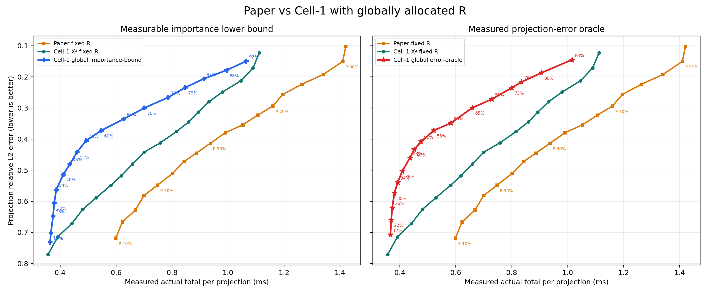
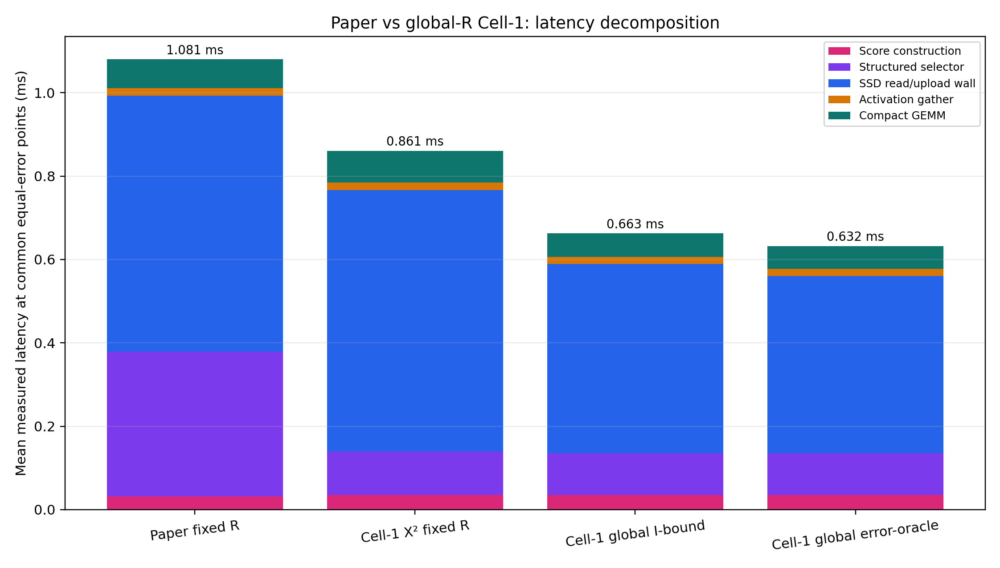
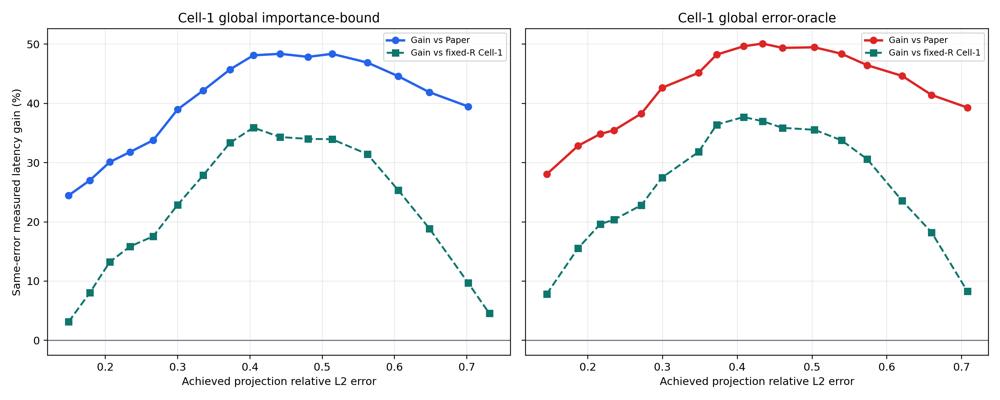

# Experiment 44: Paper vs globally allocated Cell-1 R

Experiment 43에서 실측한 동일한 holdout mask와 actual-total latency를 
사용해 Paper, fixed-R Cell-1, global-R Cell-1을 같은 projection-error 
축에 겹쳤다. 따라서 global point의 error에서 Paper와 fixed Cell-1 
latency를 보간해 동일-error gain을 계산할 수 있다.

## Cell-1 global importance-bound

공통 error 구간 평균 gain은 Paper 대비 **39.97%**, fixed-R Cell-1 대비 **22.84%**다.

| Paper target R | resulting R | actual error | global Cell-1 | Paper at same error | gain vs Paper | gain vs fixed Cell-1 |
|---:|---:|---:|---:|---:|---:|---:|
| 90% | 91.6% | 0.1495 | 1.0650 ms | 1.4100 ms | 24.47% | 3.14% |
| 70% | 74.7% | 0.2663 | 0.7856 ms | 1.1864 ms | 33.78% | 17.56% |
| 50% | 55.7% | 0.4048 | 0.4932 ms | 0.9506 ms | 48.12% | 35.91% |
| 30% | 34.5% | 0.5624 | 0.3862 ms | 0.7272 ms | 46.89% | 31.43% |

## Cell-1 global error-oracle

공통 error 구간 평균 gain은 Paper 대비 **42.60%**, fixed-R Cell-1 대비 **26.02%**다.

| Paper target R | resulting R | actual error | global Cell-1 | Paper at same error | gain vs Paper | gain vs fixed Cell-1 |
|---:|---:|---:|---:|---:|---:|---:|
| 90% | 88.4% | 0.1452 | 1.0154 ms | 1.4110 ms | 28.04% | 7.81% |
| 70% | 68.1% | 0.2718 | 0.7288 ms | 1.1811 ms | 38.29% | 22.82% |
| 50% | 50.9% | 0.4084 | 0.4759 ms | 0.9449 ms | 49.64% | 37.70% |
| 30% | 33.6% | 0.5393 | 0.3926 ms | 0.7606 ms | 48.38% | 33.77% |

## 동일-error 구성요소 평균

모든 네 전략이 겹치는 `9`개 error 지점(0.15..0.50)에서 각 구성요소를 보간한 뒤 평균했다.

| strategy | score | selector | SSD/upload | gather | GEMM | total |
|---|---:|---:|---:|---:|---:|---:|
| Paper fixed R | 0.0319 | 0.3475 | 0.6138 | 0.0177 | 0.0698 | 1.0807 |
| Cell-1 X² fixed R | 0.0349 | 0.1054 | 0.6263 | 0.0175 | 0.0767 | 0.8608 |
| Cell-1 global I-bound | 0.0349 | 0.1005 | 0.4534 | 0.0172 | 0.0570 | 0.6629 |
| Cell-1 global error-oracle | 0.0349 | 0.1011 | 0.4243 | 0.0173 | 0.0547 | 0.6323 |

fixed-R Cell-1에서 importance-bound로 줄어든 `0.1979 ms` 중 SSD/read-upload 감소가 `0.1729 ms`(`87.4%`)다. error-oracle의 총 감소 `0.2285 ms` 중 SSD 감소는 `0.2019 ms`(`88.4%`)다. 따라서 큰 꺾임은 selector timing이나 그래프 보간이 아니라, 전역 R 배분이 비싼 projection의 실제 읽기량을 줄인 데서 나온다.

## 판정

Paper와 겹쳐도 결론은 유지된다. **현재 노트북에서 가장 큰 여지는 
mask geometry가 아니라 projection별 R 배분이다.** importance-bound 
전략의 Paper 대비 평균 gain은 `39.97%`, error-oracle 상한은 `42.60%`다.

다만 importance-bound도 한 workload의 sampled projection importance를 
모두 본 뒤 배분한 post-hoc 상한이다. decision cost에는 holdout timing을 
쓰지 않고 calibration module-median latency만 사용했지만, 실제 배포에는 
순차 layer에서 남은 quality budget을 관리하는 causal controller가 필요하다.
error-oracle은 dense reference error를 사용하므로 배포할 수 없다.

평균과 그래프에는 전체 9개 workload에서 feasible한 target만 포함했다. 
importance-bound의 Paper 95% target은 1/9 workload에서만 feasible하여 
제외했다.

## 데이터 범위

- source format: `experiment-43-adaptive-shifted-cell1-merged-v1`.
- 모델 `3`개; R=10%..95%, 5% 간격.
- latency는 score + selector + O_DIRECT/upload + activation gather + compact GEMM.
- 그래프의 global curve 위 %는 고정 입력 R이 아니라 allocation 결과의 평균 R.

